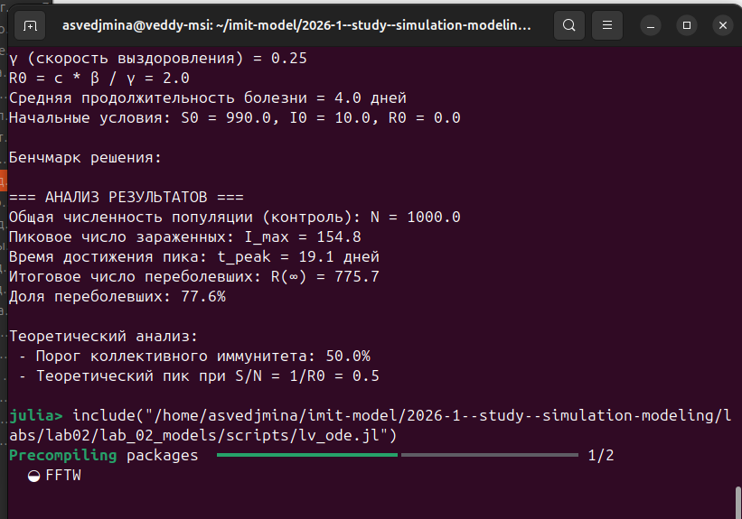
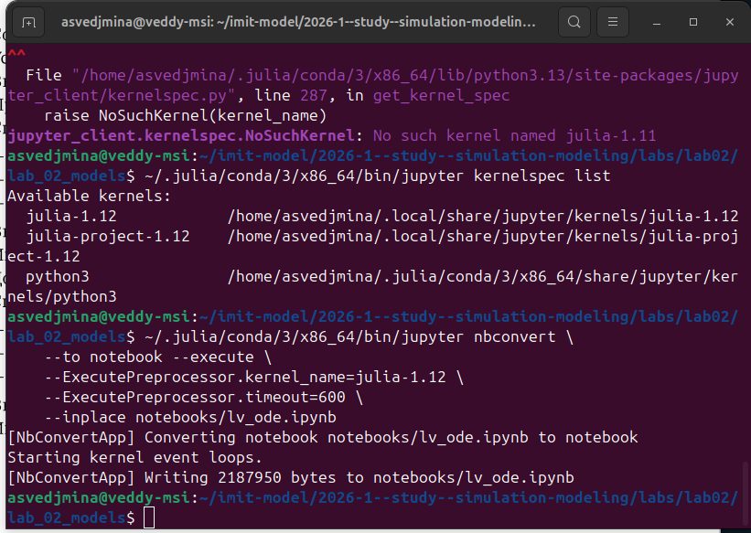
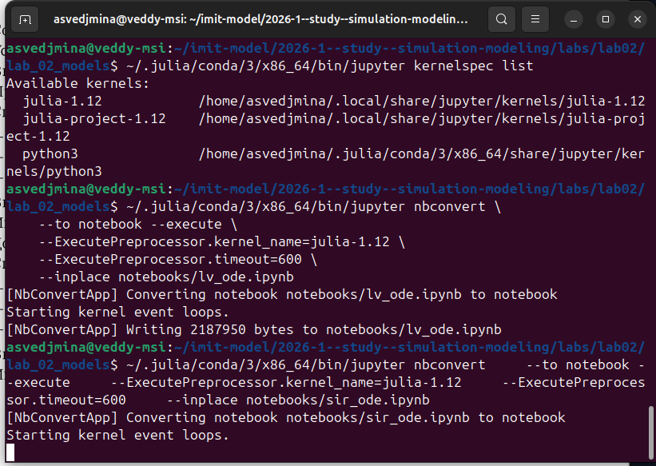
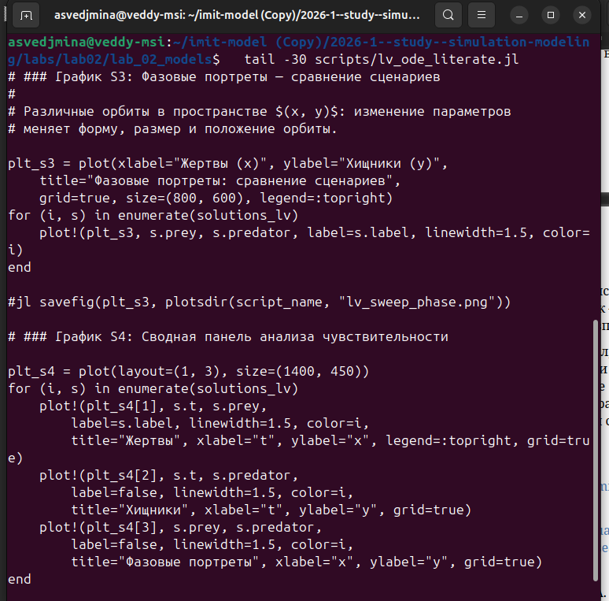
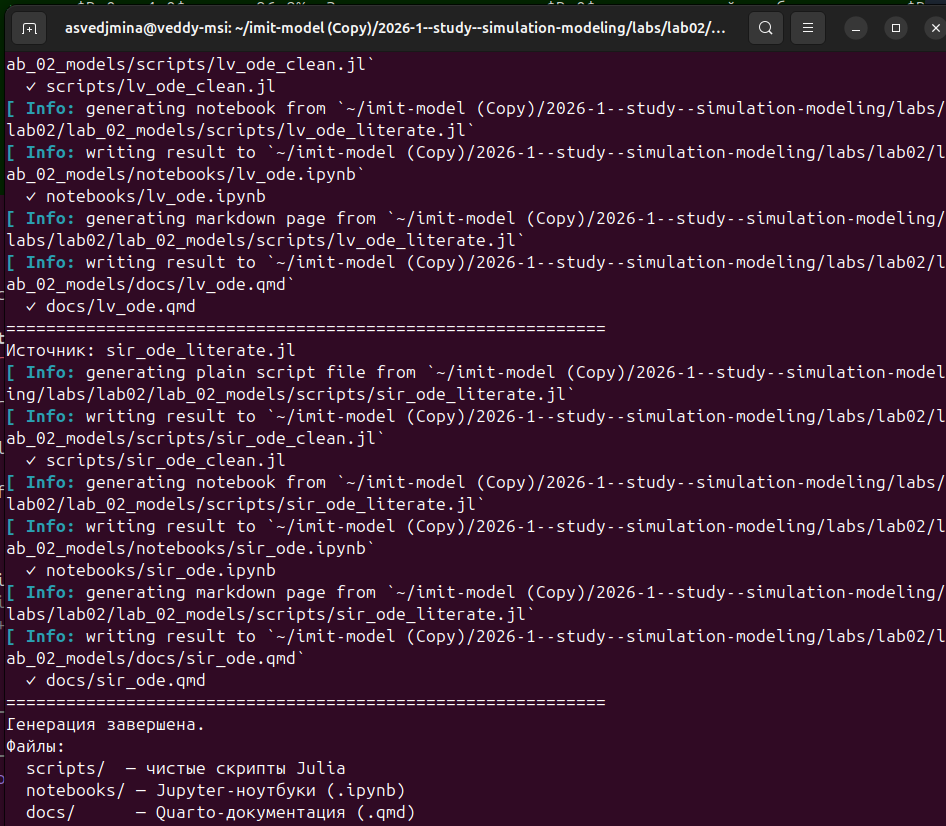
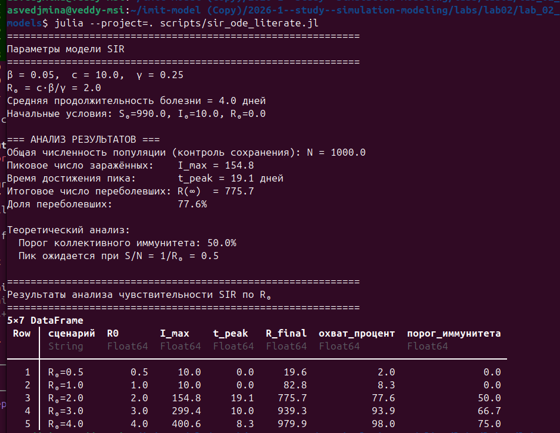

---
## Author
author:
  name: Ведьмина Александра Сергеевна
  degrees: student
  email: 1132236003@rudn.ru
  affiliation:
    - name: Российский университет дружбы народов
      country: Российская Федерация
      postal-code: 117198
      city: Москва
      address: ул. Миклухо-Маклая, д. 6
## Title
title: Лабораторная работа №2
subtitle: Имитационное моделирование
license: CC BY
date: today
date-format: "YYYY-MM-DD"
---

# Информация

## Докладчик

:::::::::::::: {.columns align=center}
::: {.column width="70%"}

  * Ведьмина Александра Сергеевна
  * студент
  * Российский университет дружбы народов
  * [1132236003@rudn.ru](mailto:1132236003@rudn.ru)

:::
::: {.column width="30%"}

:::
::::::::::::::

# Вводная часть

## Цель работы

Освоить методологию **литературного программирования** (Literate Programming)
для создания воспроизводимых имитационных моделей:

- реализовать модели **SIR** и **Лотки–Вольтерры** в виде литературных Julia-скриптов;
- сгенерировать производные форматы с помощью **Literate.jl**;
- интегрировать Quarto-документацию в академический отчёт.

## Задачи

- Создать проект DrWatson `lab_02_models`
- Написать литературные скрипты для моделей SIR и Лотки–Вольтерры
- Запустить модели и верифицировать результаты
- Сгенерировать производные форматы: `.jl`, `.ipynb`, `.qmd`
- Выполнить Jupyter notebooks
- Интегрировать Quarto-документацию в отчёт

## Литературное программирование

:::::::::::::: {.columns}
::: {.column width="50%"}

**Один источник $\to$ три формата:**

- Чистый скрипт `.jl`
- Jupyter notebook `.ipynb`
- Quarto-документация `.qmd`

:::
::: {.column width="50%"}

**Разметка Literate.jl:**

| Префикс | Назначение |
|---------|-----------|
| `# #`   | Заголовок Markdown |
| `#`     | Текст параграфа |
| `#jl`   | Только в скрипте |
| `#nb`   | Только в ноутбуке |
| `#src`  | Скрыто из всех выходных |

:::
::::::::::::::

# Теоретическое введение

## Модель SIR

$$\frac{dS}{dt} = -\frac{\beta c}{N} I S, \quad
  \frac{dI}{dt} = \frac{\beta c}{N} I S - \gamma I, \quad
  \frac{dR}{dt} = \gamma I$$

| Параметр | Значение | Смысл |
|----------|----------|-------|
| $\beta$  | 0.05 | вероятность заражения |
| $c$      | 10 | контактов/день |
| $\gamma$ | 0.25 | скорость выздоровления |

$$R_0 = \frac{\beta c}{\gamma} = 2.0$$

## Модель Лотки–Вольтерры

$$\frac{dx}{dt} = \alpha x - \beta x y, \quad
  \frac{dy}{dt} = \delta x y - \gamma y$$

| Параметр | Значение | Смысл |
|----------|----------|-------|
| $\alpha$ | 0.1 | прирост жертв |
| $\beta$  | 0.02 | выедание |
| $\delta$ | 0.01 | конверсия |
| $\gamma$ | 0.3 | смертность хищников |

Равновесие: $x^* = \gamma/\delta = 30$, $y^* = \alpha/\beta = 5$

# Выполнение лабораторной работы

## Создание проекта DrWatson

## Установка пакетов

## Запуск модели SIR — компиляция

## Результаты модели SIR

## SIR: ключевые результаты

- $R_0 = 2.0$ --- эпидемия развивается
- $I_{\max} = 154.8$ чел. на $t = 19.1$ дней
- Доля переболевших: $R(\infty) / N = 77.6\%$
- Порог коллективного иммунитета: $1 - 1/R_0 = 50\%$

## Запуск модели Лотки–Вольтерры

## Визуализация LV

## LV: завершение и анализ чувствительности

## Генерация Markdown-документации

## Генерация Jupyter Notebooks

## Выполнение ноутбуков

## Оба ноутбука выполнены

# Анализ чувствительности

## Добавление анализа параметров в литературный код

## Перегенерация производных форматов

## Выполнение ноутбуков с параметрами

## Результаты: модель Лотки–Вольтерры

## LV: выводы по чувствительности

- Увеличение $\alpha$ сокращает период колебаний
- Увеличение $\beta$ снижает $y^* = \alpha/\beta$ (меньше хищников)
- Снижение $\gamma$ смещает $x^* = \gamma/\delta$ (меньше жертв)
- Замкнутые орбиты сохраняются при всех параметрах

## Результаты: модель SIR

## SIR: выводы по чувствительности

- $R_0 \le 1$: эпидемия не развивается (охват < 9%)
- $R_0 = 2.0$: охват 77.6%, пик 154.8 чел.
- $R_0 = 3.0$: охват 93.9%, пик 299.4 чел.
- $R_0 = 4.0$: охват 98.0% --- вся популяция
- Резкий скачок вблизи порога $R_0 = 1$

# Результаты

## Выводы

- Создан проект DrWatson `lab_02_models` с зависимостями
- Реализованы литературные скрипты для **SIR** и **Лотки–Вольтерры**
- SIR: $R_0 = 2.0$, пик $I_{\max} = 154.8$ (день 19.1), атака 77.6%
- LV: период $T \approx 62.8$, равновесие $(30,\, 5)$, подтверждено FFT
- Сгенерированы `.jl`, `.ipynb`, `.qmd` через Literate.jl
- Ноутбуки выполнены через `jupyter nbconvert --execute`
- Добавлен анализ чувствительности для обеих моделей
- Перегенерированы все форматы с параметрами
- Quarto-документация интегрирована в отчёт
