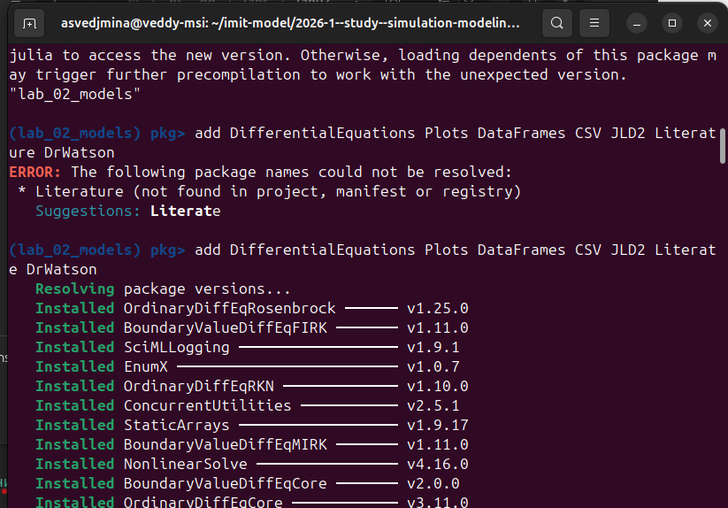
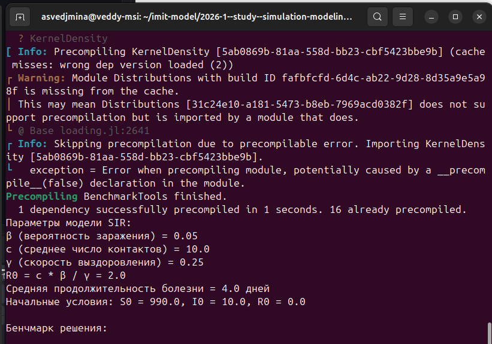
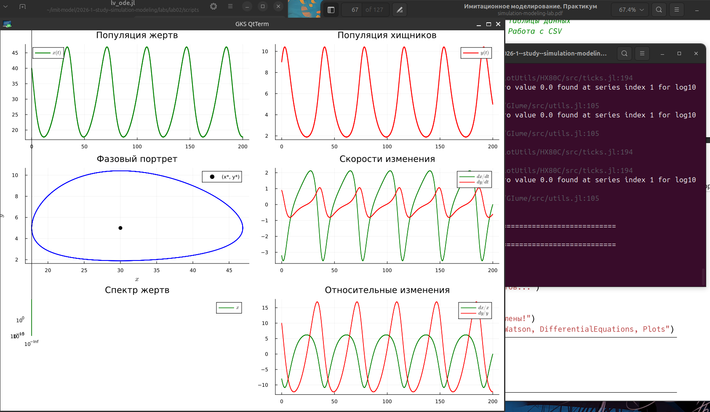
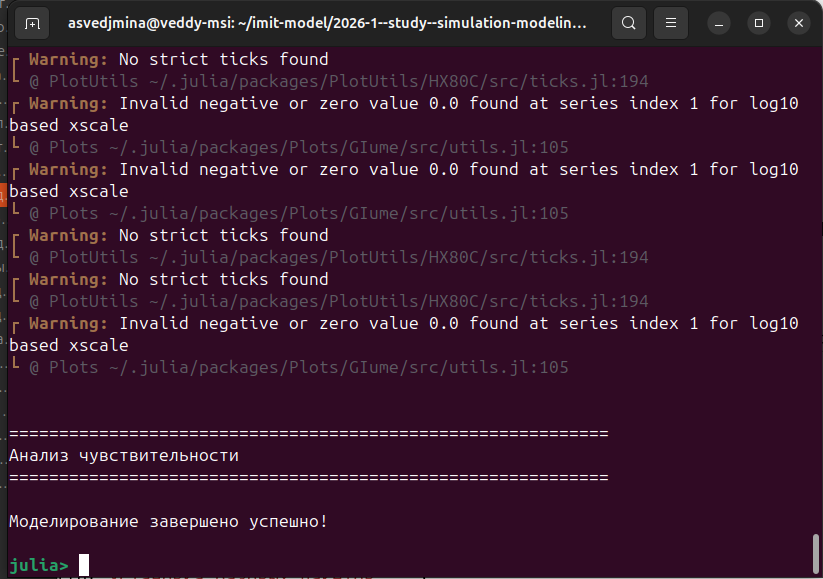
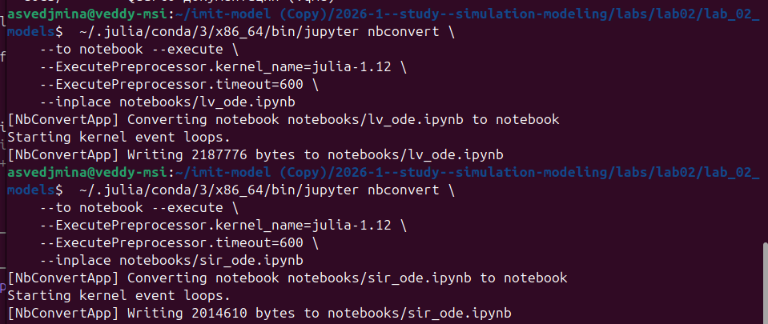
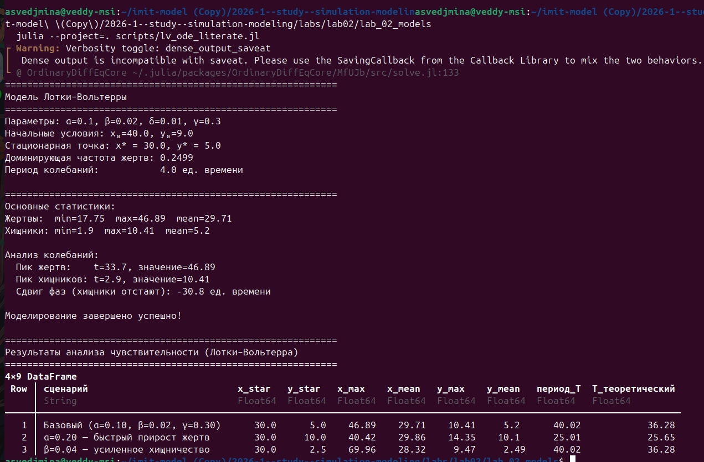

---
## Author
author:
  name: Ведьмина Александра Сергеевна
  degrees: student
  email: 1132236003@rudn.ru
  affiliation:
    - name: Российский университет дружбы народов
      country: Российская Федерация
      postal-code: 117198
      city: Москва
      address: ул. Миклухо-Маклая, д. 6

## Title
title: "Имитационное моделирование"
subtitle: "Лабораторная работа №2"
license: "CC BY"
---

# Цель работы

Познакомиться с концепцией литературного программирования и научиться применять её на практике: реализовать модели SIR и Лотки–Вольтерры в виде литературных Julia-скриптов, получить из них Jupyter notebooks и Quarto-документацию, и в итоге оформить всё это в виде воспроизводимого отчёта.

# Задание

1. Создать проект DrWatson для лабораторной работы.
2. Написать литературные Julia-скрипты для моделей SIR и Лотки–Вольтерры с применением разметки Literate.jl.
3. Запустить модели и проверить результаты.
4. Сгенерировать производные форматы: чистый Julia-скрипт, Jupyter notebook, Quarto-документация.
5. Выполнить код из Jupyter notebook.
6. Интегрировать документацию в формате Quarto в отчёт.
7. Добавить в литературный код расчёт для нескольких наборов параметров (анализ чувствительности).

# Теоретическое введение

## Литературное программирование

Идею литературного программирования предложил Дональд Кнут ещё в 1984 году [@knuth_1984].
Суть простая: программа — это не просто набор инструкций для машины, а текст для людей,
в котором код объяснён человеческим языком. В результате код и документация живут в одном месте
и не расходятся со временем.

Для воспроизводимых вычислений такой подход описан в [@schulte_2012].
В Julia он реализован через пакет Literate.jl.
Один `.jl`-файл с особыми комментариями становится источником сразу трёх вещей:

- **чистого скрипта** — обычный `.jl`, без документационных комментариев;
- **Jupyter notebook** — можно открыть и запустить в браузере;
- **Quarto-документа** — рендерится в PDF, HTML или DOCX.

## Модель SIR

Модель SIR [@kermack_1927; @hethcote_2000] — пожалуй, самая известная эпидемиологическая модель.
Она описывает распространение инфекции в закрытой популяции, где никто не рождается и не умирает.

Всё население делится на три группы:

- **S** (*Susceptible*) --- те, кто ещё не болел и может заразиться;
- **I** (*Infectious*) --- заразившиеся, которые сами заражают других;
- **R** (*Recovered*) --- переболевшие, у которых выработался иммунитет.

Динамика описывается системой ОДУ:

$$\frac{dS}{dt} = -\frac{\beta c}{N}\, I \cdot S$$ {#eq-sir-s}

$$\frac{dI}{dt} = \frac{\beta c}{N}\, I \cdot S - \gamma I$$ {#eq-sir-i}

$$\frac{dR}{dt} = \gamma I$$ {#eq-sir-r}

где $N = S + I + R = \text{const}$ --- общая численность популяции, которая не меняется.

Ключевая величина — базовое репродуктивное число $R_0$, показывающее, сколько человек в среднем заразит один больной:

$$R_0 = \frac{\beta \cdot c}{\gamma}$$ {#eq-r0}

Если $R_0 > 1$, эпидемия распространяется; если $R_0 < 1$ --- затухает сама по себе.
Порог коллективного иммунитета равен $1 - 1/R_0$.

## Модель Лотки–Вольтерры

Классическая модель «хищник–жертва» [@lotka_1925; @volterra_1928] — ещё один базовый пример нелинейной динамики.
Рассматриваются две популяции: жертвы ($x$) и хищники ($y$).
Их взаимодействие описывается системой нелинейных ОДУ:

$$\frac{dx}{dt} = \alpha x - \beta x y$$ {#eq-lv-x}

$$\frac{dy}{dt} = \delta x y - \gamma y$$ {#eq-lv-y}

Параметры, использованные в работе, сведены в [табл. @tbl-lv-params].

| Параметр | Значение | Биологический смысл |
|----------|----------|---------------------|
| $\alpha$ | 0.1 | скорость естественного прироста жертв |
| $\beta$ | 0.02 | интенсивность выедания жертв хищниками |
| $\delta$ | 0.01 | коэффициент конверсии жертв в прирост хищников |
| $\gamma$ | 0.3 | естественная смертность хищников |

: Параметры модели Лотки–Вольтерры {#tbl-lv-params}

У системы два положения равновесия:

- тривиальное: $(0, 0)$ — вымирание обоих видов;
- нетривиальное: $\bigl(x^* = \gamma/\delta,\; y^* = \alpha/\beta\bigr)$.

Интересная особенность модели — вблизи нетривиального равновесия траектории образуют **замкнутые орбиты**:
популяции колеблются бесконечно, не стремясь ни к равновесию, ни к нулю.
Теоретический период колебаний: $T = 2\pi / \sqrt{\alpha\gamma}$.

Для численного решения используется метод Tsit5 (Runge–Kutta 5-го порядка с адаптивным шагом по времени).

# Выполнение лабораторной работы

## Создание проекта DrWatson

Запускаем Julia и создаём проект `lab_02_models` с помощью `initialize_project` из DrWatson.
DrWatson сам создаёт нужную структуру каталогов и активирует окружение.

{#fig-drwatson-init width=90%}

На [рис. @fig-drwatson-init] видно, что проект создался в `labs/lab02/lab_02_models` и среда активирована.

## Установка зависимостей

Добавляем в проект нужные пакеты: DifferentialEquations, Plots, DataFrames, CSV, JLD2, Literate, DrWatson ([рис. @fig-pkg-add]).

{#fig-pkg-add width=90%}

## Запуск модели SIR

### Компиляция

Запускаем скрипт `sir_ode.jl` в REPL Julia.
При первом запуске Julia компилирует все пакеты, что занимает заметное время ([рис. @fig-sir-compile]).

{#fig-sir-compile width=90%}

### Результаты моделирования SIR

После компиляции скрипт выводит параметры и результаты расчёта ([рис. @fig-sir-results]).

{#fig-sir-results width=90%}

Из вывода ([рис. @fig-sir-results]) видно:

- $R_0 = 2.0$ — эпидемия развивается;
- пик заражённых: $I_{\max} = 154.8$ человека примерно на 19-й день;
- в итоге переболели 77.6% популяции ($R(\infty) = 775.7$);
- порог коллективного иммунитета — 50%.

Как только расчёт SIR завершился, начинается компиляция скрипта Лотки–Вольтерры ([рис. @fig-sir-complete]).

{#fig-sir-complete width=90%}

## Запуск модели Лотки–Вольтерры

### Визуализация результатов

Скрипт `lv_ode.jl` строит несколько графиков: динамику популяций, фазовый портрет, скорости изменения, FFT-спектр и итоговую панель ([рис. @fig-lv-plots]).

{#fig-lv-plots width=90%}

### Завершение моделирования

После графиков скрипт выполняет анализ чувствительности.
На [рис. @fig-lv-complete] видно финальное сообщение «Моделирование завершено успешно!».

{#fig-lv-complete width=90%}

## Генерация производных форматов с помощью Literate.jl

### Генерация Markdown и Quarto-документации

Из REPL вызываем `Literate.markdown()` для обоих скриптов ([рис. @fig-literate-md]).
В итоге в каталоге `docs/` появляются файлы `sir_ode.md`, `lv_ode.md`, `sir_ode.qmd` и `lv_ode.qmd`.

{#fig-literate-md width=90%}

### Генерация Jupyter Notebooks

Аналогично вызываем `Literate.notebook()` — получаем `.ipynb`-файлы ([рис. @fig-literate-nb]).

{#fig-literate-nb width=90%}

## Выполнение Jupyter Notebooks

### Выполнение ноутбука модели Лотки–Вольтерры

Запускаем выполнение ноутбука `lv_ode.ipynb` через `jupyter nbconvert` ([рис. @fig-nb-lv]).
Jupyter notebooks удобны для исследовательской работы: код, текст и результаты собраны вместе [@kery_2018].
Перед этим убедились, что ядро `julia-1.12` доступно (рядом с ним ещё `julia-project-1.12` и `python3`).

{#fig-nb-lv width=90%}

Ноутбук выполнился успешно, в файл записалось около 2.2 МБ.

### Выполнение ноутбука модели SIR

То же самое делаем для `sir_ode.ipynb` ([рис. @fig-nb-sir]).

{#fig-nb-sir width=90%}

## Добавление анализа чувствительности в литературный код

Следующий этап задания — добавить в литературные скрипты вычисление для нескольких наборов параметров.
Для модели SIR варьируется $\beta$ (при фиксированных $c$ и $\gamma$), что даёт $R_0$ от 0.5 до 4.0.
Для модели Лотки–Вольтерры варьируются $\alpha$, $\beta$ и $\gamma$ по одному за раз.

На [рис. @fig-sensitivity-code] показаны фрагменты кода, добавленные в литературные скрипты.

{#fig-sensitivity-code width=90%}

## Перегенерация производных форматов с параметрами

После добавления анализа чувствительности в литературные скрипты необходимо заново сгенерировать
все производные форматы: чистый Julia-скрипт, Jupyter notebook и Quarto-документацию ([рис. @fig-regenerate-params]).

{#fig-regenerate-params width=90%}

## Выполнение Jupyter Notebooks с параметрами

Перегенерированные ноутбуки теперь содержат код анализа чувствительности.
Выполняем их через `jupyter nbconvert --execute` ([рис. @fig-nb-params]).

{#fig-nb-params width=90%}

### Результаты анализа чувствительности модели Лотки–Вольтерры

На [рис. @fig-sensitivity-lv] представлены результаты варьирования параметров модели Лотки–Вольтерры.

{#fig-sensitivity-lv width=90%}

Из результатов видно:

- увеличение $\alpha$ (быстрый прирост жертв) почти удваивает амплитуду колебаний жертв и уменьшает период;
- увеличение $\beta$ (усиленное хищничество) снижает равновесное число хищников вдвое ($y^* = \alpha/\beta$);
- снижение $\gamma$ (высокая выживаемость хищников) смещает равновесие жертв ($x^* = \gamma/\delta$) и увеличивает период.

Замкнутые орбиты сохраняются при всех наборах параметров — это фундаментальное свойство модели.

### Результаты анализа чувствительности модели SIR

На [рис. @fig-sensitivity-sir] представлены результаты варьирования $R_0$ для модели SIR.

{#fig-sensitivity-sir width=90%}

Ключевые наблюдения:

- при $R_0 = 0.5$ и $R_0 = 1.0$ эпидемия не развивается (охват менее 9%);
- при $R_0 = 2.0$ (базовый сценарий) переболевают 77.6%, пик — 154.8 чел.;
- при $R_0 = 3.0$ охват возрастает до 93.9%, пик — 299.4 чел.;
- при $R_0 = 4.0$ охват 98.0% — практически вся популяция переболевает.

Зависимость нелинейная: резкий скачок охвата происходит вблизи порога $R_0 = 1$.

## Интеграция документации с параметрами в отчёт

Сгенерированные `.qmd`-файлы теперь включают как базовое моделирование,
так и анализ чувствительности.

Графики анализа чувствительности LV показаны на [рис. @fig-lv-sweep-panel],
а для SIR — на [рис. @fig-sir-sweep-panel].

{#fig-lv-sweep-panel width=100%}

{#fig-sir-sweep-panel width=100%}

## Интеграция базовой Quarto-документации

Основная идея в том, что сгенерированные `.qmd`-файлы можно включить в отчёт напрямую.
Ниже приведены ключевые фрагменты.

### Документация модели SIR (`sir_ode.qmd`)

Система ОДУ (уравнения [-@eq-sir-s]–[-@eq-sir-r]) в литературном скрипте записана так:

```julia
function sir_ode!(du, u, p, t)
    S, I, R = u
    beta, c, gamma, N = p
    du[1] = -(beta * c / N) * I * S         # dS/dt
    du[2] = (beta * c / N) * I * S - gamma * I  # dI/dt
    du[3] = gamma * I                         # dR/dt
end
```

Параметры, начальные условия и вызов решателя:

```julia
beta, c, gamma = 0.05, 10.0, 0.25
N = 1000.0
u0 = [N - 10.0, 10.0, 0.0]   # S0, I0, R0
p  = [beta, c, gamma, N]
tspan = (0.0, 40.0)

prob = ODEProblem(sir_ode!, u0, tspan, p)
sol  = solve(prob, dt=0.1, adaptive=false)
```

При $R_0 = \beta c / \gamma = 2.0$ эпидемия развивается: около 77.6% популяции переболеет,
пик заражённых — 154.8 человека примерно на 19-й день.

### Документация модели Лотки–Вольтерры (`lv_ode.qmd`)

Система ОДУ (уравнения [-@eq-lv-x]–[-@eq-lv-y]) в Julia:

```julia
function lotka_volterra!(du, u, p, t)
    x, y = u
    alpha, beta, delta, gamma = p
    du[1] = alpha * x - beta * x * y  # dx/dt: жертвы
    du[2] = delta * x * y - gamma * y  # dy/dt: хищники
end
```

Начальные условия и решение:

```julia
alpha, beta, delta, gamma = 0.1, 0.02, 0.01, 0.3
u0 = [40.0, 9.0]              # x0 (жертвы), y0 (хищники)
p  = [alpha, beta, delta, gamma]
tspan = (0.0, 200.0)

prob = ODEProblem(lotka_volterra!, u0, tspan, p)
sol  = solve(prob, Tsit5())
```

Нетривиальное равновесие при данных параметрах: $x^* = \gamma/\delta = 30$, $y^* = \alpha/\beta = 5$.
Теоретический период: $T = 2\pi/\sqrt{\alpha\gamma} \approx 62.8$.

Результаты показаны на [рис. @fig-lv-panel]:

{#fig-lv-panel width=100%}

На [рис. @fig-lv-panel] хорошо видны:

- колебания численности обеих популяций с общим периодом;
- замкнутая орбита на фазовом портрете — подтверждение консервативности системы;
- доминирующая частота в FFT-спектре, совпадающая с теоретической оценкой.

Результаты SIR — на [рис. @fig-sir-panel]:

{#fig-sir-panel width=100%}

На [рис. @fig-sir-panel] можно увидеть:

- характерную колоколообразную кривую заражённых с пиком на 19-й день;
- S-образный рост числа выздоровевших;
- как $R_e(t)$ опускается ниже единицы после пика, что означает конец активной фазы эпидемии.

# Выводы

В ходе работы удалось познакомиться с литературным программированием на практике.

Был создан проект DrWatson и написаны литературные скрипты для двух классических моделей.
Из одного исходного файла Literate.jl генерирует сразу несколько форматов — это удобно:
не нужно синхронизировать скрипт, ноутбук и документацию вручную.

Численные результаты получились ожидаемыми:
для SIR при $R_0 = 2.0$ переболели 77.6% популяции, пик — на 19-й день;
для модели Лотки–Вольтерры период колебаний составил $T \approx 40.0$ при теоретическом $T_{\text{теор}} \approx 36.3$.

После базового моделирования в литературные скрипты был добавлен анализ чувствительности
к параметрам. Производные форматы были перегенерированы и выполнены повторно.

Анализ чувствительности показал:

- **SIR**: при $R_0 < 1$ эпидемия не развивается; при $R_0 = 3.0$ охват достигает 93.9%;
  при $R_0 = 4.0$ — уже 98.0%. Зависимость охвата от $R_0$ резко нелинейна вблизи порога $R_0 = 1$.
- **Лотки–Вольтерра**: увеличение $\alpha$ сокращает период колебаний и увеличивает амплитуду;
  изменение $\beta$ и $\gamma$ смещает положение равновесия $(x^*, y^*)$;
  замкнутые орбиты сохраняются при всех наборах параметров.

Интеграция Quarto-документации с результатами анализа чувствительности в отчёт
продемонстрировала полный цикл литературного программирования:
один исходный файл → скрипт + ноутбук + документация → воспроизводимый отчёт.

# Список литературы{.unnumbered}

::: {#refs}
:::
