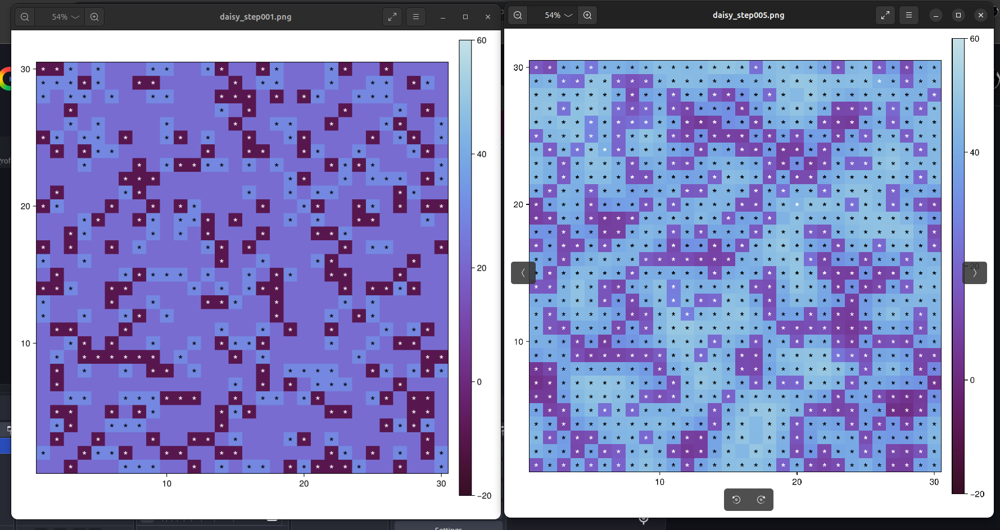
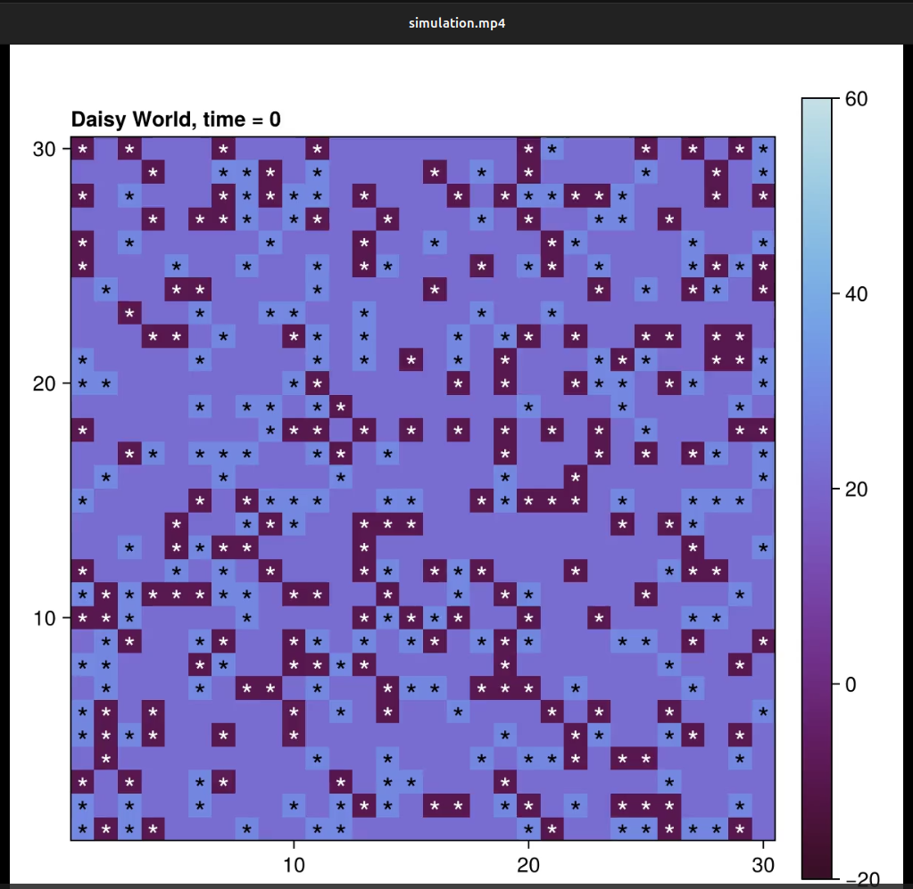
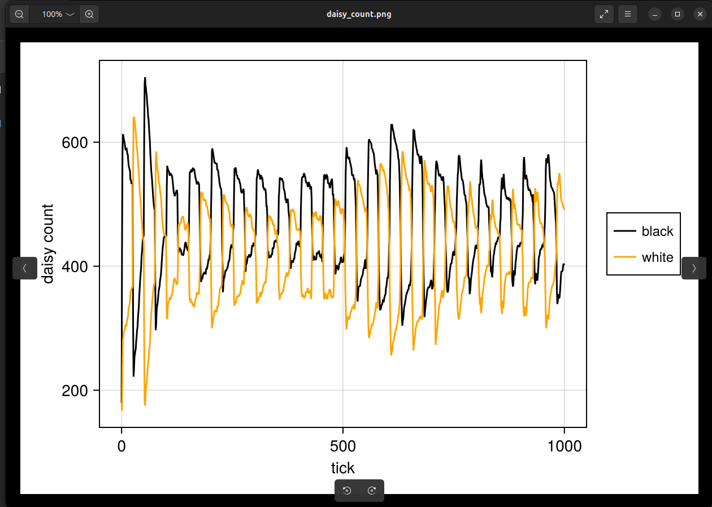
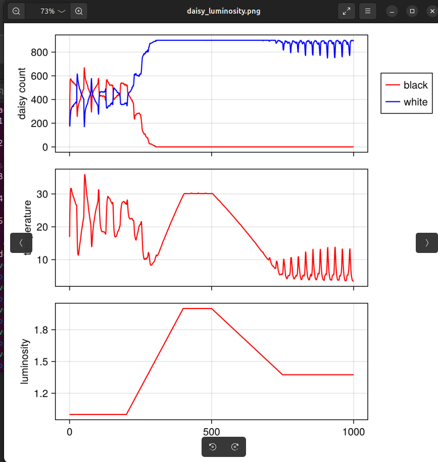
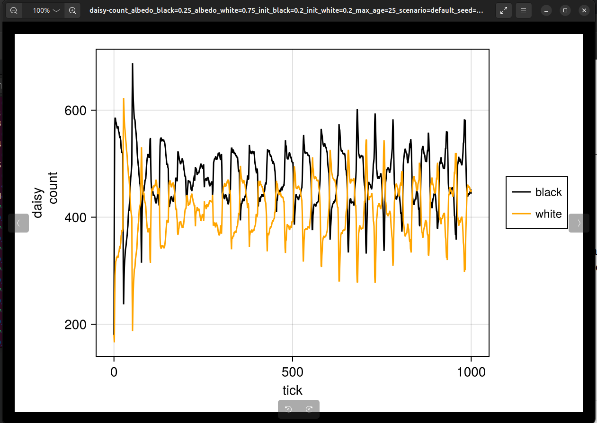
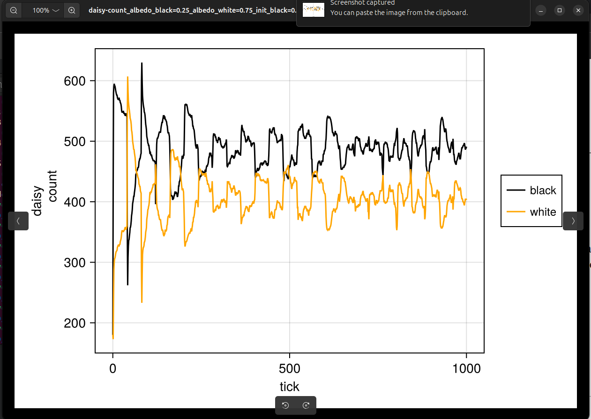
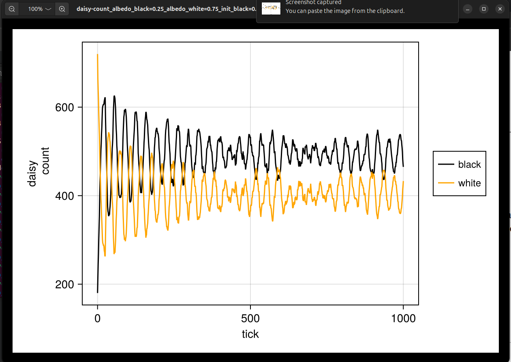
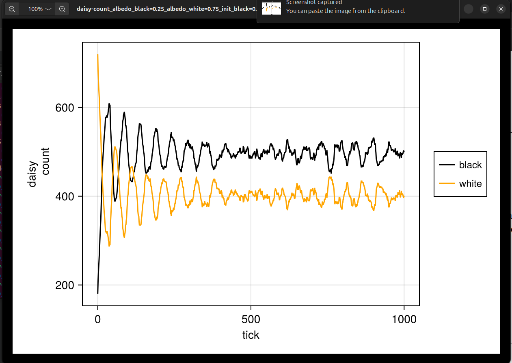
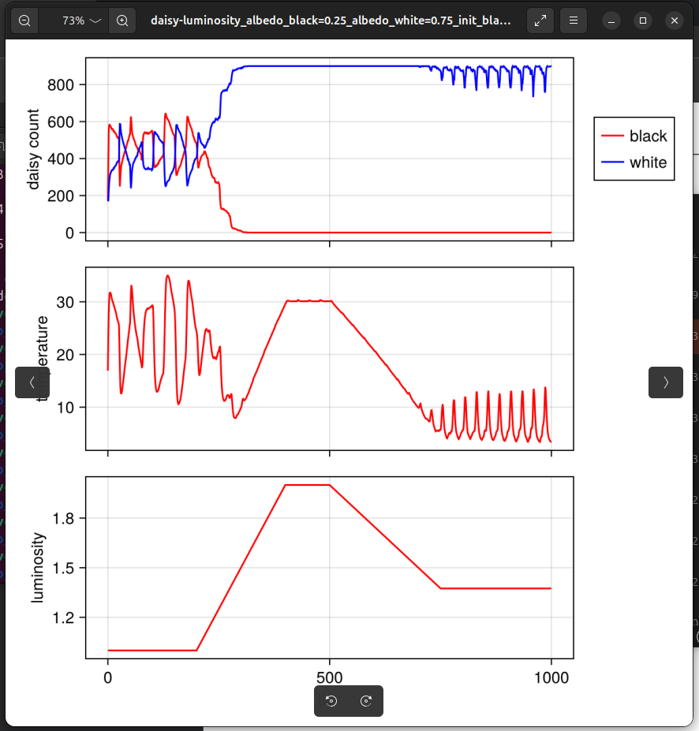

---
## Author
author:
  name: Ведьмина Александра Сергеевна
  degrees: student
  email: 1132236003@rudn.ru
  affiliation:
    - name: Российский университет дружбы народов
      country: Российская Федерация
      postal-code: 117198
      city: Москва
      address: ул. Миклухо-Маклая, д. 6
## Title
title: Лабораторная работа №3
subtitle: Имитационное моделирование
license: CC BY
date: today
date-format: "YYYY-MM-DD"
format:
  beamer:
    incremental: false
  revealjs:
    incremental: false
---

# Информация

## Докладчик

:::::::::::::: {.columns align=center}
::: {.column width="70%"}

  * Ведьмина Александра Сергеевна
  * студент
  * Российский университет дружбы народов
  * [1132236003@rudn.ru](mailto:1132236003@rudn.ru)

:::
::: {.column width="30%"}

:::
::::::::::::::

# Вводная часть

## Цель работы

Изучить **агентный подход** к имитационному моделированию и реализовать
модель **Daisyworld** с помощью **Agents.jl**:

- создать агентную модель саморегулирующейся экосистемы;
- построить визуализации и анимацию;
- провести анализ чувствительности к параметрам;
- преобразовать код в литературный стиль (Literate.jl).

## Задачи

- Создать проект DrWatson `lab_03_daisyworld`
- Реализовать и запустить модель Daisyworld
- Создать визуализации: тепловые карты, анимацию, графики динамики
- Провести анализ чувствительности к параметрам
- Преобразовать код в литературный стиль
- Сгенерировать производные форматы: `.jl`, `.ipynb`, `.qmd`
- Выполнить Jupyter notebooks
- Интегрировать Quarto-документацию в отчёт

## Агентное моделирование

:::::::::::::: {.columns}
::: {.column width="50%"}

**Три элемента ABM:**

- Агенты (свойства + правила)
- Среда (сетка, граф, пространство)
- Взаимодействия (локальные, глобальные)

:::
::: {.column width="50%"}

**Принципы:**

- Эмерджентность
- Автономия
- Гетерогенность
- Локальность

:::
::::::::::::::

## Модель Daisyworld

- Предложена Лавлоком и Уотсоном (1983)
- Иллюстрирует **гипотезу Геи** --- планета как саморегулирующаяся система
- Агенты: чёрные и белые маргаритки на сетке $30 \times 30$
- Чёрные: альбедо $= 0.25$ (нагревают среду)
- Белые: альбедо $= 0.75$ (охлаждают среду)
- Обратная связь через температуру $\to$ саморегуляция

## Параметры модели

| Параметр | Значение | Смысл |
|----------|----------|-------|
| `albedo_black` | 0.25 | альбедо чёрных |
| `albedo_white` | 0.75 | альбедо белых |
| `surface_albedo` | 0.4 | альбедо почвы |
| `max_age` | 25 | макс. возраст |
| `init_white` | 0.2 | начальная доля белых |
| `init_black` | 0.2 | начальная доля чёрных |

# Выполнение лабораторной работы

## Создание проекта DrWatson

## Установка пакетов

## Тепловые карты: шаги 1 и 5

:::::::::::::: {.columns}
::: {.column width="60%"}

:::
::: {.column width="40%"}

- **Шаг 1**: маргаритки равномерно рассеяны (по 20%), температура однородная ($\sim 20$--$30\,°$С)
- **Шаг 5**: начало кластеризации; чёрные создают «горячие пятна» ($T > 30\,°$С), белые --- «холодные зоны» ($T < 15\,°$С)

:::
::::::::::::::

## Тепловая карта: шаг 40

:::::::::::::: {.columns}
::: {.column width="50%"}

:::
::: {.column width="50%"}

- Маргаритки заселили $\sim 900$ из $900$ клеток
- Мозаичная структура из кластеров одного цвета
- Температурный контраст: $0$--$50\,°$С
- Пространственная сегрегация --- результат локального размножения

:::
::::::::::::::

## Анимация модели

:::::::::::::: {.columns}
::: {.column width="50%"}

:::
::: {.column width="50%"}

- Видео `simulation.mp4` --- 60 кадров эволюции модели
- Заселение сетки, формирование кластеров, конкуренция за пространство
- Начальный кадр: случайное равномерное распределение

:::
::::::::::::::

## Динамика числа маргариток

:::::::::::::: {.columns}
::: {.column width="60%"}

:::
::: {.column width="40%"}

- Быстрый рост от 180 до $\sim 700$ ($t < 50$)
- Стационарный режим: чёрные $\sim 500$, белые $\sim 400$
- Колебания антикоррелированы (амплитуда $\sim 200$)
- Суммарно $\sim 850$--$900$ (ёмкость сетки)
- Саморегуляция: ни одна популяция не вымирает

:::
::::::::::::::

## Динамика при изменении светимости (ramp)

:::::::::::::: {.columns}
::: {.column width="55%"}

:::
::: {.column width="45%"}

- **Верх**: при $L > 1.5$ чёрные вымирают (перегрев), белые $\to 850$
- **Середина**: пик $T = 30\,°$С, затем охлаждение до $8\,°$С белыми
- **Низ**: $L = 1.0 \to 1.95 \to 1.3$
- **Гистерезис**: при снижении $L$ чёрные не восстанавливаются
- Демонстрация **саморегуляции** через обратную связь

:::
::::::::::::::

# Анализ чувствительности

## Параметры эксперимента

- `max_age` $\in \{25, 40\}$, `init_white` $\in \{0.2, 0.8\}$
- Итого $2 \times 2 = 4$ комбинации (DrWatson `dict_list`)

## Динамика: `max_age=25`, `init_white=0.2` (базовый)

:::::::::::::: {.columns}
::: {.column width="60%"}

:::
::: {.column width="40%"}

- Чёрные $\sim 500$, белые $\sim 400$
- Амплитуда колебаний $\sim 200$
- Переходный период $\sim 50$ тиков
- Эталонный случай для сравнения

:::
::::::::::::::

## Динамика: `max_age=40`, `init_white=0.2`

:::::::::::::: {.columns}
::: {.column width="60%"}

:::
::: {.column width="40%"}

- Колебания **сглажены**: амплитуда $\sim 100$ (vs $\sim 200$)
- Чёрные стабильнее доминируют: $\sim 480$--$520$
- Маргаритки дольше занимают клетки --- меньше «оборачиваемость»

:::
::::::::::::::

## Динамика: `max_age=25`, `init_white=0.8`

:::::::::::::: {.columns}
::: {.column width="60%"}

:::
::: {.column width="40%"}

- Начальный всплеск белых до $\sim 750$ (из 720)
- К $t \approx 30$: белые $\to 300$, чёрные $\to 600$
- К $t > 100$: тот же аттрактор
- **Робастность**: начальные условия не влияют

:::
::::::::::::::

## Динамика: `max_age=40`, `init_white=0.8`

:::::::::::::: {.columns}
::: {.column width="60%"}

:::
::: {.column width="40%"}

- Плавный переход к равновесию (оба эффекта суммируются)
- Финальный режим неотличим от остальных
- Саморегуляция --- **аттрактор** системы

:::
::::::::::::::

## Ramp: `max_age=25` (базовый) vs `max_age=40`

:::::::::::::: {.columns}
::: {.column width="50%"}

:::
::: {.column width="50%"}

:::
::::::::::::::

- `max_age=40` (справа): чёрные вымирают позже ($t \approx 380$ vs $\sim 350$), пик $T$ выше ($43\,°$С vs $30\,°$С)

## Ramp: `init_white=0.8`

:::::::::::::: {.columns}
::: {.column width="55%"}

:::
::: {.column width="45%"}

- Критическая точка та же ($t \approx 350$)
- Качественно неотличимо от базового
- Гистерезис сохраняется
- `init_white` не влияет на ramp-динамику

:::
::::::::::::::

# Литературное программирование

## Генерация производных форматов

:::::::::::::: {.columns}
::: {.column width="55%"}

:::
::: {.column width="45%"}

**Базовая модель:**

- `daisyworld_clean.jl`
- `daisyworld.ipynb`
- `daisyworld.qmd`

**С параметрами:**

- `daisyworld_param_clean.jl`
- `daisyworld_param.ipynb`
- `daisyworld_param.qmd`

:::
::::::::::::::

## Выполнение Jupyter Notebooks

:::::::::::::: {.columns}
::: {.column width="60%"}

:::
::: {.column width="40%"}

- `daisyworld.ipynb` --- 1676 bytes
- `daisyworld_param.ipynb` --- 9162 bytes
- Оба выполнены успешно через `jupyter nbconvert --execute`

:::
::::::::::::::

## Ссылки на артефакты

- [Quarto-документация базовой модели](../lab_03_models/docs/daisyworld.qmd)
- [Quarto-документация параметрического исследования](../lab_03_models/docs/daisyworld_param.qmd)
- [Jupyter notebook базовой модели](../lab_03_models/notebooks/daisyworld.ipynb)
- [Jupyter notebook параметрического исследования](../lab_03_models/notebooks/daisyworld_param.ipynb)
- [Видео анимации модели](../lab_03_models/plots/simulation.mp4)

## Основные источники

- Watson A. J., Lovelock J. E. Biological homeostasis of the global environment: the parable of Daisyworld. Tellus B, 1983.
- Bonabeau E. Agent-based modeling: Methods and techniques for simulating human systems. PNAS, 2002.
- Macal C. M., North M. J. Tutorial on agent-based modeling and simulation. Journal of Simulation, 2010.
- Agents.jl Documentation.
- DrWatson.jl Documentation.

# Результаты

## Выводы

- Создан проект DrWatson `lab_03_daisyworld` с Agents.jl v7.0.0
- Реализована агентная модель Daisyworld на сетке $30 \times 30$
- Построены тепловые карты, анимация, графики динамики
- При ramp-сценарии: саморегуляция температуры через обратную связь
- Анализ чувствительности: `max_age` $\uparrow$ $\to$ сглаживание; `init_white` не влияет
- Код преобразован в литературный стиль (Literate.jl)
- Сгенерированы `.jl`, `.ipynb`, `.qmd`; ноутбуки выполнены
- Quarto-документация интегрирована в отчёт
