---
## Author
author:
  name: Ведьмина Александра Сергеевна
  degrees: student
  email: 1132236003@rudn.ru
  affiliation:
    - name: Российский университет дружбы народов
      country: Российская Федерация
      postal-code: 117198
      city: Москва
      address: ул. Миклухо-Маклая, д. 6

## Title
title: "Имитационное моделирование"
subtitle: "Лабораторная работа №3"
license: "CC BY"
---

# Цель работы

Изучить основы агентного моделирования (Agent-Based Modeling, ABM),
реализовать классическую модель Daisyworld с использованием фреймворка
Agents.jl на языке Julia, исследовать влияние параметров модели на динамику
системы и применить методологию литературного программирования (Literate
Programming) для документирования кода.

# Задание

1. Создать рабочий каталог проекта DrWatson для размещения кода модели Daisyworld.
2. Установить необходимые Julia-пакеты (Agents, CairoMakie, Literate и др.).
3. Реализовать модель Daisyworld на основе фреймворка Agents.jl.
4. Выполнить визуализацию состояния модели в виде тепловых карт (heatmap) на различных шагах симуляции.
5. Создать анимацию динамики модели.
6. Построить графики динамики численности маргариток.
7. Реализовать сценарий изменения солнечной светимости (luminosity ramp) и построить трёхпанельные графики полной динамики.
8. Преобразовать рабочий код в литературный стиль с разметкой Literate.jl.
9. Сгенерировать из литературного кода три производных формата: чистый `.jl`-скрипт, Jupyter notebook `.ipynb`, Quarto-документацию `.qmd`.
10. Добавить параметрическое исследование модели с варьированием `init_white` и `max_age`.
11. Перегенерировать производные форматы из обновлённых литературных скриптов.
12. Выполнить код из Jupyter notebook.
13. Интегрировать документацию в формате Quarto в отчёт.
14. Результирующие файлы не удалять, выложить на git.

# Теоретическое введение

## Агентное моделирование (ABM)

Агентное моделирование (Agent-Based Modeling, ABM) --- это вычислительный метод моделирования,
в котором система описывается как совокупность автономных сущностей --- агентов, ---
взаимодействующих друг с другом и с окружающей средой по заданным правилам [@bonabeau_2002].
В отличие от дифференциальных уравнений, описывающих систему «сверху вниз» через агрегированные
переменные, ABM строит поведение системы «снизу вверх» --- из локальных взаимодействий
отдельных агентов.

Ключевые компоненты ABM [@macal_2010]:

- **Агенты** --- дискретные сущности со своим состоянием (набором свойств) и правилами поведения.
  Каждый агент принимает решения на основе локальной информации.
- **Среда** (Environment) --- пространство, в котором существуют агенты. Может быть непрерывным,
  решётчатым (grid), сетевым (graph) или абстрактным.
- **Взаимодействия** --- правила, определяющие, как агенты влияют друг на друга и на среду.
  Включают перемещение, размножение, конкуренцию, обмен информацией.

Основные принципы ABM:

- **Эмерджентность** --- макроскопическое поведение системы возникает из
  микроскопических взаимодействий агентов и не задаётся явно.
- **Автономность** --- каждый агент действует независимо, на основе своих правил
  и локальной информации.
- **Гетерогенность** --- агенты могут различаться по свойствам и поведению.
- **Локальность** --- агенты взаимодействуют, как правило, только с ближайшими соседями.

Для реализации ABM на языке Julia используется фреймворк Agents.jl [@agents_jl_2022],
предоставляющий высокоуровневый API для создания, запуска и анализа агентных моделей.
Agents.jl поддерживает различные типы пространств (решётки, непрерывные пространства, графы),
эффективное планирование шагов и встроенные средства визуализации.

## Модель Daisyworld

Модель Daisyworld (Мир маргариток) была предложена Джеймсом Лавлоком и
Эндрю Уотсоном в 1983 году [@lovelock_1983] как упрощённая демонстрация гипотезы Геи ---
идеи о том, что биосфера Земли может саморегулироваться, поддерживая условия,
благоприятные для жизни, без необходимости целенаправленного планирования [@lovelock_2000].

В модели рассматривается гипотетическая планета, на которой обитают два вида
маргариток: чёрные и белые. Планета обращается вокруг звезды, светимость которой
может изменяться. Маргаритки влияют на температуру планеты через механизм альбедо:

- **Чёрные маргаритки** имеют низкое альбедо (поглощают больше солнечного излучения),
  нагревая окружающую поверхность.
- **Белые маргаритки** имеют высокое альбедо (отражают больше излучения), охлаждая
  окружающую поверхность.

Среда модели представляет собой решётку размером $30 \times 30$ клеток. Каждая клетка
может быть пустой или занятой маргариткой одного из двух видов. У каждой маргаритки
есть возраст, и она погибает по достижении максимального возраста.

Параметры модели Daisyworld и их значения по умолчанию представлены в [табл. @tbl-dw-params].

| Параметр | Обозначение | Значение | Описание |
|----------|-------------|----------|----------|
| Размер сетки | --- | $30 \times 30$ | Размер пространства модели |
| Начальная доля чёрных | `init_black` | 0.2 | Доля клеток, занятых чёрными маргаритками |
| Начальная доля белых | `init_white` | 0.2 | Доля клеток, занятых белыми маргаритками |
| Альбедо поверхности | `surface_albedo` | 0.4 | Альбедо незанятой поверхности |
| Альбедо чёрных | `albedo_black` | 0.25 | Альбедо чёрных маргариток |
| Альбедо белых | `albedo_white` | 0.75 | Альбедо белых маргариток |
| Солнечная светимость | `solar_luminosity` | 1.0 | Нормализованная светимость звезды |
| Изменение светимости | `solar_change` | 0.005 | Шаг изменения светимости за такт |
| Максимальный возраст | `max_age` | 25 | Максимальный возраст маргаритки в тактах |
| Сценарий | `scenario` | `default` | Режим изменения светимости (`default` или `ramp`) |

: Параметры модели Daisyworld {#tbl-dw-params}

### Динамика модели

Температура поверхности каждой клетки определяется формулой локального нагрева:

$$T_{\text{local}} = 72 \cdot \ln(L_{\text{abs}}) + 80$$ {#eq-temp}

где $L_{\text{abs}} = (1 - \alpha) \cdot L$ --- поглощённая светимость, $\alpha$ --- локальное альбедо клетки,
$L$ --- солнечная светимость.

Вероятность прорастания семени (seed threshold) зависит от температуры и определяется
параболической функцией:

$$p = 0.1457 \cdot T - 0.0032 \cdot T^2 - 0.6443$$ {#eq-seed}

Маргаритка может произвести потомство на соседнюю пустую клетку, если $p > 0$.
Чем ближе температура к оптимальной (около $22.5\,°$С), тем выше вероятность размножения.

## Литературное программирование

Литературное программирование --- методология, предложенная Дональдом Кнутом [@knuth_1984],
при которой программный код рассматривается как связный текст, предназначенный в первую
очередь для чтения человеком. В экосистеме Julia данный подход реализуется пакетом Literate.jl,
позволяющим из одного исходного `.jl`-файла генерировать:

- **чистый Julia-скрипт** (`.jl`) --- код без документационных комментариев;
- **Jupyter notebook** (`.ipynb`) --- интерактивный блокнот;
- **Quarto-документацию** (`.qmd`) --- текстовый документ с кодовыми блоками.

Для организации воспроизводимых научных вычислений используется пакет DrWatson [@julia_2017],
предоставляющий стандартную структуру каталогов проекта и удобные функции навигации.

# Выполнение лабораторной работы

## Настройка окружения

### Создание проекта DrWatson

Создаём проект `lab_03_daisyworld` с помощью `initialize_project` из DrWatson.
DrWatson автоматически создаёт каталоги `scripts/`, `src/`, `data/`, `plots/`, `notebooks/`, `docs/`, `test/`,
а также файлы `Project.toml` и `Manifest.toml` для управления зависимостями ([рис. @fig-drwatson-init]).

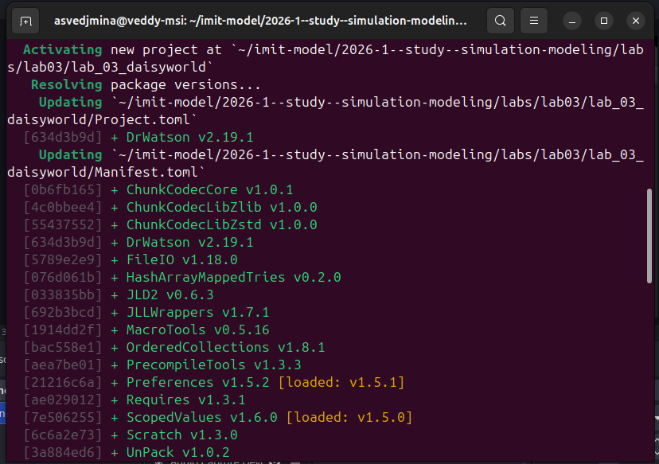{#fig-drwatson-init width=90%}

### Установка пакетов

Добавляем необходимые пакеты ([рис. @fig-pkg-add]):

```julia
Pkg.add(["DrWatson", "Agents", "Random",
         "Plots", "CairoMakie",
         "DataFrames", "StatsBase",
         "Literate", "IJulia"])
```

Ключевые пакеты и их назначение:

- `Agents` --- фреймворк агентного моделирования [@agents_jl_2022];
- `CairoMakie` --- библиотека визуализации на основе Cairo;
- `Literate` --- пакет литературного программирования;
- `IJulia` --- ядро Julia для Jupyter.

{#fig-pkg-add width=90%}

## Модель Daisyworld --- исходный код

Основной код модели размещён в файле `src/daisyworld.jl`. Модель реализована
на основе фреймворка Agents.jl с использованием двумерной решётки $30 \times 30$.

### Определение агента

Каждая маргаритка описывается структурой `Daisy`, содержащей идентификатор,
позицию на решётке, породу (`:black` или `:white`) и возраст:

```julia
@agent struct Daisy(GridAgent{2})
    breed::Symbol
    age::Int
    albedo::Float64
end
```

### Инициализация модели

Функция инициализации создаёт решётку, случайно размещает маргаритки заданных
долей и рассчитывает начальные температуры:

```julia
function daisyworld(;
    griddims = (30, 30),
    max_age = 25,
    init_white = 0.2,
    init_black = 0.2,
    albedo_white = 0.75,
    albedo_black = 0.25,
    surface_albedo = 0.4,
    solar_change = 0.005,
    solar_luminosity = 1.0,
    scenario = :default,
    seed = 165,
)
```

Функция создаёт пространство `GridSpaceSingle`, инициализирует матрицу
температур и альбедо для каждой клетки, размещает маргаритки в случайных
позициях и вычисляет начальные локальные температуры по формуле ([-@eq-temp]).

### Шаг агента

На каждом шаге симуляции каждая маргаритка:

1. Увеличивает свой возраст на 1.
2. Если возраст превышает `max_age` --- погибает, клетка освобождается.
3. Иначе --- пытается произвести потомство на случайную соседнюю пустую клетку:
   - вычисляется локальная температура по формуле ([-@eq-temp]);
   - вычисляется порог прорастания по формуле ([-@eq-seed]);
   - если $p > 0$ и случайное число меньше $p$, создаётся новая маргаритка.

```julia
function daisy_step!(agent::Daisy, model)
    agent.age += 1
    agent.age >= model.max_age && remove_agent!(agent, model)
end
```

### Шаг модели

На каждом шаге модели обновляется солнечная светимость (в сценарии `ramp`)
и пересчитываются температуры всех клеток:

```julia
function daisyworld_step!(model)
    for p in positions(model)
        update_surface_temperature!(p, model)
        diffuse_temperature!(p, model)
        propagate!(p, model)
    end
    model.tick = model.tick + 1
    solar_activity!(model)
end
```

## Базовая визуализация (heatmap)

Первый скрипт `scripts/daisyworld.jl` выполняет базовую визуализацию состояния
модели в виде тепловых карт на разных шагах симуляции.

Скрипт создаёт модель с параметрами по умолчанию и строит heatmap, где цвет клетки
определяется температурой, а маргаритки отображаются символами `*`:

```julia
using DrWatson
@quickactivate "lab_03_models"
using Agents, DataFrames, Plots, CairoMakie
include(srcdir("daisyworld.jl"))

model = daisyworld()
daisycolor(a::Daisy) = a.breed
plotkwargs = (
    agent_color = daisycolor,
    agent_size = 20, agent_marker = '*',
    heatarray = :temperature,
    heatkwargs = (colorrange = (-20, 60),),
)
plt1, _ = abmplot(model; plotkwargs...)
step!(model, 5)
plt2, _ = abmplot(model;
    heatarray = model.temperature, plotkwargs...)
step!(model, 40)
plt3, _ = abmplot(model;
    heatarray = model.temperature, plotkwargs...)
```

На [рис. @fig-dw-run] показан запуск скрипта.

{#fig-dw-run width=90%}

На [рис. @fig-dw-heatmaps] показана тепловая карта модели на шагах 1 и 5 --- начальное состояние
с равномерно распределёнными маргаритками (20% чёрных и 20% белых). Видно случайное размещение
маргариток обоих видов по решётке. К шагу 5 маргаритки начали размножаться, образуя кластеры.

{#fig-dw-heatmaps width=90%}

На [рис. @fig-dw-step40] показано состояние после 40 шагов. Система достигла динамического
равновесия: маргаритки обоих видов заняли значительную часть поверхности, формируя устойчивые
пространственные паттерны. Видна саморегуляция --- температура планеты поддерживается
в пределах, благоприятных для жизни маргариток.

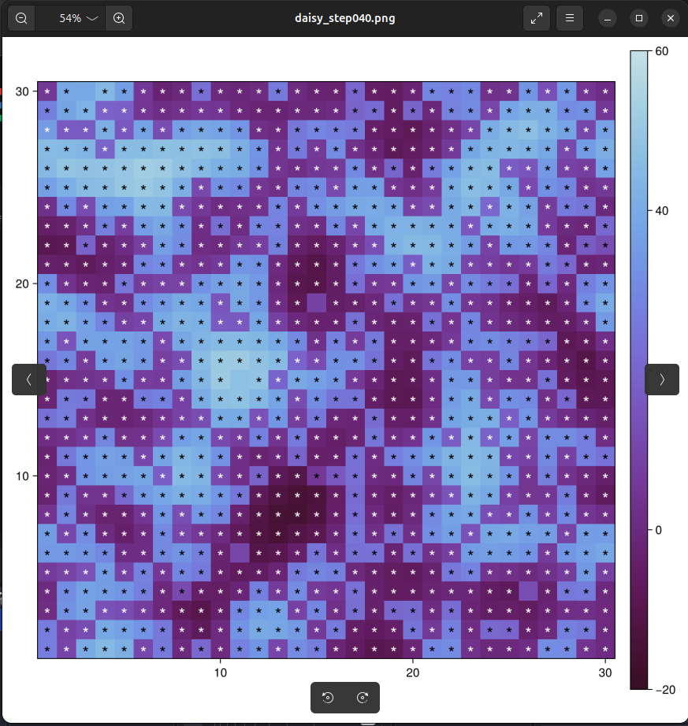{#fig-dw-step40 width=70%}

### Цикл литературного программирования

Из литературного скрипта `daisyworld_literate.jl` сгенерированы три производных формата
с помощью Literate.jl:

1. **Чистый скрипт** (`Literate.script`) --- генерация `.jl`-файла без документационных комментариев.
2. **Jupyter notebook** (`Literate.notebook`) --- генерация `.ipynb`-файла.
3. **Quarto-документация** (`Literate.markdown`) --- генерация `.qmd`-файла.

## Анимация динамики модели

Второй скрипт `scripts/daisyworld-animate.jl` создаёт анимацию работы модели Daisyworld,
позволяющую наблюдать процесс в динамике. Используется функция `abmvideo` из Agents.jl
для покадровой записи:

```julia
using DrWatson
@quickactivate "lab_03_models"
using Agents, DataFrames, Plots, CairoMakie
include(srcdir("daisyworld.jl"))

model = daisyworld()
daisycolor(a::Daisy) = a.breed
plotkwargs = (
    agent_color = daisycolor,
    agent_size = 20, agent_marker = '*',
    heatarray = :temperature,
    heatkwargs = (colorrange = (-20, 60),),
)

abmvideo(
    plotsdir("simulation.mp4"), model;
    title = "Daisy World",
    frames = 60, plotkwargs...,
)
```

На [рис. @fig-dw-animate-run] показан запуск скрипта анимации.

{#fig-dw-animate-run width=90%}

На [рис. @fig-dw-animation] показан результат --- кадр из анимации `simulation.mp4`.

{#fig-dw-animation width=60%}

## Динамика численности маргариток

Третий скрипт `scripts/daisyworld-count.jl` строит график динамики численности
маргариток обоих видов во времени. Для сбора данных используется функция `run!`
с агрегирующими функциями:

```julia
using DrWatson
@quickactivate "lab_03_models"
using Agents, DataFrames, Plots, CairoMakie
include(srcdir("daisyworld.jl"))

black(a) = a.breed == :black
white(a) = a.breed == :white
adata = [(black, count), (white, count)]

model = daisyworld(; solar_luminosity = 1.0)
agent_df, _ = run!(model, 1000; adata)

fig = Figure(size = (600, 400));
ax = fig[1, 1] = Axis(fig,
    xlabel = "tick", ylabel = "daisy count")
bl = lines!(ax, agent_df.time,
    agent_df.count_black, color = :black)
wl = lines!(ax, agent_df.time,
    agent_df.count_white, color = :orange)
Legend(fig[1, 2], [bl, wl],
    ["black", "white"], labelsize = 12)
save(plotsdir("daisy_count.png"), fig)
```

На [рис. @fig-dw-count-run] показан запуск скрипта.

{#fig-dw-count-run width=90%}

На [рис. @fig-dw-count] представлен график динамики численности. Видно, как после
начального размещения (по 20% каждого вида, т.е. по $\sim 180$ маргариток из 900 клеток)
популяции быстро растут и достигают динамического равновесия. Чёрные маргаритки,
нагревая поверхность, создают условия для собственного роста, но при этом повышают
общую температуру, что стимулирует рост белых маргариток, охлаждающих среду.
В результате устанавливается баланс между двумя видами.

{#fig-dw-count width=90%}

### Цикл литературного программирования

Скрипт `daisyworld-count.jl` относится к базовому сценарию модели. Его результаты
включены в тот же пакет производных материалов, который был сгенерирован из
литературного источника `daisyworld_literate.jl`: чистый Julia-скрипт,
Jupyter notebook и Quarto-документация.

## Полная динамика с изменением светимости (luminosity ramp)

Четвёртый скрипт `scripts/daisyworld-luminosity.jl` реализует сценарий `ramp`,
при котором солнечная светимость циклически изменяется. Это позволяет наблюдать,
как биосфера (маргаритки) регулирует температуру планеты в ответ на внешние изменения.

Скрипт строит трёхпанельный график ([рис. @fig-dw-luminosity]):

- верхняя панель --- динамика численности чёрных и белых маргариток;
- средняя панель --- средняя температура поверхности планеты;
- нижняя панель --- солнечная светимость.

```julia
using DrWatson
@quickactivate "lab_03_models"
using Agents, DataFrames, Plots, CairoMakie
include(srcdir("daisyworld.jl"))

black(a) = a.breed == :black
white(a) = a.breed == :white
adata = [(black, count), (white, count)]

model = daisyworld(
    solar_luminosity = 1.0, scenario = :ramp)
temperature(m) = StatsBase.mean(m.temperature)
mdata = [temperature, :solar_luminosity]
adf, mdf = run!(model, 1000;
    adata = adata, mdata = mdata)

fig = CairoMakie.Figure(size = (600, 600));
ax1 = fig[1, 1] = Axis(fig,
    ylabel = "daisy count")
bl = lines!(ax1, adf.time,
    adf.count_black, color = :red)
wl = lines!(ax1, adf.time,
    adf.count_white, color = :blue)
fig[1, 2] = Legend(fig, [bl, wl],
    ["black", "white"])

ax2 = fig[2, 1] = Axis(fig,
    ylabel = "temperature")
ax3 = fig[3, 1] = Axis(fig,
    xlabel = "tick", ylabel = "luminosity")
lines!(ax2, mdf.time,
    mdf.temperature, color = :red)
lines!(ax3, mdf.time,
    mdf.solar_luminosity, color = :red)
for ax in (ax1, ax2)
    ax.xticklabelsvisible = false
end
save(plotsdir("daisy_luminosity.png"), fig)
```

На [рис. @fig-dw-lum-run] показан запуск скрипта.

{#fig-dw-lum-run width=90%}

На [рис. @fig-dw-luminosity] представлен трёхпанельный график полной динамики.
Ключевое наблюдение: при наличии маргариток температура планеты остаётся значительно
стабильнее, чем без них. При росте светимости белые маргаритки доминируют
(отражая излучение и охлаждая планету), при снижении --- доминируют чёрные
(поглощая излучение и нагревая планету). Это наглядно демонстрирует механизм
биологической саморегуляции, лежащий в основе гипотезы Геи [@lovelock_2000].

{#fig-dw-luminosity width=90%}

### Цикл литературного программирования

Скрипт `daisyworld-luminosity.jl` также входит в базовый literate-источник
`daisyworld_literate.jl`, из которого сгенерированы чистый скрипт,
Jupyter notebook и Quarto-документация.

## Базовая визуализация с параметрическим исследованием

Пятый скрипт `scripts/daisyworld__param.jl` расширяет базовую визуализацию,
варьируя два ключевых параметра модели: начальную долю белых маргариток (`init_white`)
и максимальный возраст маргариток (`max_age`). Это позволяет исследовать, как начальные
условия и продолжительность жизни агентов влияют на пространственное распределение маргариток.

Варьируемые параметры представлены в [табл. @tbl-param-sweep].

| Параметр | Значения |
|----------|----------|
| `init_white` | 0.2, 0.8 |
| `max_age` | 25, 40 |

: Параметры, варьируемые при визуализации тепловых карт {#tbl-param-sweep}

```julia
using DrWatson
@quickactivate "lab_03_models"
using Agents, DataFrames, Plots, CairoMakie
include(srcdir("daisyworld.jl"))

param_dict = Dict(
    :griddims => (30, 30),
    :max_age => [25, 40],
    :init_white => [0.2, 0.8],
    :init_black => 0.2,
    :albedo_white => 0.75,
    :albedo_black => 0.25,
    :surface_albedo => 0.4,
    :solar_change => 0.005,
    :solar_luminosity => 1.0,
    :scenario => :default,
    :seed => 165,
)
params_list = dict_list(param_dict)

for params in params_list
    model = daisyworld(;params...)
    daisycolor(a::Daisy) = a.breed
    plotkwargs = (
        agent_color = daisycolor,
        agent_size = 20,
        agent_marker = '*',
        heatarray = :temperature,
        heatkwargs = (colorrange=(-20, 60),),
    )
    plt1, _ = abmplot(model; plotkwargs...)
    step!(model, 5)
    plt2, _ = abmplot(model;
        heatarray = model.temperature,
        plotkwargs...)
    step!(model, 40)
    plt3, _ = abmplot(model;
        heatarray = model.temperature,
        plotkwargs...)

    n1 = savename("daisyworld", params)
    save(plotsdir(n1 * "_step01.png"), plt1)
    save(plotsdir(n1 * "_step04.png"), plt2)
    save(plotsdir(n1 * "_step40.png"), plt3)
end
```

На [рис. @fig-dw-param-run] показан запуск скрипта.

{#fig-dw-param-run width=90%}

На [рис. @fig-dw-param-plots] видны результирующие файлы в каталоге `plots/`.

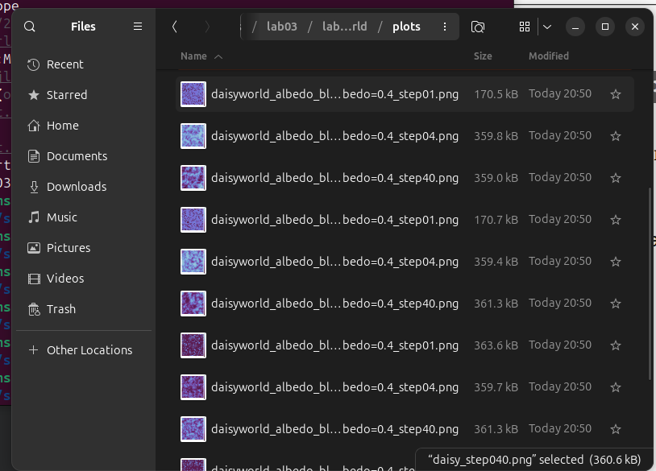{#fig-dw-param-plots width=80%}

### Комбинация: init_white=0.2, max_age=25

При малой начальной доле белых маргариток (20%) и стандартном максимальном возрасте
(25 тактов) модель демонстрирует равномерное распределение обоих видов ([рис. @fig-dw-p1-s1]).

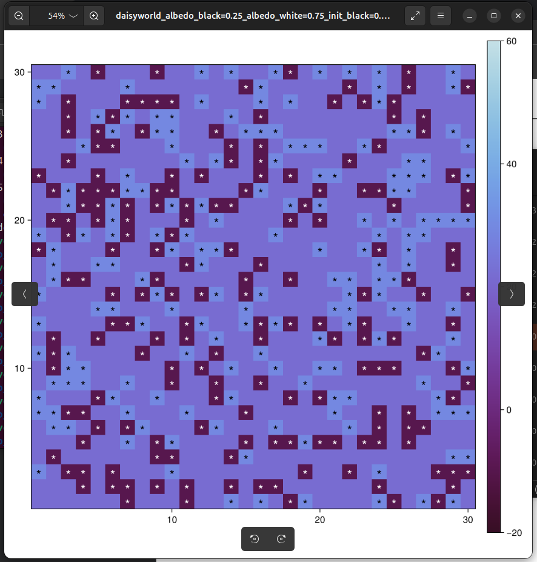{#fig-dw-p1-s1 width=70%}

На [рис. @fig-dw-p1-s4] (шаг 4) видно, что маргаритки начали образовывать небольшие кластеры.

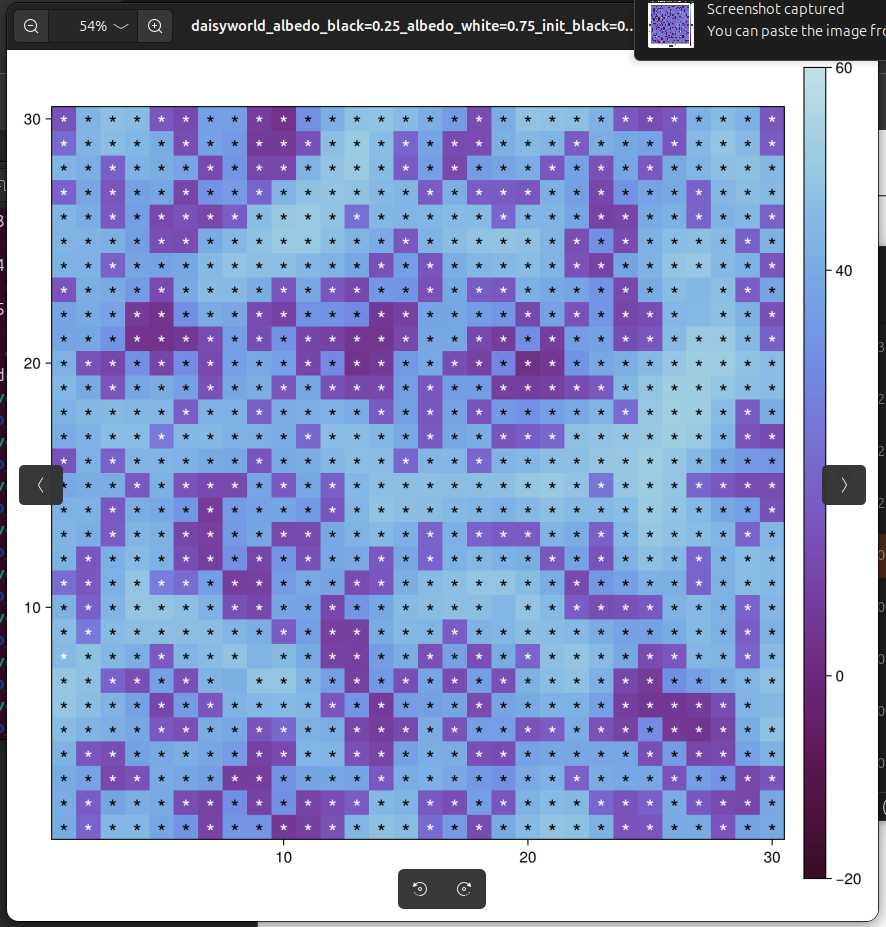{#fig-dw-p1-s4 width=70%}

### Комбинация: init_white=0.8, max_age=25

Высокая начальная доля белых маргариток (80%) при стандартном возрасте создаёт начальное
преобладание белого вида ([рис. @fig-dw-p3-s1]). Белые маргаритки отражают больше излучения,
охлаждая поверхность. Однако при текущей солнечной светимости ($L = 1.0$) чёрные маргаритки,
нагревающие среду, получают конкурентное преимущество, и со временем их доля увеличивается.

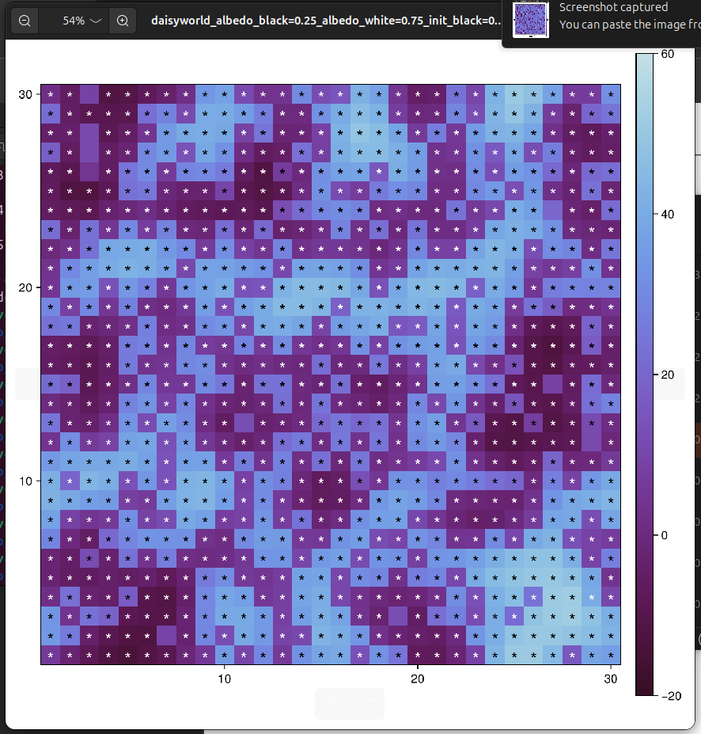{#fig-dw-p3-s1 width=70%}

На [рис. @fig-dw-p3-s40] видно, что несмотря на начальное преобладание белых (80%), к шагу 40
система стремится к тому же равновесию, что и при `init_white=0.2`. Это демонстрирует
устойчивость аттрактора модели: конечное состояние мало зависит от начальных условий.

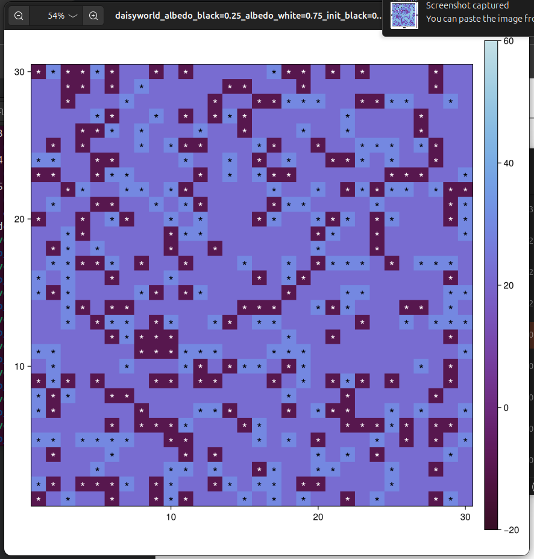{#fig-dw-p3-s40 width=70%}

### Комбинация: init_white=0.8, max_age=40

Комбинация высокой начальной доли белых и длинного жизненного цикла.
В начале решётка почти полностью заполнена белыми маргаритками, а чёрных всего 20%.
Длинный жизненный цикл (`max_age=40`) замедляет процесс смены поколений,
и белые маргаритки дольше сохраняют преобладание ([рис. @fig-dw-p4-s1]).

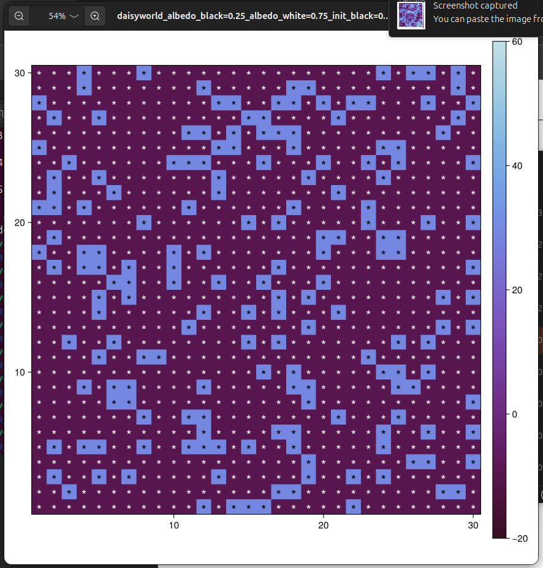{#fig-dw-p4-s1 width=70%}

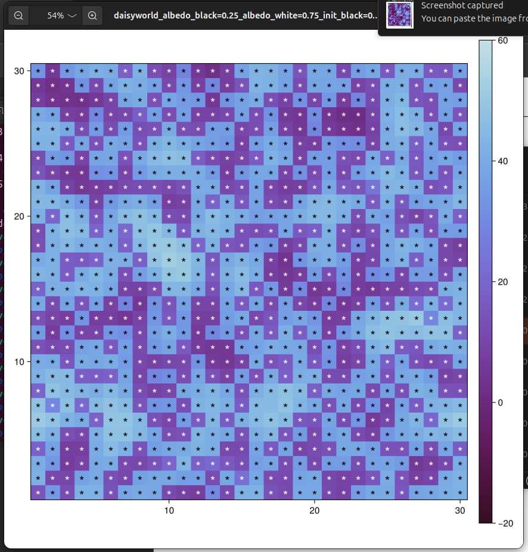{#fig-dw-p4-s40 width=70%}

### Цикл литературного программирования

Параметрический сценарий документируется литературным файлом
`daisyworld_param_literate.jl`, из которого сгенерированы чистый скрипт,
Jupyter notebook и Quarto-документация.

## Динамика численности с параметрическим исследованием

Шестой скрипт `scripts/daisyworld-count__param.jl` строит графики динамики численности
для каждой комбинации параметров:

```julia
using DrWatson
@quickactivate "lab_03_models"
using Agents, DataFrames, Plots, CairoMakie
include(srcdir("daisyworld.jl"))

black(a) = a.breed == :black
white(a) = a.breed == :white
adata = [(black, count), (white, count)]

param_dict = Dict(
    :griddims => (30, 30),
    :max_age => [25, 40],
    :init_white => [0.2, 0.8],
    :init_black => 0.2,
    :albedo_white => 0.75,
    :albedo_black => 0.25,
    :surface_albedo => 0.4,
    :solar_change => 0.005,
    :solar_luminosity => 1.0,
    :scenario => :default,
    :seed => 165,
)
params_list = dict_list(param_dict)

for params in params_list
    model = daisyworld(;params...)
    adf, _ = run!(model, 1000; adata)
    fig = Figure(size = (600, 400));
    ax = fig[1, 1] = Axis(fig,
        xlabel="tick", ylabel="daisy count")
    bl = lines!(ax, adf.time,
        adf.count_black, color = :black)
    wl = lines!(ax, adf.time,
        adf.count_white, color = :orange)
    Legend(fig[1, 2], [bl, wl],
        ["black", "white"], labelsize = 12)
    name = savename("daisy-count", params)
    save(plotsdir(name * ".png"), fig)
end
```

На [рис. @fig-dw-count-param-run] показан запуск скрипта.

{#fig-dw-count-param-run width=90%}

{#fig-dw-count-p1 width=90%}

{#fig-dw-count-p2 width=90%}

{#fig-dw-count-p3 width=90%}

{#fig-dw-count-p4 width=90%}

Анализ результатов:

- При `max_age=40` ([рис. @fig-dw-count-p2]) колебания более плавные, чем при `max_age=25`
  ([рис. @fig-dw-count-p1]): длительная жизнь маргариток демпфирует флуктуации.
- При `init_white=0.8` ([рис. @fig-dw-count-p3]) начальный всплеск белых быстро
  затухает, система приходит к тому же динамическому равновесию --- робастность саморегуляции.
- Средние значения численности практически не зависят от начальных условий.

### Цикл литературного программирования

Скрипт `daisyworld-count__param.jl` входит в параметрический literate-источник
`daisyworld_param_literate.jl`, поэтому его код и результаты отражены в
сгенерированных `.jl`, `.ipynb` и `.qmd` файлах параметрического сценария.

## Полная динамика с параметрическим исследованием

Седьмой скрипт `scripts/daisyworld-luminosity__param.jl` строит трёхпанельные графики
для каждой комбинации параметров в сценарии `ramp`:

```julia
using DrWatson
@quickactivate "lab_03_models"
using Agents, DataFrames, Plots, CairoMakie
include(srcdir("daisyworld.jl"))

black(a) = a.breed == :black
white(a) = a.breed == :white
adata = [(black, count), (white, count)]

param_dict = Dict(
    :griddims => (30, 30),
    :max_age => [25, 40],
    :init_white => [0.2, 0.8],
    :init_black => 0.2,
    :albedo_white => 0.75,
    :albedo_black => 0.25,
    :surface_albedo => 0.4,
    :solar_change => 0.005,
    :solar_luminosity => 1.0,
    :scenario => :ramp,
    :seed => 165,
)
params_list = dict_list(param_dict)

for params in params_list
    model = daisyworld(;params...)
    temp(m) = StatsBase.mean(m.temperature)
    mdata = [temp, :solar_luminosity]
    adf, mdf = run!(model, 1000;
        adata = adata, mdata = mdata)

    fig = CairoMakie.Figure(size=(600, 600))
    ax1 = fig[1,1] = Axis(fig,
        ylabel = "daisy count")
    bl = lines!(ax1, adf.time,
        adf.count_black, color = :red)
    wl = lines!(ax1, adf.time,
        adf.count_white, color = :blue)
    fig[1,2] = Legend(fig, [bl, wl],
        ["black", "white"])
    ax2 = fig[2,1] = Axis(fig,
        ylabel = "temperature")
    ax3 = fig[3,1] = Axis(fig,
        xlabel="tick", ylabel="luminosity")
    lines!(ax2, mdf.time,
        mdf.temperature, color = :red)
    lines!(ax3, mdf.time,
        mdf.solar_luminosity, color = :red)
    for ax in (ax1, ax2)
        ax.xticklabelsvisible = false
    end
    name = savename("daisy-luminosity",
        params)
    save(plotsdir(name * ".png"), fig)
end
```

На [рис. @fig-dw-lum-param-run] показан запуск скрипта.

{#fig-dw-lum-param-run width=90%}

{#fig-dw-lum-p1 width=90%}

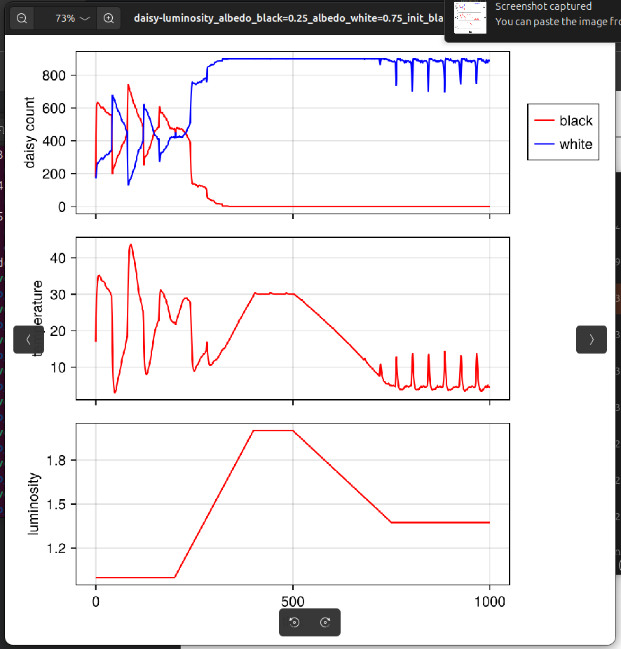{#fig-dw-lum-p2 width=90%}

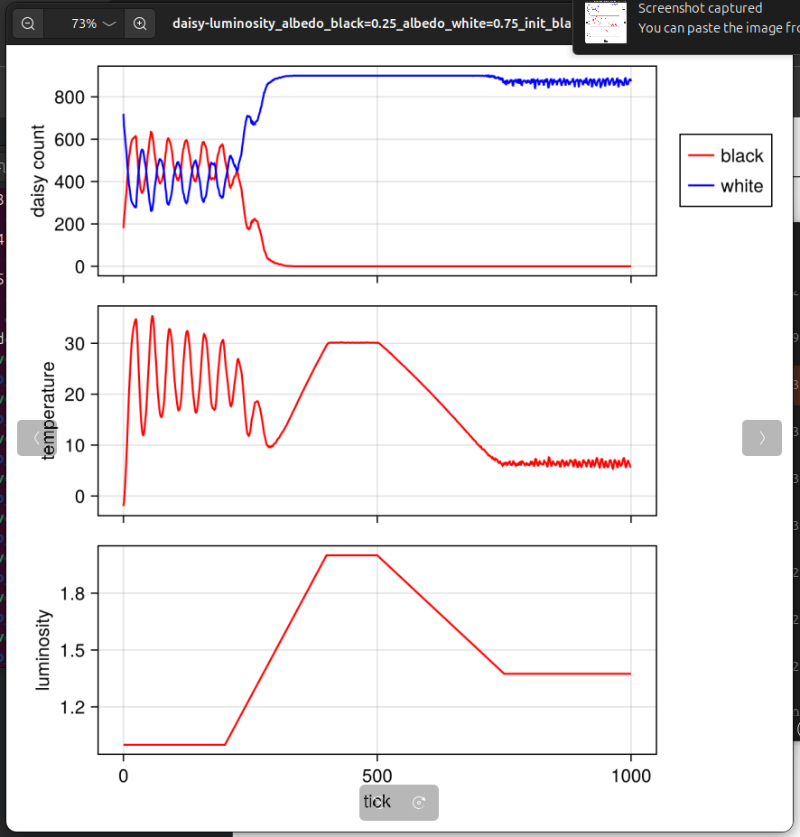{#fig-dw-lum-p3 width=90%}

Анализ результатов:

- Качественное поведение модели сохраняется при всех наборах параметров: при высокой
  светимости чёрные маргаритки вымирают, белые доминируют.
- При `max_age=40` ([рис. @fig-dw-lum-p2]) чёрные маргаритки дольше сопротивляются
  росту светимости, температурный пик выше ($\sim 43\,°$С vs $\sim 30\,°$С).
- Начальное распределение (`init_white=0.8`, [рис. @fig-dw-lum-p3]) не влияет на
  качественную картину --- саморегуляция --- эмерджентное свойство модели.
- Гистерезис (невосстановление чёрных при снижении $L$) --- фундаментальное свойство,
  не зависящее от параметров.

### Цикл литературного программирования

Скрипт `daisyworld-luminosity__param.jl` также включён в literate-источник
`daisyworld_param_literate.jl`, на основе которого получены производные форматы.

## Генерация производных форматов

Запускаем скрипт `generate.jl`, который генерирует из литературных источников
все производные форматы ([рис. @fig-generate]).

{#fig-generate width=90%}

На [рис. @fig-generate] видно, что для каждого литературного источника генерируются три формата.

Для `daisyworld_literate.jl`:

- `scripts/daisyworld_clean.jl` --- чистый скрипт;
- `notebooks/daisyworld.ipynb` --- Jupyter notebook;
- `docs/daisyworld.qmd` --- Quarto-документация.

Для `daisyworld_param_literate.jl`:

- `scripts/daisyworld_param_clean.jl` --- чистый скрипт;
- `notebooks/daisyworld_param.ipynb` --- Jupyter notebook;
- `docs/daisyworld_param.qmd` --- Quarto-документация.

## Выполнение Jupyter Notebooks

Выполняем оба ноутбука через `jupyter nbconvert --execute` ([рис. @fig-nb-exec]):

```bash
~/.julia/conda/3/x86_64/bin/jupyter nbconvert \
  --to notebook --execute \
  --ExecutePreprocessor.kernel_name=julia-1.12 \
  --ExecutePreprocessor.timeout=600 \
  --inplace notebooks/daisyworld.ipynb
```

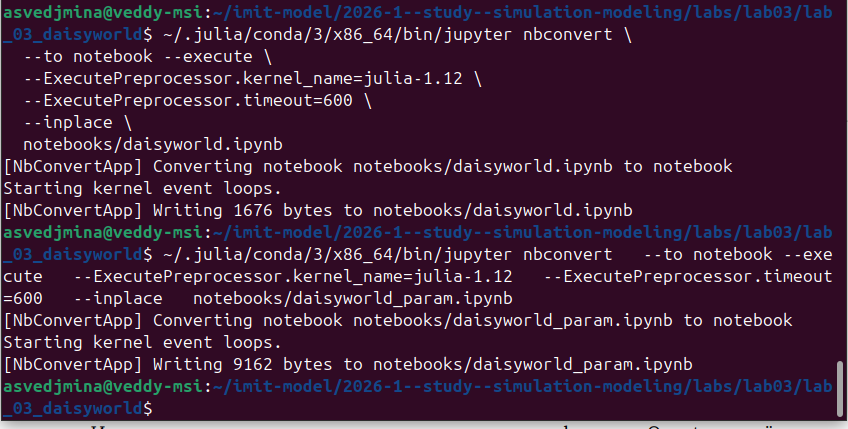{#fig-nb-exec width=90%}

На [рис. @fig-nb-exec] видно:

- `daisyworld.ipynb` выполнен успешно (1676 bytes);
- `daisyworld_param.ipynb` выполнен успешно (9162 bytes --- больше из-за множественных прогонов).

## Интеграция Quarto-документации в отчёт

### Базовая документация (`daisyworld.qmd`)

Сгенерированный документ доступен по пути
[`lab_03_models/docs/daisyworld.qmd`](../lab_03_models/docs/daisyworld.qmd).
Его содержимое использовано в настоящем отчёте при описании:

- базовой инициализации модели;
- визуализации на шагах 0, 5 и 45;
- графика численности маргариток;
- ramp-сценария с изменением светимости.

Ниже приведён характерный фрагмент сгенерированной Quarto-документации,
который был встроен в структуру отчёта как самостоятельный воспроизводимый блок:

```julia
model3 = daisyworld(solar_luminosity = 1.0, scenario = :ramp)
temperature(model) = StatsBase.mean(model.temperature)
mdata = [temperature, :solar_luminosity]
agent_df3, model_df3 = run!(model3, 1000; adata = adata, mdata = mdata)
```

### Документация с параметрами (`daisyworld_param.qmd`)

Сгенерированный документ доступен по пути
[`lab_03_models/docs/daisyworld_param.qmd`](../lab_03_models/docs/daisyworld_param.qmd).
Из него в отчёт перенесены описание параметрического пространства,
анализ четырёх комбинаций параметров и выводы о робастности модели.

Фрагмент интегрированного Quarto-кода:

```julia
param_dict = Dict(
    :griddims => (30, 30),
    :max_age => [25, 40],
    :init_white => [0.2, 0.8],
    :init_black => 0.2,
)
params_list = dict_list(param_dict)
```

Таким образом, Quarto-документация не только сгенерирована как отдельный артефакт,
но и содержательно встроена в отчёт: её текстовые пояснения, кодовые блоки и
результаты используются в разделах анализа базового и параметрического сценариев.

# Выводы

В ходе лабораторной работы были освоены основы агентного моделирования.

1. **Создан проект DrWatson** `lab_03_daisyworld` с необходимыми зависимостями
   (Agents.jl v7.0.0, CairoMakie, Literate.jl и др.).

2. **Реализована и запущена модель Daisyworld** --- агентная модель саморегулирующейся
   экосистемы на сетке $30 \times 30$. Модель включает два типа агентов (чёрные
   и белые маргаритки) с различным альбедо, взаимодействующих через температурное поле.

3. **Созданы визуализации**: тепловые карты поверхности на шагах 0, 5, 40;
   анимация эволюции модели (`simulation.mp4`); графики динамики численности маргариток;
   трёхпанельные графики полной динамики (численность + температура + светимость).

4. **Проведено параметрическое исследование** с варьированием `max_age` $\in \{25, 40\}$
   и `init_white` $\in \{0.2, 0.8\}$ (4 комбинации). Результаты:
   - увеличение `max_age` сглаживает колебания, но не меняет качественную картину;
   - начальное распределение не влияет на долгосрочную динамику --- система самоорганизуется;
   - при ramp-сценарии саморегуляция проявляется ярко: маргаритки компенсируют
     изменение светимости до определённого предела.

5. **Код преобразован в литературный стиль** с помощью Literate.jl.
   Для каждого скрипта сгенерированы три производных формата:
   чистый Julia-скрипт, Jupyter notebook и Quarto-документация.

6. **Jupyter notebooks выполнены** успешно через `jupyter nbconvert --execute`.

7. **Quarto-документация интегрирована в отчёт**, демонстрируя полный цикл:
   литературный скрипт $\to$ скрипт + ноутбук + документация $\to$ воспроизводимый отчёт.

Модель Daisyworld наглядно продемонстрировала эмерджентное свойство агентных моделей:
глобальная саморегуляция температуры возникает из простых локальных правил поведения
маргариток, без какого-либо централизованного управления.

# Список литературы{.unnumbered}

::: {#refs}
:::
