---
## Author
author:
  name: Ведьмина Александра Сергеевна
  degrees: student
  email: 1132236003@rudn.ru
  affiliation:
    - name: Российский университет дружбы народов
      country: Российская Федерация
      postal-code: 117198
      city: Москва
      address: ул. Миклухо-Маклая, д. 6
## Title
title: Лабораторная работа №4
subtitle: Имитационное моделирование
license: CC BY
date: today
date-format: "YYYY-MM-DD"
format:
  beamer:
    incremental: false
  revealjs:
    incremental: false
---

# Информация

## Докладчик

:::::::::::::: {.columns align=center}
::: {.column width="70%"}

  * Ведьмина Александра Сергеевна
  * студент
  * Российский университет дружбы народов
  * [1132236003@rudn.ru](mailto:1132236003@rudn.ru)

:::
::: {.column width="30%"}


:::
::::::::::::::

# Вводная часть

## Цель работы

Изучить агентную реализацию SIR-модели на графе городов и выполнить полный
цикл вычислительного эксперимента:

- организовать проект в структуре DrWatson;
- реализовать модель на Julia и Agents.jl;
- провести основные и дополнительные эксперименты;
- подготовить literate-версии и производные форматы;
- собрать подробный отчёт и презентацию.

## Задачи

- Создать проект `lab_04_models`
- Подготовить зависимости Julia
- Реализовать агентную SIR-модель на графе из трёх городов
- Выполнить базовый, параметрический и сценарный анализ
- Выполнить дополнительные задания: порог, гетерогенность, миграция, карантин, оптимизация
- Сгенерировать `.jl`, `.ipynb`, `.qmd` через `Literate.jl`
- Выполнить Jupyter notebook и интегрировать результаты в документацию

## Теоретическая основа

- Классы модели: `S`, `I`, `R`
- Каждый человек моделируется как отдельный агент
- Пространство: полный граф из трёх городов
- В модели учитываются заражение, миграция, выздоровление, смерть и повторное заражение
- Дополнительно вводятся гетерогенность городов и карантин

## Базовые параметры

| Параметр | Значение | Смысл |
|---|---:|---|
| `Ns` | `[1000, 1000, 1000]` | население трёх городов |
| `beta_und` | `[0.5, 0.5, 0.5]` | заразность до выявления |
| `beta_det` | `[0.05, 0.05, 0.05]` | заразность после выявления |
| `infection_period` | `14` | длительность болезни |
| `detection_time` | `7` | момент снижения заразности |
| `death_rate` | `0.02` | вероятность смерти |
| `reinfection_probability` | `0.1` | повторное заражение |

## Репродуктивное число

$$
R_0 \approx \beta \cdot infection\_period
$$

Для базового сценария:

$$
R_0 \approx 0.5 \cdot 14 = 7.
$$

Вывод:

- базовый режим существенно выше эпидемического порога;
- модель должна демонстрировать сильную вспышку;
- это подтверждается результатами базового эксперимента.

# Подготовка проекта

## Создание проекта DrWatson


## Активация и установка пакетов

:::::::::::::: {.columns}
::: {.column width="45%"}

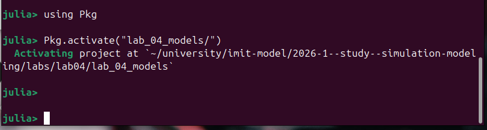

:::
::: {.column width="55%"}


:::
::::::::::::::

## Структура проекта

- `src/sir_model.jl` --- модель и шаг агента
- `src/sir_analysis.jl` --- функции экспериментов, таблицы и графики
- `scripts/` --- запускаемые сценарии и literate-источники
- `docs/` и `notebooks/` --- сгенерированные производные форматы
- `data/` и `plots/` --- численные результаты и визуализации
- `test/runtests.jl` --- проверки корректности

# Ключевые элементы кода

## Агент и инициализация модели

```julia
@agent struct Person(GraphAgent)
    days_infected::Int
    status::Symbol
    home_city::Int
end

function initialize_sir(;
    Ns = [1000, 1000, 1000],
    migration_rates = nothing,
    beta_und = [0.5, 0.5, 0.5],
    beta_det = [0.05, 0.05, 0.05],
    infection_period = 14,
    detection_time = 7,
    death_rate = 0.02,
    reinfection_probability = 0.1,
    Is = [0, 0, 1],
)
```

- пространство задаётся как `GraphSpace(complete_graph(C))`;
- в каждом городе создаётся фиксированное число агентов;
- стартовое заражение задаётся вектором `Is`.

## Шаг агента

```julia
function sir_agent_step!(agent, model)
    migrate!(agent, model)
    agent.status == :I && transmit!(agent, model)
    agent.status == :I && (agent.days_infected += 1)
    recover_or_die!(agent, model)
    return nothing
end
```

- сначала агент может мигрировать;
- затем инфицированный заражает контакты в своём городе;
- после этого обновляется длительность болезни;
- в конце происходит выздоровление или смерть.

## Сценарии, карантин и оптимизация

```julia
function quarantine_experiment(; thresholds = [0.05, 0.10, 0.15, 0.20], ...)
function heterogeneity_experiment(; ...)
function optimize_under_peak_constraint(; peak_limit = 0.30, ...)
```

- `heterogeneity_experiment` сравнивает однородный и неоднородный режимы;
- `quarantine_experiment` закрывает город при превышении порога;
- `optimize_under_peak_constraint` строит Pareto-фронт и отбирает допустимые решения.

Код полностью приведён в приложениях отчёта; в презентации вынесены ключевые
фрагменты логики.

# Основные эксперименты

## Базовый запуск модели

:::::::::::::: {.columns}
::: {.column width="42%"}


:::
::: {.column width="58%"}

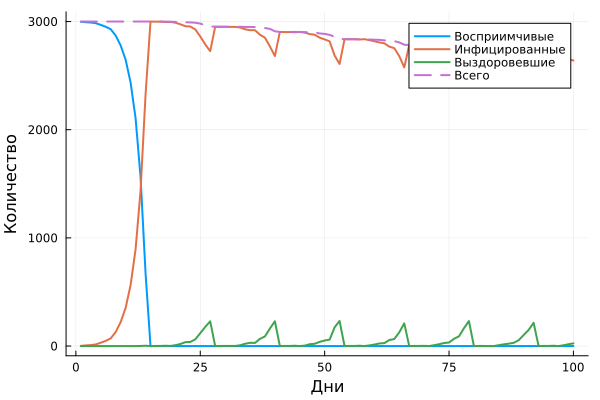

:::
::::::::::::::

- пик инфицированных достигает `3000`;
- время пика `15` дней;
- смертность `335`;
- результат согласуется с `R_0 = 7`.

## Сканирование коэффициента заразности

:::::::::::::: {.columns}
::: {.column width="42%"}


:::
::: {.column width="58%"}

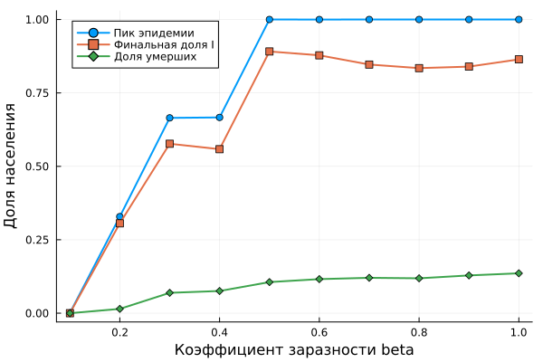

:::
::::::::::::::

- при `beta = 0.1` устойчивой вспышки почти нет;
- около `beta = 0.2` начинается резкий рост пика;
- при больших `beta` эпидемия захватывает почти всю популяцию.

## Таблица результатов сканирования `beta`


CSV-файл `beta_scan_all.csv` фиксирует по каждому запуску:

- значение `beta`;
- номер `seed`;
- пик заражения;
- финальные доли инфицированных и выздоровевших;
- число умерших.

## Исследование миграции

:::::::::::::: {.columns}
::: {.column width="40%"}


:::
::: {.column width="60%"}

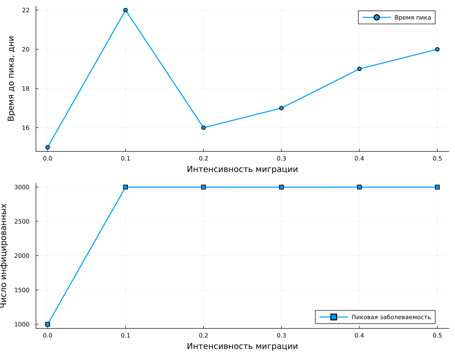

:::
::::::::::::::

- нулевая миграция даёт локальную вспышку;
- ненулевая миграция переносит инфекцию между городами;
- глобальная динамика чувствительна к интенсивности перемещений.

## Сводная визуализация

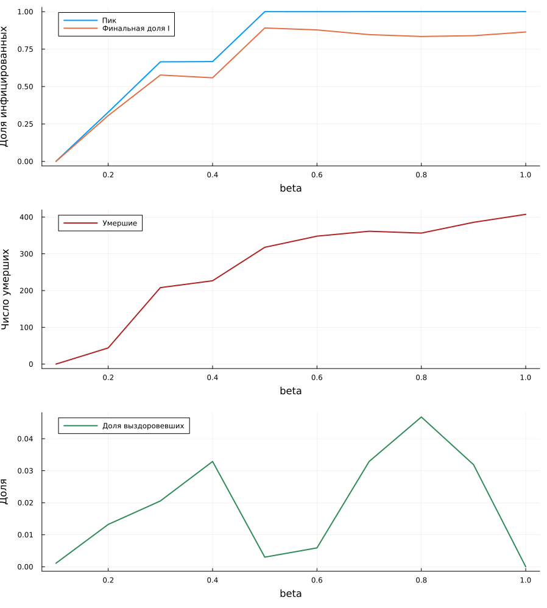

- верхняя панель: средний пик заражения;
- средняя панель: среднее число умерших;
- нижняя панель: доля выздоровевших;
- график объединяет эффекты изменения `beta`.

# Сценарный анализ

## Базовый и неоднородный сценарии

:::::::::::::: {.columns}
::: {.column width="50%"}

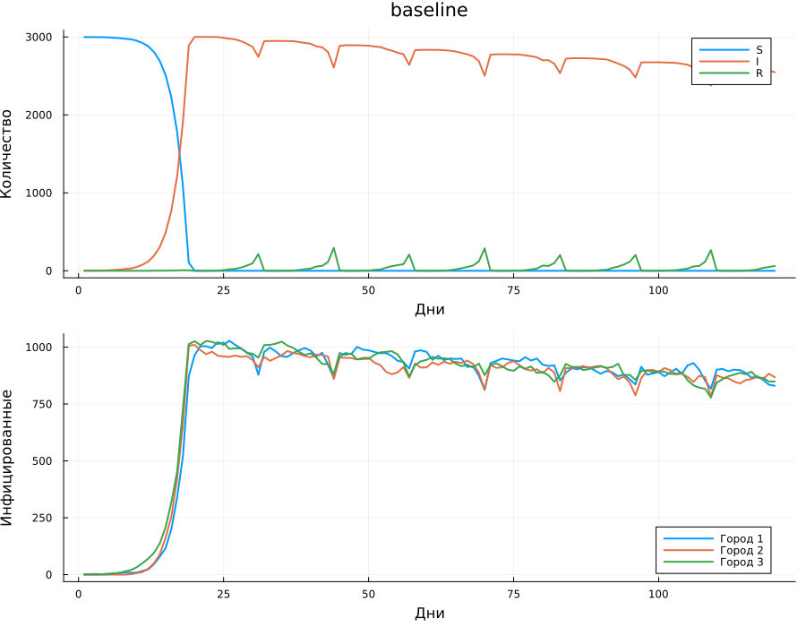

:::
::: {.column width="50%"}

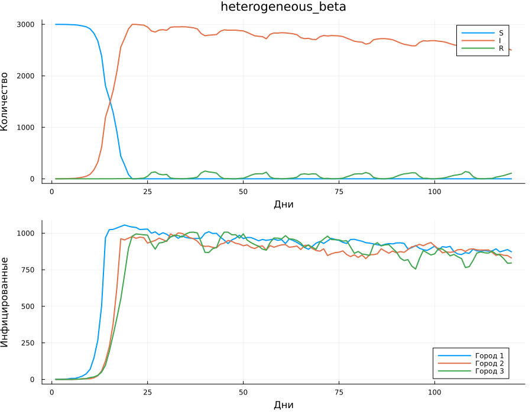

:::
::::::::::::::

- `baseline` используется как контрольный режим;
- `heterogeneous_beta` задаёт разные `beta` по городам;
- различия по городам проявляются как в локальных пиках, так и в суммарной динамике.

## Быстрая миграция и позднее выявление

:::::::::::::: {.columns}
::: {.column width="50%"}

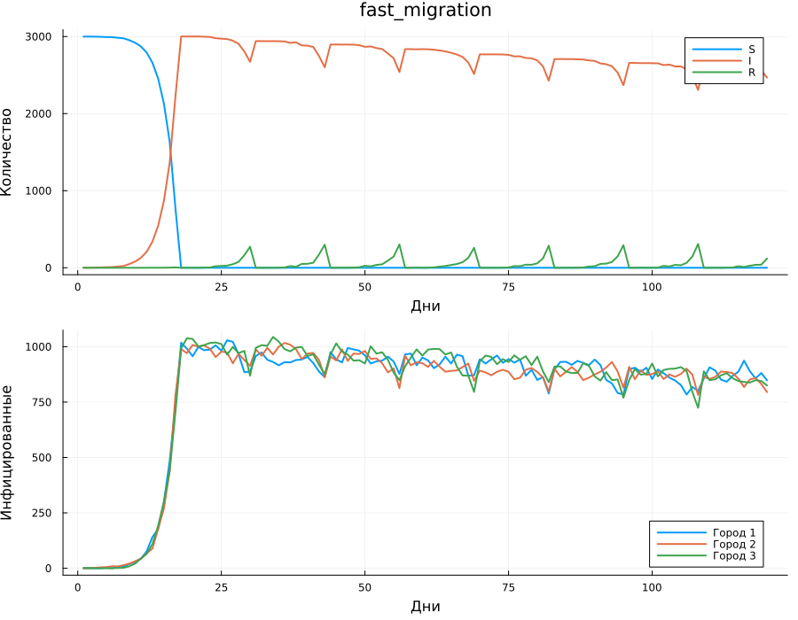

:::
::: {.column width="50%"}

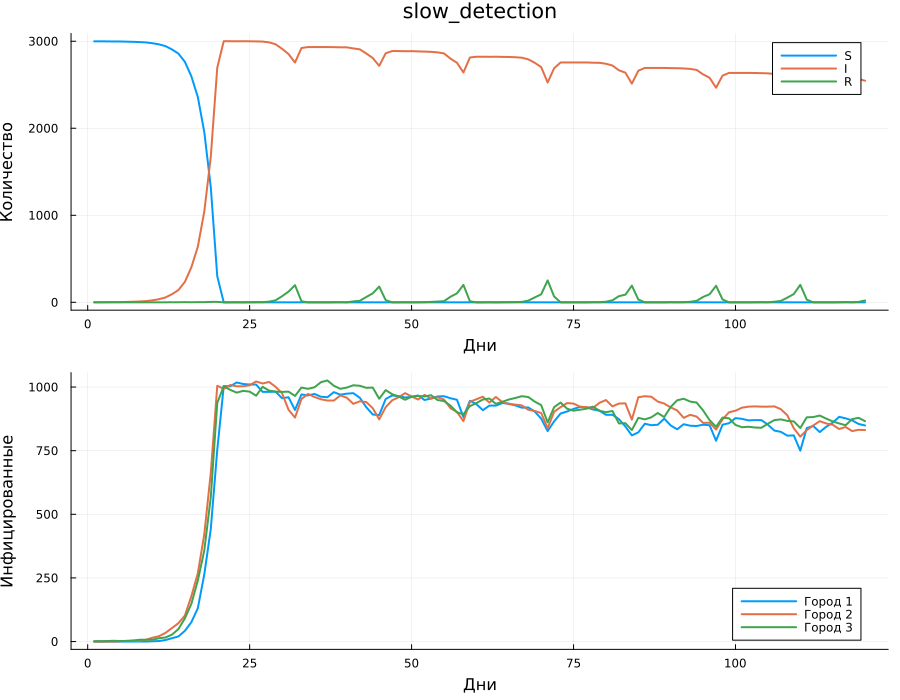

:::
::::::::::::::

- `fast_migration` ускоряет межгородской перенос;
- `slow_detection` дольше удерживает высокую заразность;
- оба сценария делают эпидемию тяжелее по сравнению с базовым.

## Сравнение сценариев

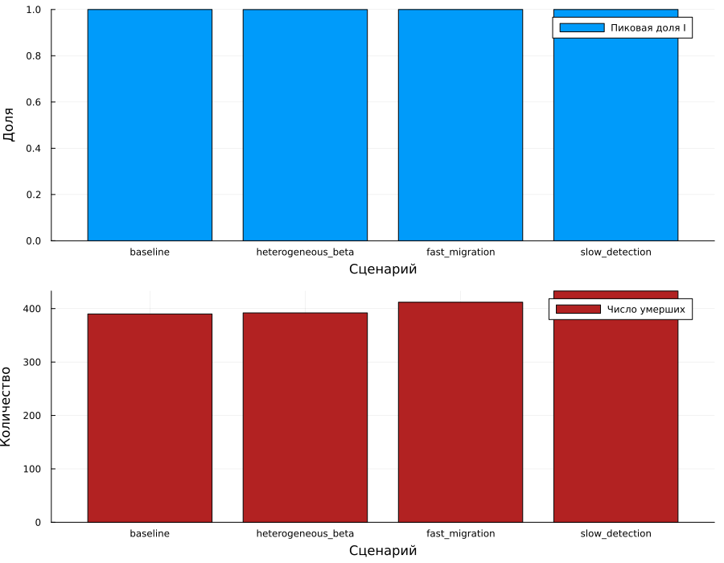

- `slow_detection` даёт наибольшее число умерших;
- `fast_migration` ускоряет развитие вспышки;
- сценарный анализ показывает чувствительность модели к небольшим изменениям правил.

# Дополнительные задания

## Задание 1. Базовый анализ `R_0`

- `R_0 = 7.0`
- `peak_fraction = 1.0`
- `peak_time = 15`
- `deaths = 335`

Вывод:

- базовый режим находится далеко выше порога;
- вспышка охватывает всю систему;
- теоретическая оценка согласуется с модельным поведением.

## Задание 2. Порог эпидемии

:::::::::::::: {.columns}
::: {.column width="38%"}

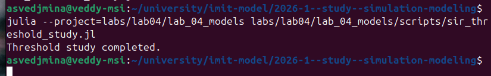

:::
::: {.column width="62%"}

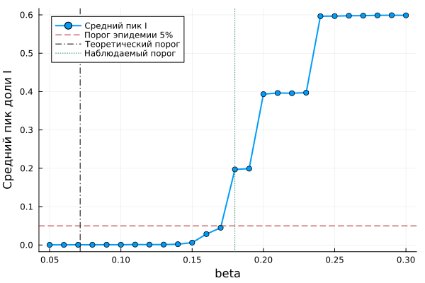

:::
::::::::::::::

- теоретический порог: `beta ≈ 0.0714`;
- наблюдаемый порог: `beta ≈ 0.18`;
- критерий эпидемии: средний пик выше `5%`;
- разница объясняется стохастичностью агентной модели.

## Задание 3. Гетерогенность городов

:::::::::::::: {.columns}
::: {.column width="38%"}


:::
::: {.column width="62%"}

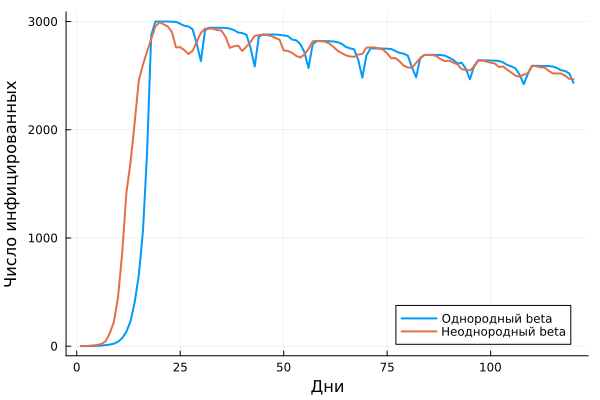

:::
::::::::::::::

## Динамика по городам и сводка эффекта гетерогенности

:::::::::::::: {.columns}
::: {.column width="50%"}

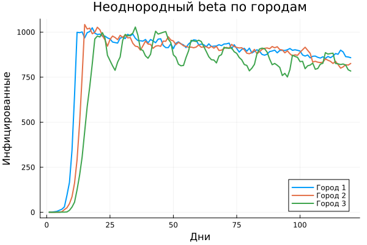

:::
::: {.column width="50%"}

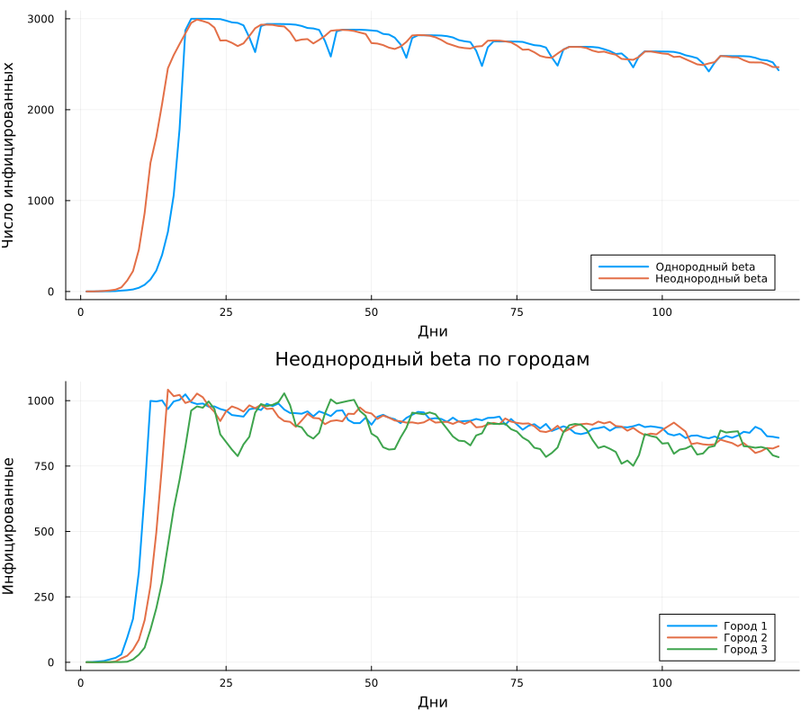

:::
::::::::::::::

- в неоднородном режиме пики по городам различаются;
- суммарная смертность возрастает с `429` до `444`;
- миграция сглаживает различия, но не устраняет их.

## Задание 4. Миграция

:::::::::::::: {.columns}
::: {.column width="38%"}

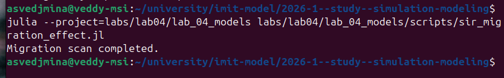

:::
::: {.column width="62%"}


:::
::::::::::::::

- для межгородского распространения важна не только величина пика, но и время до него;
- уже при умеренной миграции эпидемия становится общей для всей системы;
- миграция выступает главным каналом синхронизации вспышек между городами.

## Задание 5. Карантинные меры

:::::::::::::: {.columns}
::: {.column width="36%"}

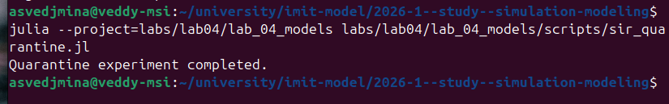

:::
::: {.column width="64%"}

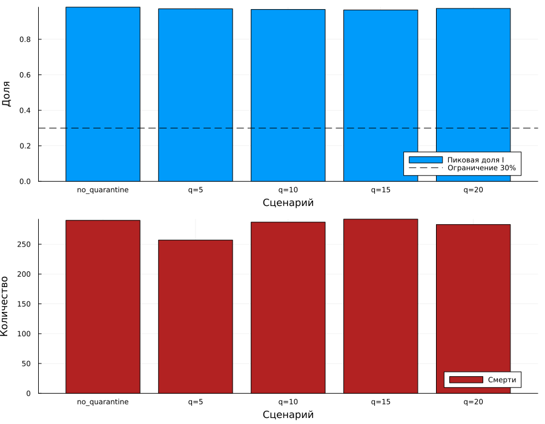

:::
::::::::::::::

## Лучший карантинный режим

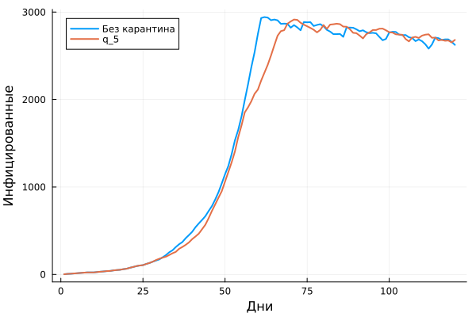

- лучший из исследованных порогов: `5%`;
- смертность снижается с `290` до `257`;
- пик смещается с `62` на `71` день;
- карантин не устраняет эпидемию, но смягчает её последствия.

## Задание 6. Оптимизация при ограничении на пик

:::::::::::::: {.columns}
::: {.column width="38%"}

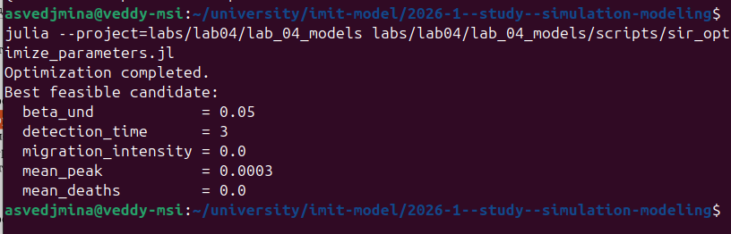

:::
::: {.column width="62%"}

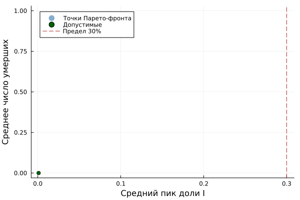

:::
::::::::::::::

- ограничение: `mean_peak <= 0.30`;
- метод: `BlackBoxOptim`, `:borg_moea`, параметры `beta_und`, `detection_time`, `death_rate`;
- лучшее допустимое решение: `beta_und = 0.1409`, `detection_time = 4`, `death_rate = 0.0497`;
- итог: `mean_peak = 0.0010`, `mean_deaths = 0.0`.

# Literate и Jupyter

## Генерация производных форматов

:::::::::::::: {.columns}
::: {.column width="50%"}

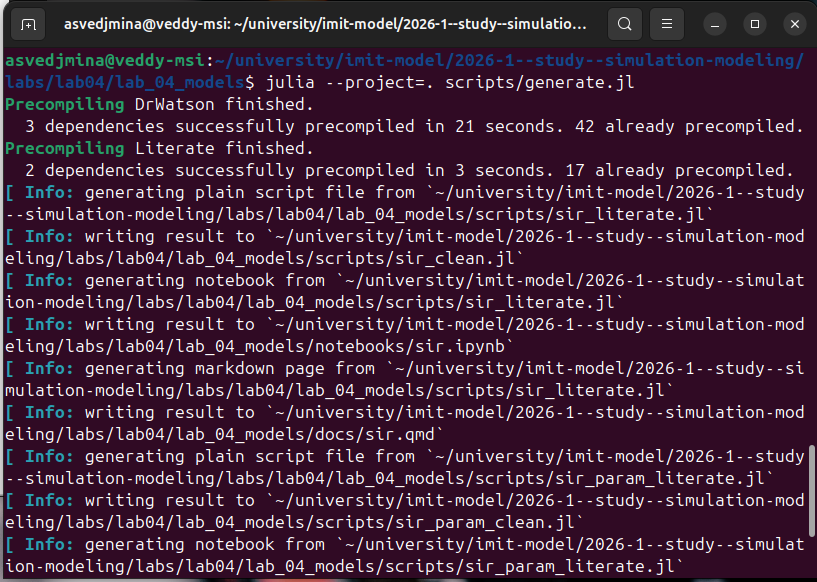

:::
::: {.column width="50%"}


:::
::::::::::::::

- из literate-источников получаются `clean .jl`, `ipynb` и `qmd`;
- генерация выполняется единым скриптом `generate.jl`;
- это обеспечивает воспроизводимость всех экспериментов.

## Запуск Jupyter и список notebook

:::::::::::::: {.columns}
::: {.column width="42%"}

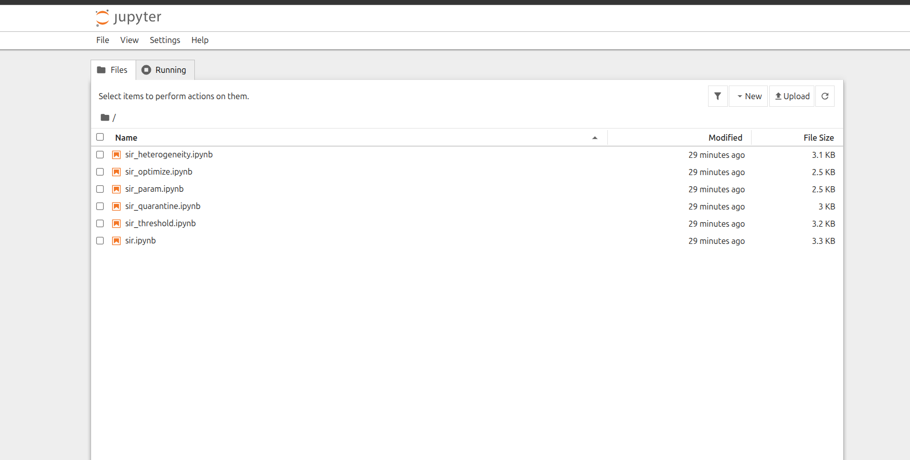

:::
::: {.column width="58%"}

- `sir.ipynb`
- `sir_param.ipynb`
- `sir_threshold.ipynb`
- `sir_heterogeneity.ipynb`
- `sir_quarantine.ipynb`
- `sir_optimize.ipynb`

:::
::::::::::::::

## Выполненные notebook

:::::::::::::: {.columns}
::: {.column width="50%"}

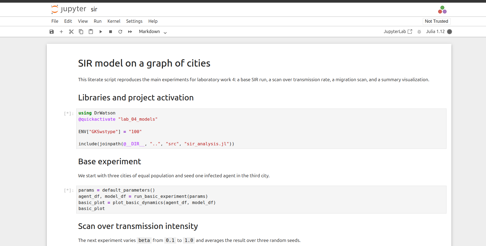

:::
::: {.column width="50%"}

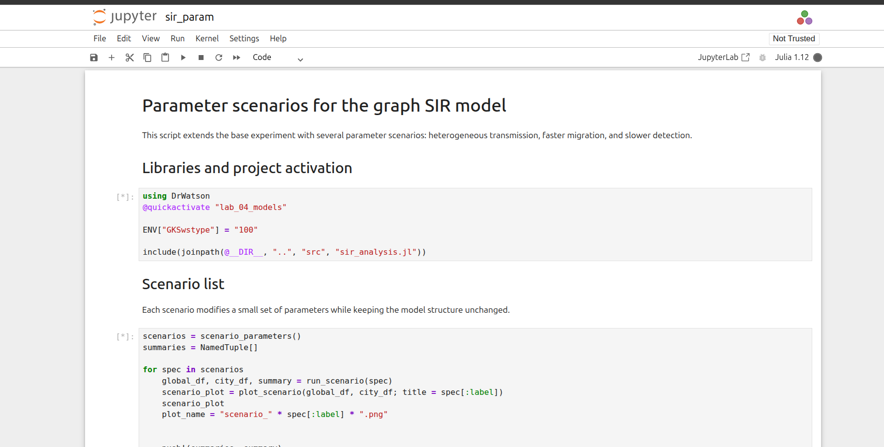

:::
::::::::::::::

## Notebook для дополнительных заданий

:::::::::::::: {.columns}
::: {.column width="50%"}


:::
::: {.column width="50%"}


:::
::::::::::::::

## Ещё два notebook сценарного анализа

:::::::::::::: {.columns}
::: {.column width="50%"}


:::
::: {.column width="50%"}


:::
::::::::::::::

- notebook были выполнены в Jupyter и сохранены с выходами;
- каждый из них соответствует одному literate-источнику;
- код и документация остаются синхронизированными.

# Выводы

## Итоги работы

- Реализована агентная SIR-модель на графе трёх городов
- Выполнены базовый, параметрический и сценарный эксперименты
- Выполнены все дополнительные задания: `R_0`, порог, гетерогенность, миграция, карантин, оптимизация
- Подготовлены literate-версии и производные форматы `.jl`, `.ipynb`, `.qmd`
- Все основные результаты, графики и полный код вынесены в отчёт
- Наиболее содержательные эффекты: порог эпидемии, влияние миграции, неоднородность и карантин
