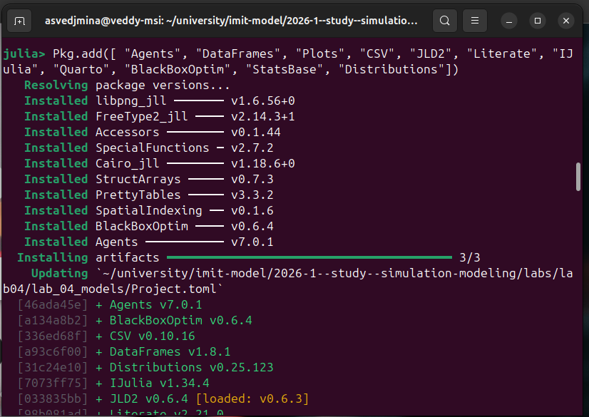
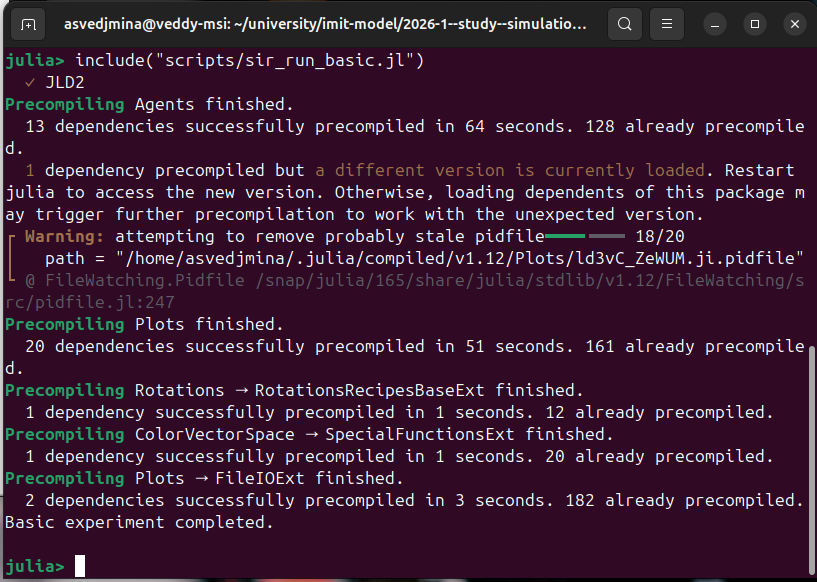
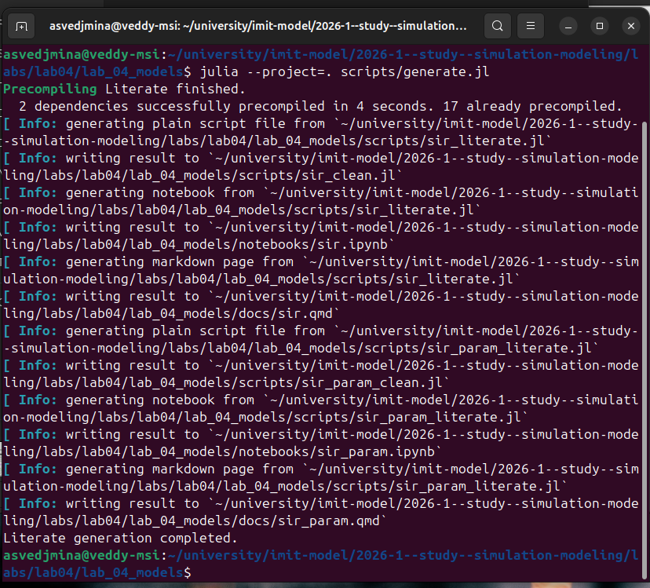
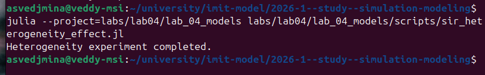

---
## Author
author:
  name: Ведьмина Александра Сергеевна
  degrees: student
  email: 1132236003@rudn.ru
  affiliation:
    - name: Российский университет дружбы народов
      country: Российская Федерация
      postal-code: 117198
      city: Москва
      address: ул. Миклухо-Маклая, д. 6

## Title
title: "Имитационное моделирование"
subtitle: "Лабораторная работа №4. Реализация основных моделей в агентном подходе"
license: "CC BY"
---

# Цель работы

Изучить реализацию эпидемиологической модели SIR в агентном подходе на языке
Julia с использованием фреймворка Agents.jl, организовать воспроизводимый
проект в структуре DrWatson, выполнить базовые и дополнительные вычислительные
эксперименты, подготовить literate-версии скриптов и собрать отчёт с полным
описанием полученных результатов.

# Задание

В рамках лабораторной работы требовалось:

1. создать отдельный проект `DrWatson` для агентной SIR-модели;
2. подключить необходимые Julia-пакеты и подготовить структуру каталогов;
3. реализовать агентную модель распространения инфекции на графе городов;
4. выполнить базовый эксперимент, сканирование коэффициента заразности,
   исследование миграции и сценарные расчёты;
5. оформить основные сценарии в стиле literate programming и сгенерировать из
   них производные форматы `.jl`, `.ipynb` и `.qmd`;
6. выполнить код из Jupyter notebook и включить результаты в отчёт;
7. выполнить дополнительные задания: оценку `R_0`, поиск эпидемического
   порога, исследование гетерогенности, анализ миграции, карантинные меры и
   оптимизацию при ограничении на пик заболеваемости.

# Теоретическое введение

## Агентное моделирование

Агентное моделирование (Agent-Based Modeling, ABM) описывает систему как
совокупность автономных сущностей, каждая из которых имеет собственное
состояние и действует по локальным правилам [@bonabeau_2002; @macal_2010].
Глобальное поведение в ABM не задаётся напрямую, а возникает из большого числа
локальных взаимодействий. Для эпидемиологических задач это особенно удобно,
потому что позволяет моделировать:

- отдельных людей, а не только доли популяции;
- неоднородность по городам и сценариям;
- миграцию между узлами графа;
- логические меры управления, например карантин.

В работе для реализации ABM используется пакет Agents.jl [@agents_jl_2022],
ориентированный на построение агентных моделей на графах, решётках и других
пространствах.

## Классическая SIR-модель и её агентная версия

Классическая модель SIR делит популяцию на три класса [@kermack_1927;
@hethcote_2000]:

- `S` --- восприимчивые;
- `I` --- инфицированные;
- `R` --- выздоровевшие.

В непрерывной постановке динамика описывается системой дифференциальных
уравнений. В данной лабораторной работе используется дискретная агентная
постановка, где каждый человек моделируется как отдельный агент, а переходы
между состояниями реализуются как последовательность событий:

1. агент перемещается между городами;
2. инфицированный агент заражает случайное число контактов;
3. по достижении `infection_period` агент либо выздоравливает, либо умирает;
4. выздоровевший агент может быть повторно инфицирован с заданной
   вероятностью.

Модель строится на полном графе из трёх вершин, где каждая вершина
соответствует городу. Это делает постановку одновременно простой и наглядной:
можно отдельно анализировать влияние `beta`, миграции, неоднородности по
городам и карантинного ограничения.

## Репродуктивное число и эпидемический порог

При фиксированной длительности болезни `infection_period` теоретическая оценка
базового репродуктивного числа имеет вид

$$
R_0 \approx \beta \cdot infection\_period.
$$

В базовом сценарии `beta_und = 0.5`, `infection_period = 14`, поэтому

$$
R_0 \approx 0.5 \cdot 14 = 7.
$$

Такое значение существенно больше единицы, а значит, режим должен
соответствовать устойчивому развитию эпидемии.

## Литературное программирование и воспроизводимость

В работе использовалась методология literate programming [@knuth_1984], при
которой код и объясняющий текст ведутся из единого источника. Пакет
Literate.jl [@literate_jl] позволяет из одного `.jl`-файла получить:

- чистый Julia-скрипт;
- Jupyter notebook;
- Quarto-документацию.

Для организации воспроизводимого исследовательского проекта использован пакет
DrWatson [@drwatson_jl]. Он задаёт стандартную структуру каталогов и упрощает
связь между исходным кодом, данными, графиками и документами.

## Основные параметры модели

Основные параметры агентной SIR-модели приведены в [табл. @tbl-sir-params].

| Параметр | Обозначение | Значение | Интерпретация |
|---|---|---:|---|
| Размерности городов | `Ns` | `[1000, 1000, 1000]` | население трёх городов |
| Заразность до выявления | `beta_und` | `[0.5, 0.5, 0.5]` | интенсивность передачи инфекции |
| Заразность после выявления | `beta_det` | `[0.05, 0.05, 0.05]` | ослабленная передача после обнаружения |
| Длительность инфекции | `infection_period` | `14` | число шагов болезни |
| Время выявления | `detection_time` | `7` | момент переключения на `beta_det` |
| Смертность | `death_rate` | `0.02` | вероятность смерти при завершении болезни |
| Повторное заражение | `reinfection_probability` | `0.1` | вероятность повторного перехода `R -> I` |
| Начальные заражённые | `Is` | `[0, 0, 1]` | источник эпидемии в третьем городе |
| Базовое число шагов | `n_steps` | `100` | горизонт моделирования |

: Параметры базовой агентной SIR-модели {#tbl-sir-params}

# Выполнение лабораторной работы

## Подготовка окружения

### Запуск Julia и создание проекта

Подготовка проекта началась с запуска Julia REPL, подключения DrWatson и
создания каталога `lab_04_models` с типовой структурой
воспроизводимого проекта.

{#fig-init-project width=90%}

На этом этапе DrWatson создал каркас каталогов `src/`, `scripts/`, `docs/`,
`notebooks/`, `data/`, `plots/`, `test/` и файл `Project.toml`, куда затем
были добавлены зависимости проекта.

### Активация окружения и установка пакетов

После создания проекта окружение было активировано через `Pkg.activate`, а
затем в него были установлены необходимые пакеты: `Agents`, `DataFrames`,
`Plots`, `CSV`, `JLD2`, `Literate`, `IJulia`, `Quarto`, `StatsBase`,
`Distributions` и другие.

{#fig-activate width=85%}

{#fig-pkg-add width=90%}

Фактический состав зависимостей проекта определяется файлом `Project.toml`.
Для воспроизводимости дальнейших запусков это важно, поскольку все скрипты
выполняются с явным указанием `--project=labs/lab04/lab_04_models`.

## Структура проекта

После подготовки окружения была сформирована следующая структура:

- `src/sir_model.jl` --- базовая агентная модель и шаг агента;
- `src/sir_analysis.jl` --- функции для проведения экспериментов, построения
  таблиц и графиков;
- `scripts/` --- исполняемые сценарии и literate-источники;
- `docs/` --- автоматически сгенерированные Quarto-документы;
- `notebooks/` --- сгенерированные Jupyter notebook;
- `data/` --- численные результаты экспериментов;
- `plots/` --- итоговые графики;
- `test/runtests.jl` --- проверка корректности логики модели.

Такое разбиение полностью повторяет подход из лабораторной работы №3 и хорошо
согласуется с рекомендациями DrWatson.

## Реализация модели

### Агент и пространство модели

Основная модель реализована в файле `src/sir_model.jl`. Агент задаётся
структурой `Person`, содержащей число дней болезни, текущий статус и домашний
город:

```julia
@agent struct Person(GraphAgent)
    days_infected::Int
    status::Symbol
    home_city::Int
end
```

Пространство модели --- полный граф из трёх вершин. Каждая вершина
соответствует отдельному городу, а потому агент всегда находится в одном из
трёх дискретных узлов графа.

### Инициализация модели

Функция `initialize_sir` создаёт полный граф, размещает в каждом городе
заданное число агентов, задаёт матрицу миграции и заражает стартовое число
агентов. Если матрица миграции не передана явно, она создаётся автоматически.

В базовой постановке используется симметричный сценарий по населению и по
коэффициентам передачи, однако в дополнительных заданиях параметры изменяются
по сценариям.

### Логика шага агента

Один шаг агента реализуется функцией `sir_agent_step!` и состоит из четырёх
частей:

1. `migrate!` --- возможный переход в другой город;
2. `transmit!` --- заражение части контактов в текущем городе;
3. увеличение счётчика `days_infected`;
4. `recover_or_die!` --- выздоровление или смерть.

Для заражения используется распределение Пуассона, поэтому число новых
контактов в каждом шаге является случайной величиной. До момента
`detection_time` используется `beta_und`, а затем --- более слабая
интенсивность `beta_det`.

### Карантин и вспомогательные функции

В модель дополнительно встроены:

- `create_migration_matrix` для явного задания интенсивности миграции;
- `infected_count`, `recovered_count`, `susceptible_count` и другие функции
  подсчёта;
- `lock_city!` и `update_quarantine!` для сценариев с ограничением миграции.

Таким образом, уже на уровне базового исходника модель поддерживает как
основные эксперименты, так и дополнительные задания без отдельного форка кода.

## Базовый эксперимент

Базовый сценарий запускается скриптом `scripts/sir_run_basic.jl`, который
формирует временные ряды `S(t)`, `I(t)`, `R(t)` и общей численности популяции.

{#fig-run-basic width=90%}

Результат базового эксперимента показан на [рис. @fig-basic-dynamics].

{#fig-basic-dynamics width=90%}

Согласно `basic_summary.csv`, были получены следующие характеристики:

- теоретическое `R_0 = 7.0`;
- максимальное число инфицированных `3000`, то есть `100%` популяции;
- время достижения пика `15` дней;
- итоговое число умерших `335`.

Форма графика соответствует ожидаемому поведению при `R_0 \gg 1`: сначала
число инфицированных быстро растёт, затем после достижения пика происходит
спад за счёт перехода части агентов в класс `R` и за счёт смертности, а общая
численность популяции уменьшается.

## Исследование коэффициента заразности

Следующим шагом было выполнено сканирование коэффициента `beta` с помощью
скрипта `scripts/sir_scan_beta.jl`.

{#fig-beta-run width=90%}

Для каждого значения `beta` использовалось несколько значений `seed`, а
результаты сохранялись в таблицу `beta_scan_all.csv`. Фрагмент этой таблицы
показан на [рис. @fig-beta-csv].

{#fig-beta-csv width=90%}

График усреднённых результатов представлен на [рис. @fig-beta-plot].

{#fig-beta-plot width=90%}

По графику и CSV-файлу видно, что:

- при `beta = 0.1` вспышка либо не возникает, либо остаётся очень слабой;
- около `beta = 0.2` система проходит через пороговый режим;
- при `beta >= 0.5` пик эпидемии захватывает почти всю популяцию;
- число умерших растёт вместе с усилением передачи.

Это исследование понадобилось далее для порогового анализа и для интерпретации
результатов дополнительных заданий.

## Исследование миграции

Влияние межгородских перемещений анализировалось отдельным сценарием
миграционного анализа. Имя файла сценария: `sir_migration_effect.jl`.

{#fig-migration-run width=90%}

Результирующий график представлен на [рис. @fig-migration-plot].

{#fig-migration-plot width=90%}

Из графика и таблицы `migration_scan_all.csv` следует:

- при нулевой миграции вспышка остаётся по существу локальной;
- при ненулевой миграции заражение переносится между городами и охватывает
  почти всю систему;
- среди миграционных режимов быстрое развитие эпидемии наблюдается уже при
  умеренных интенсивностях миграции.

Это подтверждает, что структура мобильности между городами является
существенным фактором глобальной динамики.

## Сценарные эксперименты

В `sir_analysis.jl` дополнительно реализована функция `scenario_parameters`,
задающая четыре сценария:

- `baseline`;
- `heterogeneous_beta`;
- `fast_migration`;
- `slow_detection`.

Для каждого сценария строится отдельный график глобальной и по-городской
динамики, после чего формируется сводная таблица `scenario_summary.csv`.

### Базовый сценарий

{#fig-scenario-baseline width=90%}

Этот график используется как контрольная точка для всех остальных сценариев.

### Неоднородная заразность

{#fig-scenario-hetero width=90%}

В этом сценарии коэффициенты заразности по городам различаются, что приводит к
асимметричному распределению локальных пиков.

### Ускоренная миграция

{#fig-scenario-fast-mig width=90%}

Увеличение интенсивности миграции ускоряет межгородской перенос инфекции и
делает вспышку более синхронной.

### Позднее обнаружение инфекции

{#fig-scenario-slow-detect width=90%}

Позднее переключение с `beta_und` на `beta_det` усиливает распространение
болезни и увеличивает итоговую тяжесть эпидемии.

### Сводное сравнение сценариев

{#fig-scenario-comparison width=90%}

Согласно `scenario_summary.csv`, наиболее тяжёлым из рассмотренных сценариев
оказался `slow_detection`, где число умерших достигает `433`, а в сценарии
`fast_migration` эпидемия развивается быстрее, чем в базовом.

## Оптимизация и итоговая комплексная визуализация

После основных сценариев был запущен скрипт построения сводных графиков
`scripts/sir_visualize_dynamics.jl`.

{#fig-comprehensive-run width=85%}

Полученный многопанельный график приведён на [рис. @fig-comprehensive].

{#fig-comprehensive width=90%}

Он объединяет три семейства зависимостей:

- средний пик заражения;
- среднее число умерших;
- среднюю долю выздоровевших.

Такой график удобен тем, что сразу показывает компромисс между интенсивностью
эпидемии, смертностью и финальной структурой популяции.

## Литературное программирование и производные форматы

Главные эксперименты были оформлены в двух базовых literate-источниках:

- `sir_literate.jl`;
- `sir_param_literate.jl`.

Позднее к ним были добавлены отдельные literate-источники для дополнительных
заданий:

- `sir_threshold_literate.jl`;
- `sir_heterogeneity_literate.jl`;
- `sir_quarantine_literate.jl`;
- `sir_optimize_literate.jl`.

Генерация производных форматов выполняется скриптом `generate.jl`.

{#fig-generate-1 width=90%}

{#fig-generate-2 width=90%}

Сгенерированные notebook располагаются в каталоге `notebooks/`, Quarto-файлы
--- в `docs/`, а чистые Julia-скрипты --- в `scripts/`.

Итоговый набор производных файлов имеет вид:

- `sir_literate.jl`:
  clean `sir_clean.jl`, notebook `sir.ipynb`, quarto `sir.qmd`.
- `sir_param_literate.jl`:
  clean `sir_param_clean.jl`, notebook `sir_param.ipynb`, quarto `sir_param.qmd`.
- `sir_threshold_literate.jl`:
  clean `sir_threshold_clean.jl`, notebook `sir_threshold.ipynb`, quarto `sir_threshold.qmd`.
- `sir_heterogeneity_literate.jl`:
  clean `sir_heterogeneity_clean.jl`, notebook `sir_heterogeneity.ipynb`, quarto `sir_heterogeneity.qmd`.
- `sir_quarantine_literate.jl`:
  clean `sir_quarantine_clean.jl`, notebook `sir_quarantine.ipynb`, quarto `sir_quarantine.qmd`.
- `sir_optimize_literate.jl`:
  clean `sir_optimize_clean.jl`, notebook `sir_optimize.ipynb`, quarto `sir_optimize.qmd`.

Использование единого literate-источника для каждого эксперимента устраняет
рассинхронизацию между кодом, notebook и документацией.

# Дополнительные задания

## Задание 1. Базовый анализ `R_0`

В базовом режиме было получено:

- `R_0 = 7.0`;
- `peak_fraction = 1.0`;
- `peak_time = 15`;
- `deaths = 335`.

Следовательно, уже по первому дополнительному заданию видно, что модель
находится глубоко в надпороговом режиме: инфекция уверенно распространяется по
всей популяции, а наблюдаемая динамика полностью согласуется с теоретической
оценкой `R_0`.

## Задание 2. Порог эпидемии

Для поиска практического эпидемического порога был реализован отдельный
скрипт `sir_threshold_study.jl`.

{#fig-threshold-run width=90%}

График порогового исследования приведён на [рис. @fig-threshold-plot].

{#fig-threshold-plot width=90%}

По таблице `threshold_summary.csv` были получены значения:

- эмпирический критерий эпидемии: `peak > 5%`;
- наблюдаемый порог: `beta ≈ 0.18`;
- теоретический порог: `beta ≈ 0.0714`;
- разрыв между ними: `≈ 0.1086`.

Такой разрыв естественен для агентной стохастической модели: теоретический
порог соответствует только условию `R_0 = 1`, а практический критерий требует
заметной и устойчивой вспышки.

## Задание 3. Эффект гетерогенности

Отдельное исследование неоднородной заразности выполнялось скриптом
`sir_heterogeneity_effect.jl`.

{#fig-hetero-run width=90%}

Для анализа были построены три графика.

{#fig-hetero-global width=90%}

{#fig-hetero-city width=90%}

{#fig-hetero-summary width=90%}

По `heterogeneity_summary.csv` и `heterogeneity_city_summary.csv` получаем:

- однородный режим: пик `3000`, смертность `429`;
- неоднородный режим: пик `2992`, смертность `444`;
- пиковые значения по городам при `beta = [0.8, 0.45, 0.2]` составили
  `1024`, `1042`, `1028`.

Иными словами, неоднородность не устраняет эпидемию, а перераспределяет её
локальную интенсивность между городами и слегка ухудшает итог по смертности.

## Задание 4. Влияние миграции

Это задание содержательно опирается на уже выполненный выше миграционный
эксперимент. Дополнительный вывод состоит в том, что для межгородского
распространения эпидемии важна не только величина пика, но и скорость его
достижения.

{#fig-migration-run-extra width=90%}

График на [рис. @fig-migration-plot] показывает, что уже при умеренной
миграции вспышка становится общей для всех городов, а время до глобального
пика уменьшается по сравнению с разрозненными локальными очагами.

## Задание 5. Карантинные меры

Для анализа карантина был реализован скрипт `sir_quarantine.jl`.

{#fig-quarantine-run width=90%}

В эксперименте сравнивались сценарий без карантина и несколько значений
порога закрытия города.

{#fig-quarantine-summary width=90%}

{#fig-quarantine-best width=90%}

Итоговая сводка `quarantine_summary.csv` показывает:

| Сценарий | Порог | Пиковая доля `I` | Время пика | Смерти | Закрытые города |
|---|---:|---:|---:|---:|---:|
| `no_quarantine` | `-1` | `0.9810` | `62` | `290` | `0` |
| `q_5` | `0.05` | `0.9717` | `71` | `257` | `3` |
| `q_10` | `0.10` | `0.9680` | `66` | `287` | `3` |
| `q_15` | `0.15` | `0.9653` | `64` | `292` | `3` |
| `q_20` | `0.20` | `0.9737` | `65` | `283` | `3` |

Наиболее удачным из проверенных оказался порог `5%`: он уменьшает число
смертей и одновременно оттягивает пик эпидемии.

## Задание 6. Оптимизация при ограничении на пик

Последнее дополнительное задание решалось отдельным сценарием оптимизации.
Имя файла сценария: `sir_optimize_parameters.jl`.

{#fig-opt-run width=90%}

Для поиска решений использован многокритериальный эволюционный алгоритм
`Borg MOEA` из пакета `BlackBoxOptim`. Оптимизируемые параметры:
`beta_und`, `detection_time` и `death_rate`. Алгоритм строит Pareto-фронт по
двум критериям: средний пик заболеваемости и среднее число умерших. После
этого из фронта выбираются допустимые решения с ограничением
`mean_peak <= 0.30`.

{#fig-opt-plot width=90%}

Лучшая допустимая комбинация по `optimization_pareto.csv`:

- `beta_und = 0.1409`;
- `detection_time = 4`;
- `death_rate = 0.0497`;
- `mean_peak = 0.0010`;
- `mean_deaths = 0.0`.

Эта картина показывает, что даже при ненулевой смертности и относительно
небольшом, но не экстремально малом `beta`, раннее выявление удерживает
эпидемию глубоко ниже заданного порога по пику.

## Выполнение Jupyter notebook

После генерации производных форматов Jupyter notebook из каталога
`notebooks/` были выполнены и сохранены уже с результатами.

{#fig-jupyter-files width=95%}

В репозитории сохранены все шесть выполненных notebook:

- `sir.ipynb`;
- `sir_param.ipynb`;
- `sir_threshold.ipynb`;
- `sir_heterogeneity.ipynb`;
- `sir_quarantine.ipynb`;
- `sir_optimize.ipynb`.

Ниже приведены скриншоты соответствующих блокнотов:

{#fig-ipynb-hetero width=95%}

{#fig-ipynb-opt width=95%}

{#fig-ipynb-param width=95%}

{#fig-ipynb-quarantine width=95%}

{#fig-ipynb-threshold width=95%}

{#fig-ipynb-base width=95%}

Скриншоты показывают работу с notebook в Jupyter, а сами файлы `.ipynb`
сохранены с заполненными `execution_count` и блоками `outputs`, то есть
подтверждают именно выполнение, а не только генерацию.

# Полный код проекта

В приложении приводится полный авторский код проекта:

- исходные модули из `src/`;
- исполняемые сценарии из `scripts/`;
- literate-источники;
- генератор производных форматов;
- тесты.

Автоматически сгенерированные `*_clean.jl`, `.ipynb` и `.qmd` не дублируются в
тексте отчёта, поскольку они полностью воспроизводятся из literate-источников
скриптом `generate.jl`.

## Исходный код модели `sir_model.jl`

```julia

```

## Исходный код аналитики `sir_analysis.jl`

```julia

```

## Генератор literate-форматов `generate.jl`

```julia

```

## Скрипт базового эксперимента `sir_run_basic.jl`

```julia

```

## Скрипт сканирования `beta` `sir_scan_beta.jl`

```julia

```

## Скрипт исследования миграции `sir_migration_effect.jl`

```julia

```

## Скрипт итоговой визуализации `sir_visualize_dynamics.jl`

```julia

```

## Скрипт порогового исследования `sir_threshold_study.jl`

```julia

```

## Скрипт исследования гетерогенности `sir_heterogeneity_effect.jl`

```julia

```

## Скрипт карантинного сценария `sir_quarantine.jl`

```julia

```

## Скрипт оптимизации `sir_optimize_parameters.jl`

```julia

```

## Literate-источник `sir_literate.jl`

```julia

```

## Literate-источник `sir_param_literate.jl`

```julia

```

## Literate-источник `sir_threshold_literate.jl`

```julia

```

## Literate-источник `sir_heterogeneity_literate.jl`

```julia

```

## Literate-источник `sir_quarantine_literate.jl`

```julia

```

## Literate-источник `sir_optimize_literate.jl`

```julia

```

## Тесты `runtests.jl`

```julia

```

# Выводы

В ходе лабораторной работы была реализована агентная эпидемиологическая
SIR-модель на графе трёх городов. Проект оформлен в структуре DrWatson,
основная логика вынесена в `src/sir_model.jl` и `src/sir_analysis.jl`, а для
воспроизводимости экспериментов использованы отдельные сценарные скрипты.

Были выполнены все основные и дополнительные задания: базовый эксперимент,
сканирование коэффициента заразности, исследование миграции, сценарный анализ,
оценка `R_0`, поиск порога эпидемии, анализ гетерогенности, карантинные меры и
оптимизация при ограничении на пик. Все ключевые сценарии оформлены также в
literate-стиле и преобразованы в `.jl`, `.ipynb` и `.qmd`.

Полученные результаты содержательно согласуются с теорией. Базовый режим с
`R_0 = 7` приводит к мощной вспышке, рост `beta` резко усиливает эпидемию,
межгородская миграция ускоряет распространение, неоднородность перераспределяет
локальные пики, а карантин и раннее выявление позволяют смягчить последствия.
Наиболее эффективным в исследованном диапазоне карантинных порогов оказался
режим `q_5`, а оптимизация при ограничении на пик показала ожидаемый переход к
слабому распространению инфекции.

# Список литературы{.unnumbered}

::: {#refs}
:::
