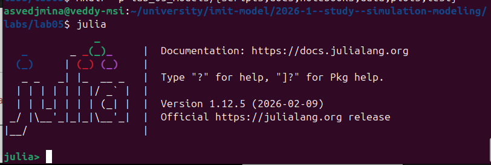
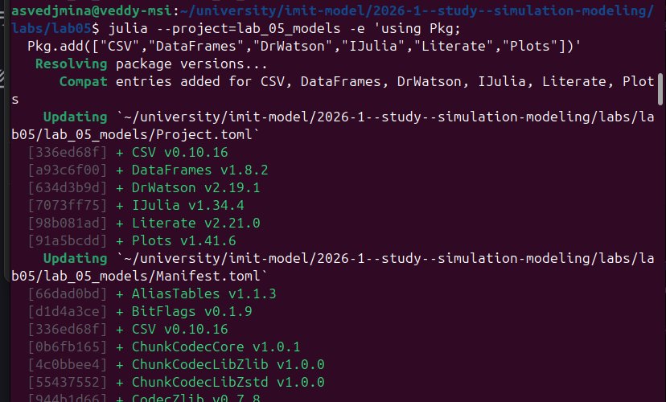
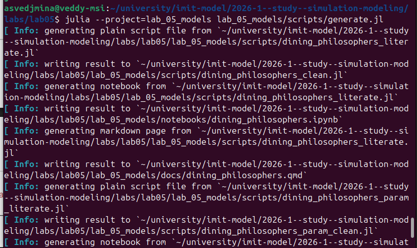
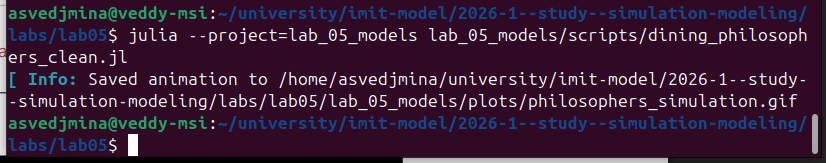
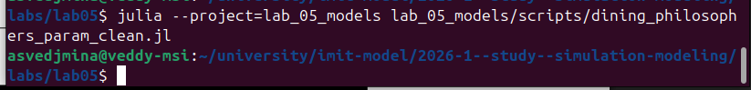
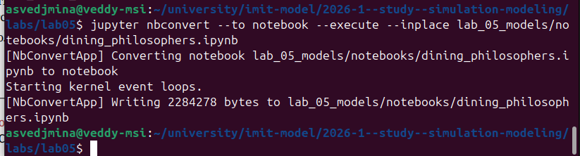
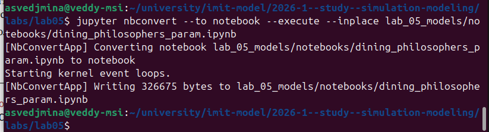
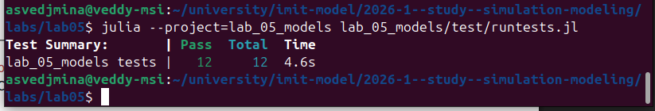

---
## Author
author:
  name: Ведьмина Александра Сергеевна
  degrees: student
  email: 1132236003@rudn.ru
  affiliation:
    - name: Российский университет дружбы народов
      country: Российская Федерация
      postal-code: 117198
      city: Москва
      address: ул. Миклухо-Маклая, д. 6
## Title
title: Лабораторная работа №5
subtitle: Имитационное моделирование
license: CC BY
date: today
date-format: "YYYY-MM-DD"
format:
  beamer:
    incremental: false
  revealjs:
    incremental: false
---

## Содержание

1. Информация
2. Вводная часть
3. Подготовка проекта
4. Реализация
5. Результаты
6. Проверка воспроизводимости
7. Выводы

# Информация

## Докладчик

:::::::::::::: {.columns align=center}
::: {.column width="68%"}

- Ведьмина Александра Сергеевна
- студент
- Российский университет дружбы народов
- [1132236003@rudn.ru](mailto:1132236003@rudn.ru)

:::
::: {.column width="32%"}


:::
::::::::::::::

# Вводная часть

## Цель работы

Изучить задачу обедающих философов в аппарате сетей Петри и выполнить полный
воспроизводимый цикл вычислений:

- реализовать классическую сеть и сеть с арбитром;
- провести стохастическое и детерминированное моделирование;
- оформить скрипты в literate-стиле;
- получить `jl`, `ipynb`, `qmd`;
- выполнить notebook и тесты;
- собрать отчёт и презентацию.

## Теоретическая основа

- сеть Петри задаётся четвёркой `N = (P, T, F, M_0)`;
- позиции содержат фишки, переходы изменяют маркировку;
- тупик возникает, когда каждый философ удерживает по одной вилке;
- арбитр ограничивает число одновременно активных философов до `N-1`;
- для стохастической симуляции используется алгоритм Гиллеспи.

# Подготовка проекта

## Запуск Julia и установка зависимостей

:::::::::::::: {.columns}
::: {.column width="44%"}



:::
::: {.column width="56%"}



:::
::::::::::::::

- использована Julia `1.12.5`;
- добавлены `CSV`, `DataFrames`, `DrWatson`, `IJulia`, `Literate`, `Plots`;
- структура проекта приведена к формату `lab_05_models`.

## Генерация производных форматов



- `generate.jl` создаёт clean-скрипты;
- затем формируются `ipynb` и `qmd`;
- все вычислительные сценарии ведутся из единых literate-источников.

# Реализация

## Структура проекта

- `src/DiningPhilosophers.jl` --- модель сети Петри и анализ;
- `scripts/generate.jl` --- генерация производных форматов;
- `scripts/dining_philosophers_literate.jl` --- базовый сценарий;
- `scripts/dining_philosophers_param_literate.jl` --- параметрический сценарий;
- `notebooks/` --- два исполненных notebook;
- `data/` и `plots/` --- таблицы и графики;
- `test/runtests.jl` --- автоматические проверки.

## Ключевой код модели

```julia
struct PetriNet
    n_places::Int
    n_transitions::Int
    pre::Matrix{Int}
    post::Matrix{Int}
    incidence::Matrix{Int}
    place_names::Vector{Symbol}
    transition_names::Vector{Symbol}
    metadata::Dict{Symbol, Any}
end
```

```julia
function build_classical_network(N::Int)
    n_places = 4 * N
    n_transitions = 3 * N
    ...
    return net, u0, copy(net.place_names)
end
```

- позиции `Think_i`, `Hungry_i`, `Eat_i`, `Fork_i`;
- переходы `GetLeft_i`, `GetRight_i`, `PutForks_i`;
- в модели с арбитром добавляется позиция `Arbiter`.

## Код скрипта генерации

```julia
using DrWatson
@quickactivate "lab_05_models"
using Literate

sources = [
    ("dining_philosophers_literate.jl", "dining_philosophers", ...),
    ("dining_philosophers_param_literate.jl", "dining_philosophers_param", ...),
]

for (src_file, base, title, description) in sources
    Literate.script(...)
    Literate.notebook(...)
    Literate.markdown(...)
end
```

- один источник даёт три производных формата;
- заголовки Quarto дописываются автоматически.

## Код базового и параметрического сценариев

```julia
N = 5
tmax = 50.0
net_classic, u0_classic, _ = build_classical_network(N)
df_classic = simulate_stochastic(net_classic, u0_classic, tmax; ...)
deadlock_classic = detect_deadlock(df_classic, net_classic)
classic_marking_plot = plot_marking_evolution(df_classic, net_classic)
```

```julia
philosopher_counts = 3:7
seeds = 1:16
raw_scan = parameter_scan(philosopher_counts; seeds = seeds, tmax = 60.0)
summary_scan = summarize_parameter_scan(raw_scan)
parameter_plot = plot_parameter_summary(summary_scan)
```

- первый скрипт исследует две сети при `N = 5`;
- второй скрипт оценивает вероятность тупика для набора `N`.

# Результаты

## Запуск вычислительных скриптов

:::::::::::::: {.columns}
::: {.column width="50%"}



:::
::: {.column width="50%"}



:::
::::::::::::::

- базовый clean-скрипт сгенерировал CSV, PNG и GIF;
- параметрический clean-скрипт сформировал сводку по `N = 3:7`.

## Схемы сетей Петри

:::::::::::::: {.columns}
::: {.column width="50%"}


:::
::: {.column width="50%"}


:::
::::::::::::::

- в классической сети возможен `deadlock`;
- позиция `Arbiter` убирает сценарий полной взаимной блокировки.

## Маркировки и динамика состояний

:::::::::::::: {.columns}
::: {.column width="50%"}


:::
::: {.column width="50%"}


:::
::::::::::::::

- классическая сеть: `deadlock = true`;
- время наступления тупика в базовом прогоне: `0.6297`;
- сеть с арбитром: `deadlock = false`.

## Сравнение моделей

:::::::::::::: {.columns}
::: {.column width="52%"}


:::
::: {.column width="48%"}


:::
::::::::::::::

- стохастическая и детерминированная постановки согласуются качественно;
- в классической сети поток `Eat_i` затухает;
- с арбитром система остаётся активной.

## Параметрический анализ


- исследованы `N = 3:7`;
- по `16` стохастических прогонов на каждую модель и каждое `N`;
- для классической сети `deadlock_probability = 1.0`;
- для сети с арбитром `deadlock_probability = 0.0`.

## Краткая таблица результатов

| `N` | Среднее время deadlock в классической сети | Вероятность deadlock с арбитром |
|---:|---:|---:|
| 3 | `2.3200` | `0.0` |
| 4 | `4.6227` | `0.0` |
| 5 | `8.9553` | `0.0` |
| 6 | `4.3216` | `0.0` |
| 7 | `5.9987` | `0.0` |

# Проверка воспроизводимости

## Выполнение notebook и тестов

:::::::::::::: {.columns}
::: {.column width="50%"}





:::
::: {.column width="50%"}



:::
::::::::::::::

- выполнены оба Jupyter notebook;
- тесты завершились успешно: `12` из `12`;
- результаты интегрированы в отчёт и презентацию.

# Выводы

## Итоги работы

- классическая сеть Петри для задачи обедающих философов приводит к взаимной блокировке;
- введение арбитра устраняет тупик во всех проведённых прогонах;
- literate-подход позволил поддерживать единый источник для кода, notebook и документации;
- в отчёт включены скриншоты запуска, графики, численные результаты и исходный код ключевых скриптов.
