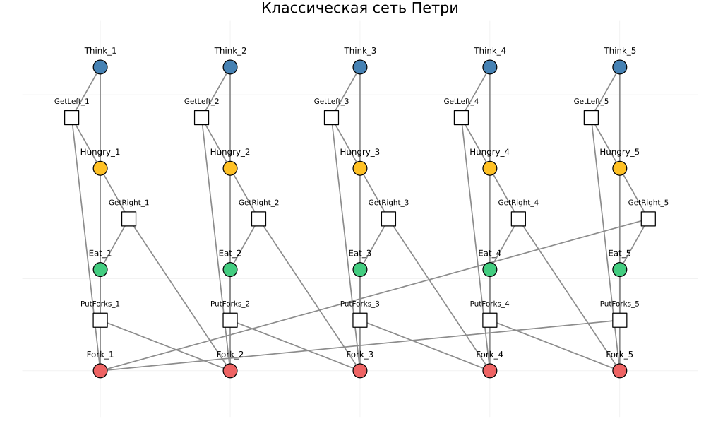
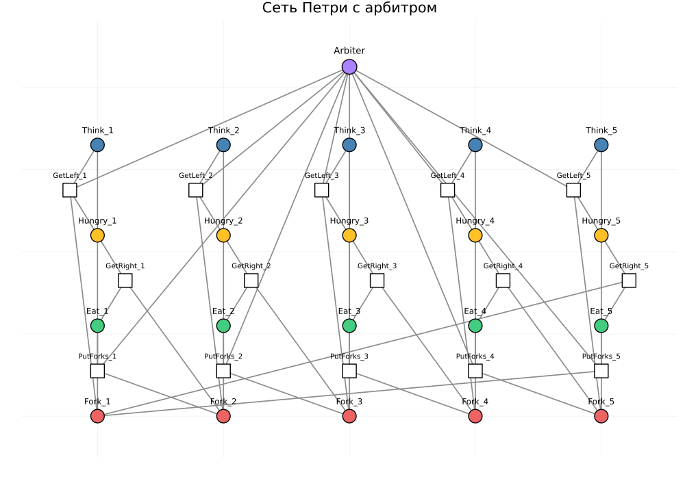
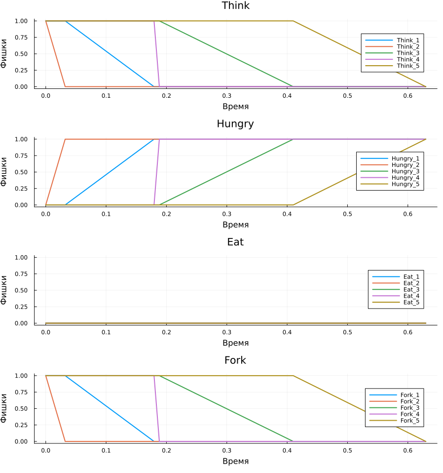
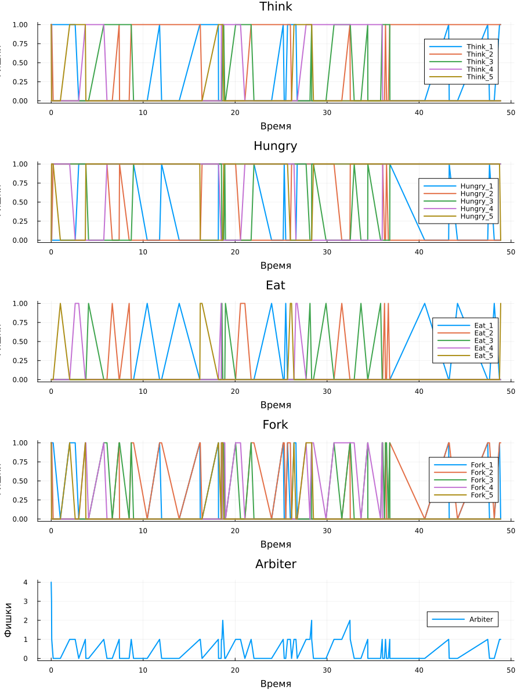
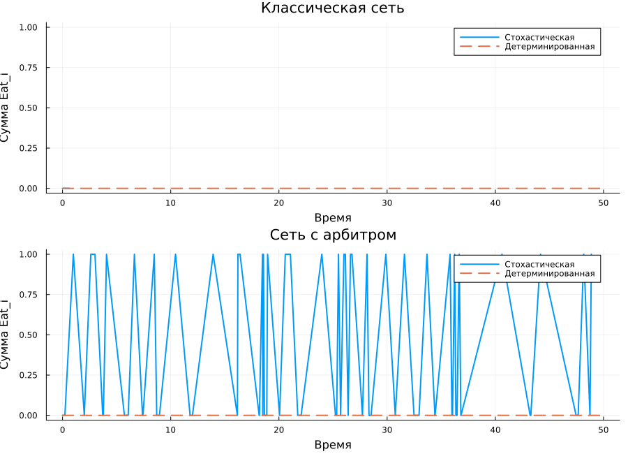
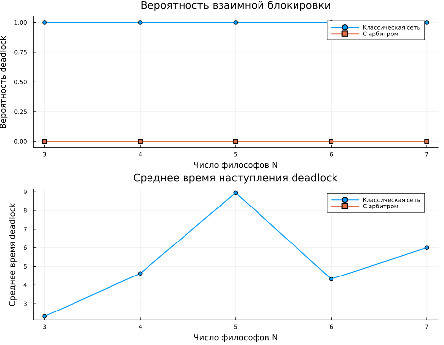

---
## Author
author:
  name: Ведьмина Александра Сергеевна
  degrees: student
  email: 1132236003@rudn.ru
  affiliation:
    - name: Российский университет дружбы народов
      country: Российская Федерация
      postal-code: 117198
      city: Москва
      address: ул. Миклухо-Маклая, д. 6

## Title
title: "Имитационное моделирование"
subtitle: "Лабораторная работа №5. Аппарат сетей Петри и задача обедающих философов"
license: "CC BY"
---

# Цель работы

Изучить аппарат сетей Петри на примере задачи обедающих философов, реализовать
классическую и модифицированную модели на Julia, выполнить стохастическое и
детерминированное моделирование, подготовить literate-источники, сгенерировать
из них чистые скрипты, Jupyter notebook и Quarto-документацию, а затем
интегрировать все полученные результаты в отчёт и презентацию.

# Задание

В ходе лабораторной работы требовалось:

1. подготовить каталог проекта и зависимости Julia;
2. реализовать сеть Петри для задачи обедающих философов;
3. исследовать классическую модель и модификацию с арбитром;
4. обнаружить и проанализировать состояние `deadlock`;
5. перевести вычислительные сценарии в literate-стиль;
6. сгенерировать `.jl`, `.ipynb` и `.qmd`;
7. выполнить оба notebook;
8. провести дополнительное параметрическое исследование.

# Теоретическое введение

Сеть Петри задаётся четвёркой

$$
N = (P, T, F, M_0),
$$

где `P` --- множество позиций, `T` --- множество переходов, `F` --- множество
дуг, а `M_0` --- начальная маркировка [@petri1962; @murata1989]. Переход может
сработать только тогда, когда каждая входная позиция содержит необходимое
число фишек.

Задача обедающих философов является классическим примером конкурентного
доступа к разделяемым ресурсам [@dijkstra1971]. В наивной постановке каждый
философ берёт левую вилку, затем правую. Если все философы одновременно
захватывают по одной вилке, возникает взаимная блокировка. Для устранения
такого сценария вводится арбитр, ограничивающий число философов, которым
разрешено одновременно входить в критическую секцию.

Стохастическое моделирование выполняется алгоритмом Гиллеспи [@gillespie1977].
Для воспроизводимости проекта используется `DrWatson.jl`, а для literate-кода
--- `Literate.jl` [@drwatson_jl; @literate_jl; @knuth1984].

# Выполнение лабораторной работы

## Подготовка проекта

### Запуск Julia

Работа начиналась с проверки установленной версии Julia и запуска REPL.

{#fig-julia-start width=85%}

Версия `1.12.5` соответствует окружению, в котором затем запускались все
скрипты лабораторной работы.

### Установка зависимостей

После создания проекта были добавлены необходимые библиотеки:
`CSV`, `DataFrames`, `DrWatson`, `IJulia`, `Literate`, `Plots`.

{#fig-pkg-add width=90%}

В результате сформирован воспроизводимый проект `lab_05_models` со следующими
каталогами:

- `src/` --- исходный код модели;
- `scripts/` --- literate-источники и clean-скрипты;
- `docs/` --- Quarto-документы;
- `notebooks/` --- Jupyter notebook;
- `data/` --- таблицы с результатами;
- `plots/` --- PNG-графики и GIF-анимация;
- `test/` --- автоматические тесты.

## Реализация модели сети Петри

Основной код сосредоточен в файле `src/DiningPhilosophers.jl`. В нём заданы:

- структура `PetriNet`;
- функции `build_classical_network` и `build_arbiter_network`;
- симуляторы `simulate_stochastic` и `simulate_deterministic`;
- функции `detect_deadlock`, `parameter_scan`, `plot_network`,
  `plot_marking_evolution`, `plot_parameter_summary`.

Ниже приведены ключевые фрагменты реализации.

### Структура сети и дуги

```julia
struct PetriNet
    n_places::Int
    n_transitions::Int
    pre::Matrix{Int}
    post::Matrix{Int}
    incidence::Matrix{Int}
    place_names::Vector{Symbol}
    transition_names::Vector{Symbol}
    metadata::Dict{Symbol, Any}
end

function add_input_arc!(net::PetriNet, place::Int, transition::Int, weight::Int = 1)
    net.pre[place, transition] += weight
    net.incidence[place, transition] -= weight
    return net
end

function add_output_arc!(net::PetriNet, place::Int, transition::Int, weight::Int = 1)
    net.post[place, transition] += weight
    net.incidence[place, transition] += weight
    return net
end
```

### Построение классической сети

```julia
function build_classical_network(N::Int)
    n_places = 4 * N
    n_transitions = 3 * N
    net = PetriNet(
        n_places,
        n_transitions;
        metadata = Dict(:N => N, :model => :classic, :has_arbiter => false),
    )
    ...
    return net, u0, copy(net.place_names)
end
```

### Стохастический симулятор

```julia
function simulate_stochastic(
    net::PetriNet,
    u0::AbstractVector{<:Real},
    tmax::Real;
    rates = ones(Float64, net.n_transitions),
    rng = Random.default_rng(),
    max_steps::Int = 200_000,
)
    marking = Float64.(u0)
    t = 0.0
    times = [t]
    states = [copy(marking)]
    ...
    return marking_dataframe(times, states, net.place_names)
end
```

Именно эта часть отвечает за имитацию событий и случайные интервалы времени
между срабатываниями переходов.

## Генерация literate-форматов

Переход от literate-источников к производным `.jl`, `.ipynb` и `.qmd`
выполняется скриптом `scripts/generate.jl`.

{#fig-generate width=95%}

Выполнение этого шага создаёт:

- `scripts/dining_philosophers_clean.jl`;
- `scripts/dining_philosophers_param_clean.jl`;
- `notebooks/dining_philosophers.ipynb`;
- `notebooks/dining_philosophers_param.ipynb`;
- `docs/dining_philosophers.qmd`;
- `docs/dining_philosophers_param.qmd`.

### Полный код `scripts/generate.jl`



## Базовый вычислительный сценарий

### Полный код `scripts/dining_philosophers_literate.jl`



### Запуск clean-скрипта

Основной сценарий был выполнен из clean-версии literate-файла.

{#fig-clean-main width=92%}

В ходе этого запуска были созданы:

- `dining_classic.csv`;
- `dining_arbiter.csv`;
- `dining_classic_deterministic.csv`;
- `dining_arbiter_deterministic.csv`;
- `deadlock_summary.csv`;
- `classic_network.png`, `arbiter_network.png`;
- `classic_simulation.png`, `arbiter_simulation.png`;
- `deterministic_comparison.png`, `final_report.png`;
- `philosophers_simulation.gif`.

### Схемы сетей Петри

{#fig-classic-net width=94%}

{#fig-arbiter-net width=94%}

В классической сети присутствует сценарий, при котором все философы блокируют
друг друга. В модифицированной сети с арбитром дополнительная позиция
ограничивает число одновременно активных философов до `N-1`.

На схеме классической сети видно, что каждая пара соседних философов делит одну
и ту же вилку, а захват ресурса разбит на два последовательных перехода:
сначала `GetLeft_i`, затем `GetRight_i`. Именно эта последовательность создаёт
возможность циклического ожидания. На схеме сети с арбитром появляется
дополнительная позиция `Arbiter`, из которой изымается одна фишка при входе в
критическую секцию и возвращается после освобождения вилок. Тем самым в системе
исключается состояние, в котором все философы одновременно удерживают по одной
вилке.

### Численные результаты базового прогона

Итог одного базового стохастического запуска приведён в
[табл. @tbl-base-summary].

| Модель | Наличие deadlock | Время наступления | Итоговое число философов в `Eat` |
|---|---:|---:|---:|
| Классическая сеть | `true` | `0.6297` | `0.0` |
| Сеть с арбитром | `false` | --- | `1.0` |

: Сводка базового стохастического прогона {#tbl-base-summary}

### Эволюция маркировок

{#fig-classic-marking width=96%}

{#fig-arbiter-marking width=96%}

На [рис. @fig-classic-marking] видно быстрое вырождение системы в тупиковое
состояние: все философы переходят в `Hungry_i`, а срабатывания переходов
прекращаются. На [рис. @fig-arbiter-marking] сеть с арбитром остаётся активной:
состояния `Think`, `Hungry` и `Eat` продолжают чередоваться.

Если рассматривать панели подробнее, то в классической сети маркеры в позициях
`Fork_i` быстро исчезают из свободных вилок и перестают возвращаться назад, а
линии `Eat_i` после короткого всплеска обнуляются и уже не восстанавливаются.
Одновременно линии `Hungry_i` стабилизируются на ненулевом уровне, что и
соответствует взаимной блокировке. В сети с арбитром такой стабилизации нет:
освобождение вилок происходит регулярно, линии `Fork_i` колеблются, а состояния
`Eat_i` периодически активируются у разных философов. Это означает, что сеть
остаётся живой и переходы продолжают срабатывать на всём интервале моделирования.

### Сравнение стохастической и детерминированной моделей

{#fig-det-compare width=92%}

Детерминированная аппроксимация подтверждает качественный вывод:
классическая постановка теряет активность, а вариант с арбитром сохраняет
ненулевой поток переходов в состояниях `Eat_i`.

На верхней панели сравнения видно, что стохастическая траектория классической
сети быстро падает к нулю и далее совпадает с детерминированной тенденцией
затухания. На нижней панели для сети с арбитром обе кривые остаются выше нуля:
число философов, находящихся в состоянии `Eat`, колеблется, но не замирает.
Это важно, потому что детерминированная модель здесь не просто повторяет форму
одной случайной траектории, а воспроизводит общий режим функционирования сети.

### Итоговый сравнительный график

{#fig-final-report width=92%}

Этот график служит наглядным подтверждением того, что после введения арбитра
философы продолжают получать доступ к ресурсам, тогда как в классической
сети все траектории `Eat_i` в итоге обнуляются.

В классической сети все линии `Eat_i` достаточно быстро приходят к нулю и далее
лежат на оси, что означает полное прекращение приёма пищи всеми философами.
Для сети с арбитром картина иная: траектории отдельных философов чередуются,
между ними наблюдаются сдвиги по времени, и это отражает корректную
синхронизацию доступа к вилкам. Таким образом, график показывает не только сам
факт отсутствия тупика, но и то, что механизм арбитра обеспечивает продолжающееся
обслуживание всех участников системы.

## Параметрический сценарий

### Полный код `scripts/dining_philosophers_param_literate.jl`



### Запуск параметрического clean-скрипта

{#fig-clean-param width=92%}

Во втором сценарии исследовалось влияние числа философов `N = 3:7` на
вероятность взаимной блокировки. Для каждого значения `N` выполнялось `16`
стохастических прогонов для классической сети и сети с арбитром.

### Сводная таблица параметрического анализа

| Модель | `N` | Вероятность deadlock | Среднее время deadlock | Среднее число философов в `Eat` в конце |
|---|---:|---:|---:|---:|
| Классическая | 3 | `1.0` | `2.3200` | `0.0` |
| С арбитром | 3 | `0.0` | --- | `0.5` |
| Классическая | 4 | `1.0` | `4.6227` | `0.0` |
| С арбитром | 4 | `0.0` | --- | `0.375` |
| Классическая | 5 | `1.0` | `8.9553` | `0.0` |
| С арбитром | 5 | `0.0` | --- | `0.625` |
| Классическая | 6 | `1.0` | `4.3216` | `0.0` |
| С арбитром | 6 | `0.0` | --- | `0.5` |
| Классическая | 7 | `1.0` | `5.9987` | `0.0` |
| С арбитром | 7 | `0.0` | --- | `0.625` |

: Результаты параметрического исследования {#tbl-param-summary}

### График параметрического анализа

{#fig-param-plot width=92%}

Во всех сериях для классической сети вероятность `deadlock` оказалась равной
`1.0`, а в сети с арбитром тупики не наблюдались ни разу.

На верхней панели параметрического графика кривая классической сети всё время
остаётся на уровне `1.0`, то есть при каждом исследованном значении `N`
взаимная блокировка возникала во всех шестнадцати прогонах. Кривая сети с
арбитром, напротив, лежит на уровне `0.0`, что означает полное отсутствие
тупиков в проведённой серии. Нижняя панель показывает, что среднее время
наступления `deadlock` для классической сети остаётся конечным и зависит от
числа философов: тупик может возникать как очень быстро, так и после более
длительной переходной фазы. Тем не менее во всех случаях классическая схема
неизбежно приходит к блокировке, тогда как арбитр качественно меняет режим
работы сети.

## Выполнение Jupyter notebook

После генерации были выполнены оба notebook. Скриншоты консольных запусков
приведены на [рис. @fig-nb-main] и [рис. @fig-nb-param].

{#fig-nb-main width=92%}

{#fig-nb-param width=92%}

Тем самым выполнено требование лабораторной работы о запуске кода из Jupyter
notebook для базового и параметрического сценариев.

## Автоматические тесты

Полный код проверки корректности вынесен в файл `test/runtests.jl`.

### Полный код `test/runtests.jl`



### Запуск тестов

{#fig-tests width=88%}

Тесты подтвердили:

- корректность начальной маркировки;
- обнаружение искусственно заданного `deadlock`;
- отсутствие тупика в начальном состоянии сети с арбитром;
- корректность работы стохастической симуляции;
- корректность формирования таблиц параметрического анализа.

Всего успешно пройдено `12` тестов.

# Выводы

В лабораторной работе была реализована воспроизводимая модель задачи
обедающих философов в аппарате сетей Петри. Классическая сеть устойчиво
приводит к взаимной блокировке, что подтверждается базовым стохастическим
экспериментом и параметрической серией для `N = 3:7`.

Модификация с арбитром устраняет тупик во всех проведённых прогонах,
сохраняет активность переходов и ненулевой поток в состояниях `Eat_i`.
Дополнительно был организован literate-пайплайн, из которого автоматически
получаются clean-скрипты, notebook и Quarto-документы; оба notebook были
выполнены, а корректность кода подтверждена автоматическими тестами.

# Список литературы{.unnumbered}

::: {#refs}
:::
