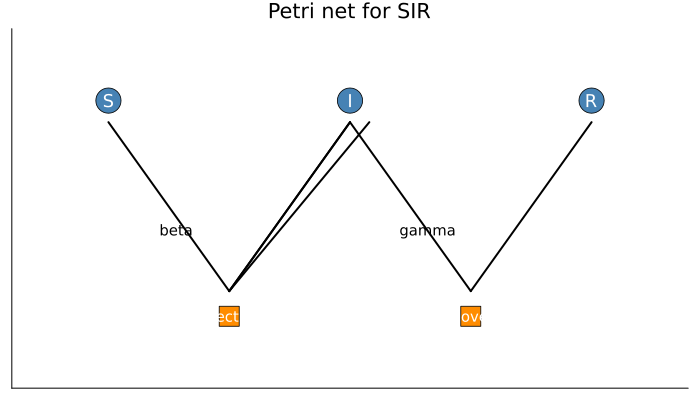
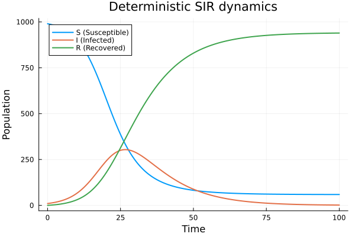
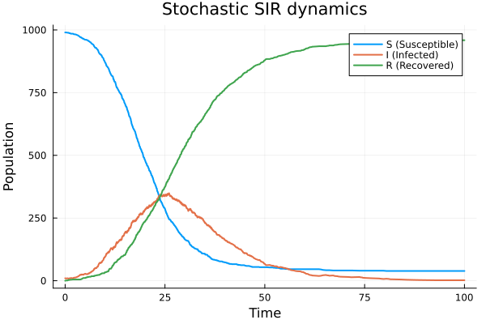
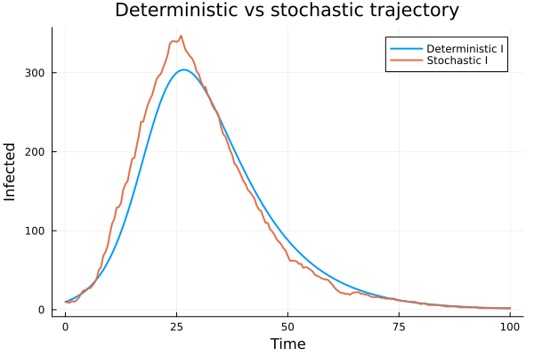
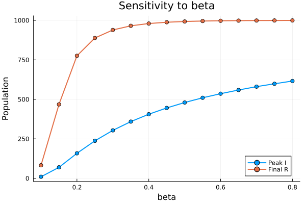
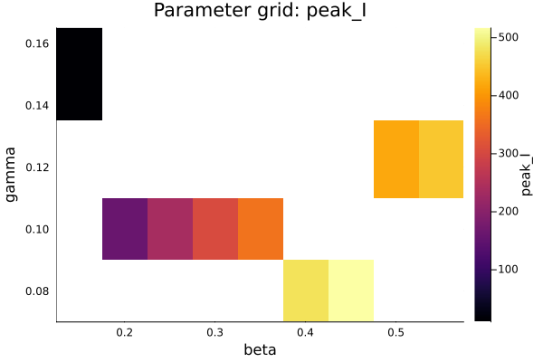

---
## Author
author:
  name: Ведьмина Александра Сергеевна
  degrees: student
  email: 1132236003@rudn.ru
  affiliation:
    - name: Российский университет дружбы народов
      country: Российская Федерация
      postal-code: 117198
      city: Москва
      address: ул. Миклухо-Маклая, д. 6
## Title
title: Лабораторная работа №6
subtitle: Имитационное моделирование
license: CC BY
date: today
date-format: "YYYY-MM-DD"
format:
  beamer:
    incremental: false
    toc: false
  revealjs:
    incremental: false
---

## Содержание

:::::::::::::: {.columns}
::: {.column width="50%"}

- Информация
- Вводная часть
- Подготовка проекта
- Реализация

:::
::: {.column width="50%"}

- Результаты
- Проверка воспроизводимости
- Выводы

:::
::::::::::::::

# Информация

## Докладчик

:::::::::::::: {.columns align=center}
::: {.column width="68%"}

- Ведьмина Александра Сергеевна
- студент
- Российский университет дружбы народов
- [1132236003@rudn.ru](mailto:1132236003@rudn.ru)

:::
::: {.column width="32%"}


:::
::::::::::::::

# Вводная часть

## Цель работы

Изучить реализацию эпидемиологической модели SIR в аппарате сетей Петри и
выполнить полный воспроизводимый цикл вычислений:

- реализовать сеть Петри для модели `S-I-R`;
- выполнить детерминированное и стохастическое моделирование;
- оформить вычислительные сценарии в literate-стиле;
- получить `jl`, `ipynb`, `qmd`;
- выполнить notebook и тесты;
- собрать отчёт и презентацию.

## Теоретическая основа

- сеть Петри задаёт позиции, переходы и начальную маркировку;
- позиции `S`, `I`, `R` соответствуют трём классам популяции;
- переход `infection` описывает заражение;
- переход `recovery` описывает выздоровление;
- для стохастической траектории используется алгоритм Гиллеспи.

# Подготовка проекта

## Создание структуры и установка зависимостей

:::::::::::::: {.columns}
::: {.column width="44%"}


:::
::: {.column width="56%"}


:::
::::::::::::::

- создан проект `lab_06_models`;
- подготовлены каталоги `src`, `scripts`, `docs`, `notebooks`, `data`, `plots`, `test`;
- добавлены `CSV`, `DataFrames`, `DrWatson`, `IJulia`, `Literate`, `Plots`.

## Проверка тестами и генерация форматов

:::::::::::::: {.columns}
::: {.column width="44%"}


:::
::: {.column width="56%"}


:::
::::::::::::::

- тесты завершились успешно: `20` из `20`;
- `generate.jl` создаёт clean-скрипты, notebook и Quarto-документы;
- literate-подход поддерживает единый источник кода и документации.

# Реализация

## Структура проекта

- `src/SIRPetri.jl` --- модель сети Петри и вычислительная логика;
- `scripts/generate.jl` --- генерация производных форматов;
- `scripts/sirpetri_literate.jl` --- базовый сценарий;
- `scripts/sirpetri_param_literate.jl` --- параметрический сценарий;
- `notebooks/` --- два исполненных notebook;
- `data/` и `plots/` --- таблицы, графики и GIF;
- `test/runtests.jl` --- автоматические проверки.

## Ключевой код модели

```julia
struct LabelledPetriNet
    states::Vector{Symbol}
    transitions::Vector{Symbol}
    inputs::Vector{Vector{Int}}
    outputs::Vector{Vector{Int}}
    rates::Dict{Symbol, Float64}
end
```

```julia
function build_sir_network(
    beta = 0.3,
    gamma = 0.1;
    initial_state = [990.0, 10.0, 0.0],
)
    states = [:S, :I, :R]
    transitions = [:infection, :recovery]
    ...
end
```

- три позиции: `S`, `I`, `R`;
- два перехода: `infection`, `recovery`;
- детерминированная модель интегрируется методом Рунге-Кутты;
- стохастическая модель использует прямой SSA-алгоритм.

## Код сценариев

```julia
beta = 0.30
gamma = 0.10
df_det = simulate_deterministic(net, u0, (0.0, tmax); ...)
df_stoch = simulate_stochastic(net, u0, (0.0, tmax); ...)
df_scan = parameter_scan(beta_range; gamma = gamma, ...)
```

```julia
parameter_pairs = [
    (beta = 0.15, gamma = 0.15),
    (beta = 0.45, gamma = 0.08),
    ...
]
grid_df = parameter_grid(parameter_pairs; tmax = 100.0, saveat = 0.5)
```

- первый сценарий строит базовые траектории, скан по `beta` и GIF;
- второй сценарий исследует сетку параметров `(beta, gamma)`.

# Результаты

## Запуск вычислительных скриптов

:::::::::::::: {.columns}
::: {.column width="50%"}


:::
::: {.column width="50%"}


:::
::::::::::::::

- базовый clean-скрипт сгенерировал CSV, PNG и GIF;
- параметрический clean-скрипт сформировал таблицу `sir_parameter_grid.csv`;
- оба сценария выполнились без ошибок.

## Схема сети и базовая динамика

:::::::::::::: {.columns}
::: {.column width="46%"}



:::
::: {.column width="54%"}



:::
::::::::::::::

- сеть Петри включает позиции `S`, `I`, `R`;
- для детерминированной траектории пик `I = 303.79` достигается при `t = 26.5`;
- итоговое число выздоровевших: `939.32`.

## Стохастическая траектория и сравнение

:::::::::::::: {.columns}
::: {.column width="50%"}



:::
::: {.column width="50%"}



:::
::::::::::::::

- стохастическая траектория даёт пик `I = 349` при `t = 26.02`;
- качественно обе постановки согласуются;
- различия объясняются случайными флуктуациями.

## Параметрический анализ

:::::::::::::: {.columns}
::: {.column width="50%"}



:::
::: {.column width="50%"}



:::
::::::::::::::

- при `beta = 0.10` эпидемия почти не развивается: `peak_I = 10`;
- при росте `beta` максимум инфицированных достигает `616.16`;
- наиболее тяжёлый режим в сетке параметров: `beta = 0.45`, `gamma = 0.08`.

## Краткая таблица результатов

| Сценарий | `peak_I` | `peak_time` | `final_R` |
|---|---:|---:|---:|
| Детерминированный | `303.79` | `26.50` | `939.32` |
| Стохастический | `349.00` | `26.02` | `959.00` |
| Лучшая пара `(0.45, 0.08)` | `516.95` | `19.50` | `995.19` |

# Проверка воспроизводимости

## Выполнение notebook

:::::::::::::: {.columns}
::: {.column width="50%"}


:::
::: {.column width="50%"}


:::
::::::::::::::

- выполнены оба Jupyter notebook;
- результаты совпадают с clean-скриптами;
- артефакты интегрированы в отчёт и презентацию.

# Выводы

## Итоги работы

- реализована модель SIR в терминах сетей Петри;
- выполнены детерминированное и стохастическое моделирование;
- literate-подход обеспечил единый источник для кода, notebook и документации;
- в работу включены скриншоты запуска, графики, численные результаты и итоговые артефакты.
