---
## Author
author:
  name: Ведьмина Александра Сергеевна
  degrees: student
  email: 1132236003@rudn.ru
  affiliation:
    - name: Российский университет дружбы народов
      country: Российская Федерация
      postal-code: 117198
      city: Москва
      address: ул. Миклухо-Маклая, д. 6
## Title
title: Лабораторная работа №7
subtitle: Имитационное моделирование
license: CC BY
date: today
date-format: "YYYY-MM-DD"
format:
  beamer:
    incremental: false
    toc: false
  revealjs:
    incremental: false
---

## Содержание

:::::::::::::: {.columns}
::: {.column width="50%"}

- Цель и задачи
- Теория
- Подготовка проекта
- Реализация

:::
::: {.column width="50%"}

- Результаты `M/M/c`
- Результаты модели Росса
- Производные форматы
- Выводы

:::
::::::::::::::

# Информация

## Докладчик

:::::::::::::: {.columns align=center}
::: {.column width="68%"}

- Ведьмина Александра Сергеевна
- студент
- Российский университет дружбы народов
- [1132236003@rudn.ru](mailto:1132236003@rudn.ru)

:::
::: {.column width="32%"}


:::
::::::::::::::

# Вводная часть

## Цель работы

Изучить дискретно-событийное моделирование на двух примерах:

- многоканальная очередь `M/M/c`;
- модель Росса для системы с резервом и ремонтом.

Также требовалось:

- оформить проект в `DrWatson`;
- написать тесты;
- получить clean-, `qmd`- и `ipynb`-версии сценариев;
- подготовить отчёт и презентацию по реальным вычислениям.

## Теоретическая основа: `M/M/c`

- пуассоновский входящий поток;
- экспоненциальное обслуживание;
- `c` параллельных каналов;
- нагрузка `rho = lambda / (c * mu)`;
- в стационарном режиме используются формулы Эрланга C;
- через формулы Литтла находятся `L_q`, `W_q`, `L`, `W`.

## Теоретическая основа: модель Росса

- `N` рабочих машин и `S` резервных;
- при отказе рабочая машина заменяется резервной;
- отказавшая машина отправляется в ремонт;
- если резерва нет, система падает;
- в работе добавлено несколько ремонтников;
- оценивается среднее время до отказа и загрузка ремонтной службы.

# Подготовка проекта

## Создание проекта и установка зависимостей

:::::::::::::: {.columns}
::: {.column width="48%"}


:::
::: {.column width="52%"}


:::
::::::::::::::

- проект `lab_07_models` создан через `DrWatson`;
- добавлены `CSV`, `DataFrames`, `DrWatson`, `IJulia`, `Literate`, `Plots`;
- окружение зафиксировано в `Project.toml` и `Manifest.toml`.

## Проверка проекта и генерация форматов

:::::::::::::: {.columns}
::: {.column width="46%"}


:::
::: {.column width="54%"}


:::
::::::::::::::

- тесты: `27/27` успешно;
- `generate.jl` создаёт clean-скрипты, notebook и `qmd`;
- literate-подход поддерживает единый источник кода и документации.

## Выполнение сценариев

:::::::::::::: {.columns}
::: {.column width="50%"}


:::
::: {.column width="50%"}


:::
::::::::::::::

- базовый сценарий строит результаты для `M/M/c` и модели Росса;
- параметрический сценарий делает серии прогонов по числу каналов, машин и ремонтников.

# Реализация

## Структура проекта

- `src/DiscreteEventModels.jl` — модуль моделей и графиков;
- `scripts/discrete_event_literate.jl` — базовый сценарий;
- `scripts/discrete_event_param_literate.jl` — параметрический сценарий;
- `scripts/generate.jl` — генерация clean-, `qmd`-, `ipynb`-форматов;
- `test/runtests.jl` — автоматические тесты;
- `data/` и `plots/` — результаты вычислений.

## Ключевой код модуля

```julia
Base.@kwdef struct MMcParameters
    lambda::Float64 = 0.9
    mu::Float64 = 0.5
    servers::Int = 2
    num_customers::Int = 500
end

Base.@kwdef struct RossParameters
    machines::Int = 10
    spares::Int = 3
    repairers::Int = 1
    failure_mean::Float64 = 100.0
    repair_mean::Float64 = 1.0
end
```

```julia
function erlang_c_metrics(lambda, mu, servers)
    ...
    p_wait = tail * p0
    Lq = p_wait * rho / (1.0 - rho)
    Wq = Lq / params.lambda
    W = Wq + 1.0 / params.mu
end
```

## Код вычислительных сценариев

```julia
mmc_params = MMcParameters(
    lambda = 0.9,
    mu = 0.5,
    servers = 2,
    num_customers = 800,
)
mmc_df = simulate_mmc(mmc_params; rng = MersenneTwister(123))
ross_params = RossParameters(
    machines = 10,
    spares = 3,
    repairers = 2,
    failure_mean = 100.0,
    repair_mean = 1.0,
)
ross_result = simulate_ross(ross_params; seed = 150)
```

```julia
mmc_sweep = mmc_server_sweep(
    1:5; lambda = 0.45, mu = 0.5,
    num_customers = 1000, seed = 900,
)
ross_machine_df = ross_machine_sweep(
    6:2:14; spares = 3, repairers = 2,
    runs = 35, seed = 1200,
)
ross_repairer_df = ross_repairer_sweep(
    1:4; machines = 10, spares = 3,
    runs = 35, seed = 1600,
)
```

# Результаты `M/M/c`

## Базовый эксперимент `M/M/2`

- параметры: `λ = 0.9`, `μ = 0.5`, `c = 2`, `800` заявок;
- нагрузка одного канала: `ρ = 0.9`;
- симуляция дала `P(wait) = 0.8888`;
- аналитика дала `P(wait) = 0.8526`;
- среднее ожидание в реализованной траектории: `16.74`.

## Графики базовой очереди

:::::::::::::: {.columns}
::: {.column width="50%"}

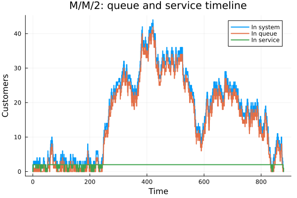

:::
::: {.column width="50%"}

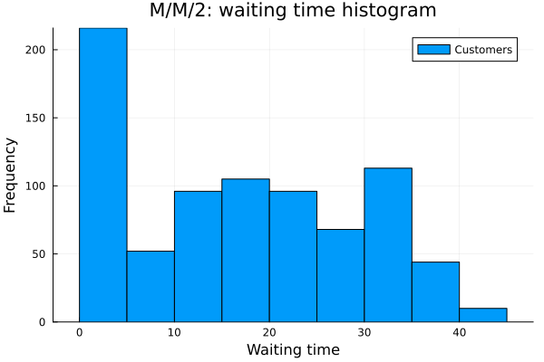

:::
::::::::::::::

- временной график показывает накопление очереди при высокой загрузке;
- гистограмма демонстрирует длинный правый хвост времени ожидания.

## Загрузка серверов и сравнение с аналитикой

:::::::::::::: {.columns}
::: {.column width="46%"}

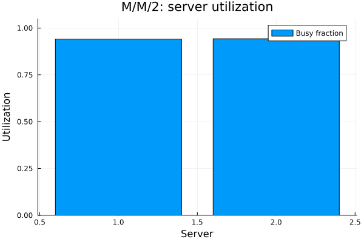

:::
::: {.column width="54%"}

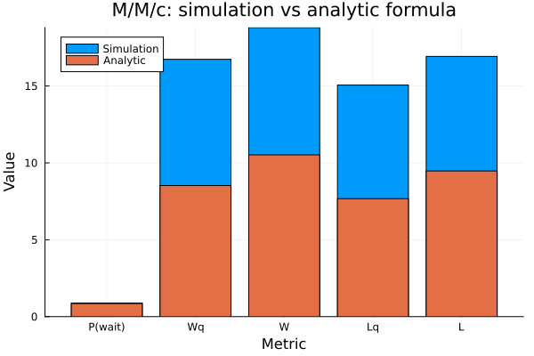

:::
::::::::::::::

- оба канала почти постоянно заняты;
- качественно симуляция согласуется с формулами Эрланга C;
- расхождение по значениям связано с одной конечной стохастической траекторией.

## Параметрический прогон по числу серверов

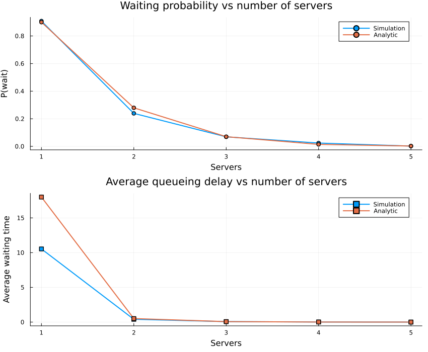

- при увеличении `c` вероятность ожидания резко уменьшается;
- уже при `c = 3` средняя задержка становится малой;
- при `c = 5` очередь практически исчезает.

# Результаты модели Росса

## Базовая конфигурация

- `10` рабочих машин;
- `3` резервных;
- `2` ремонтника;
- среднее время до отказа одной машины `100` часов;
- среднее время ремонта `1` час.

Получено:

- аналитическое среднее время до отказа: `46540` часов;
- симуляционное среднее: `47104` часов;
- средняя загрузка ремонтников: `0.0499`;
- средняя очередь на ремонт близка к нулю.

## Динамика исправных машин и очереди на ремонт

:::::::::::::: {.columns}
::: {.column width="50%"}

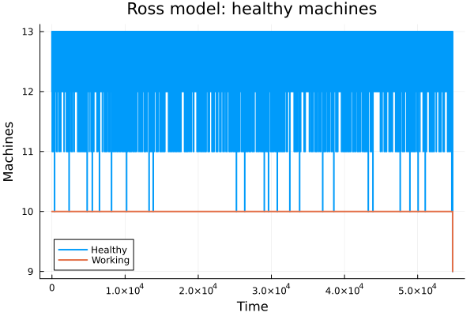

:::
::: {.column width="50%"}

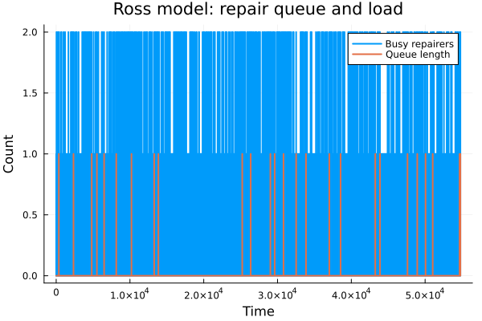

:::
::::::::::::::

- запас исправных машин медленно расходуется и пополняется ремонтами;
- очередь на ремонт возникает редко и остаётся короткой.

## Распределение времени до отказа и число ремонтников

:::::::::::::: {.columns}
::: {.column width="46%"}

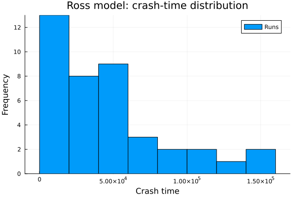

:::
::: {.column width="54%"}

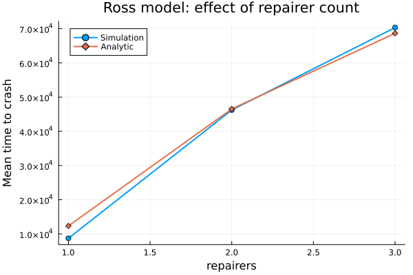

:::
::::::::::::::

- один ремонтник даёт около `8731` часов до отказа;
- два ремонтника дают около `46219` часов;
- три ремонтника дают около `70321` часа;
- добавление ремонтников резко повышает надёжность системы.

## Влияние числа машин

:::::::::::::: {.columns}
::: {.column width="46%"}

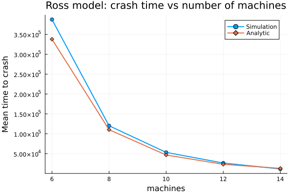

:::
::: {.column width="54%"}

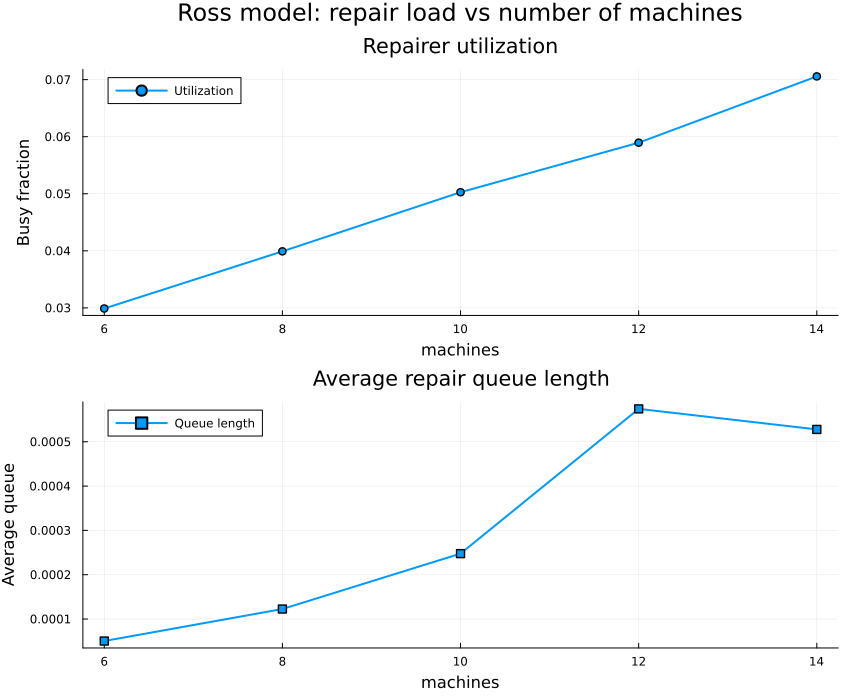

:::
::::::::::::::

- при росте числа рабочих машин резерв истощается быстрее;
- время до отказа падает с `387309` часов при `N = 6` до `11453` часов при `N = 14`;
- загрузка ремонтной службы возрастает.

## Расширенный прогон по числу ремонтников

:::::::::::::: {.columns}
::: {.column width="46%"}

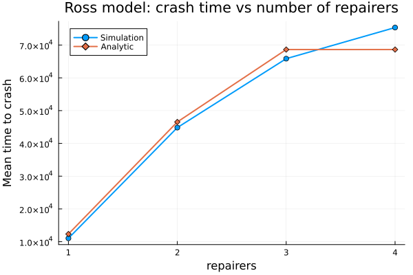

:::
::: {.column width="54%"}

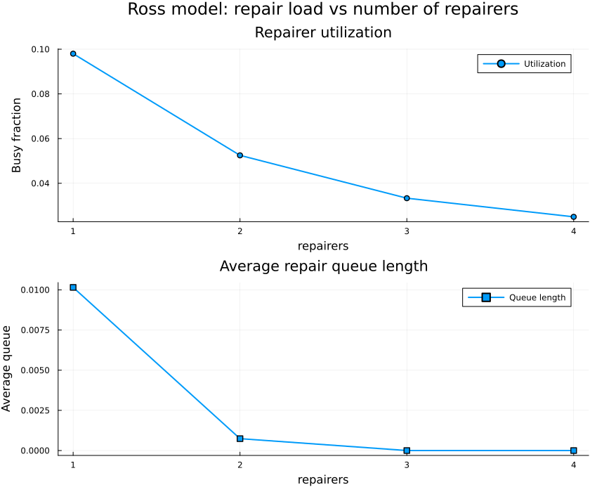

:::
::::::::::::::

- дополнительный ремонтник увеличивает среднее время до отказа;
- одновременно снижается загрузка каждого ремонтника;
- очередь на ремонт практически исчезает уже при трёх ремонтниках.

# Производные форматы

## Полученные артефакты

- clean-скрипты:
  - `discrete_event_clean.jl`
  - `discrete_event_param_clean.jl`
- документация:
  - `docs/discrete_event.qmd`
  - `docs/discrete_event_param.qmd`
- notebooks:
  - `notebooks/discrete_event.ipynb`
  - `notebooks/discrete_event_param.ipynb`

Это подтверждает, что один literate-источник обслуживает код, документацию и notebook-представление.

# Выводы

## Итоги

- реализованы две дискретно-событийные модели в общем Julia-модуле;
- проект оформлен в `DrWatson` и покрыт тестами;
- для `M/M/c` исследовано влияние числа каналов на задержки и вероятность ожидания;
- для модели Росса исследовано влияние числа машин и ремонтников на надёжность;
- все графики, исходный код и производные форматы получены и интегрированы в материалы лабораторной.
